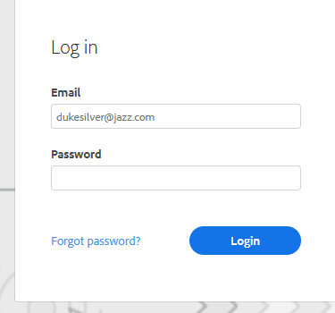

# Je Marketo-verkoopwachtwoord wijzigen {#change-your-marketo-sales-password}

Wilt u uw wachtwoord wijzigen? Zo gaat het.

## Uw wachtwoord wijzigen bij aanmelden {#change-your-password-while-signed-in}

1. Klik op het tandwielpictogram en selecteer **[!UICONTROL Settings]** .

   

1. De pagina [!UICONTROL My Profile] wordt standaard geopend. Selecteer onder [!UICONTROL Account Details] het selectievakje **[!UICONTROL Change password]** .

   

1. Voer uw huidige wachtwoord in. Voer vervolgens de nieuwe in en typ deze opnieuw om er zeker van te zijn dat ze overeenkomen. Klik op **[!UICONTROL Save]** als u klaar bent.

   

>[!NOTE]
>
>Wachtwoorden moeten:
>
>* Bevat ten minste negen tekens
>* Gebruik een combinatie van hoofdletters en kleine letters
>* Een getal opnemen
>* Een speciaal teken opnemen

## Wachtwoord wijzigen bij afmelding {#change-your-password-while-signed-out}

1. Navigeer aan de [&#x200B; Login Connect van de Verkoop &#x200B;](https://toutapp.com/login) pagina. Voer uw e-mailadres in en klik op **[!UICONTROL Login]** .

   

1. Klik op **[!UICONTROL Forgot password]**.

   

1. Voer het e-mailadres in dat aan het account is gekoppeld en klik op **[!UICONTROL Send Reset Email]** .

   

1. We zullen een e-mail verzenden om te controleren of de accounteigenaar het wachtwoord wil wijzigen. Klik op **[!UICONTROL Reset Password]**.

   

   >[!NOTE]
   >
   >Controleer ook uw map Spam, aangezien deze e-mail daar soms kan eindigen.

1. Voer uw nieuwe wachtwoord in en bevestig dit. Klik op **[!UICONTROL Set Password]** als u klaar bent.

   
