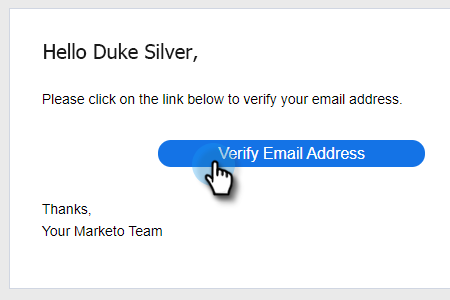

# Identiteit toevoegen {#add-identity}

Voeg een identiteit toe wanneer u meerdere e-mailadressen hebt om van te verzenden.

>[!NOTE]
>
>Het gebruiken van veelvoudige identiteiten wordt niet gesteund met Gmail of Vooruitzichten/de leveringskanalen van de Uitwisseling. Gmail en Outlook/Exchange worden op gebruikersniveau geverifieerd. Alleen e-mails van het verbonden e-mailadres worden dan verzonden. Als u meerdere identiteiten met verschillende e-mailadressen wilt gebruiken, moet u verbinding maken met een externe SMTP-provider (e-mailleveringskanaal) waarmee u e-maildomeinen kunt registreren die u van kunt verzenden. Dit staat gebruikers toe om met het SMTP leveringskanaal te verbinden en van om het even welk e-mailadres te verzenden zolang zij een geregistreerd domein zijn.

1. Klik op het pictogram Instellingen.

   

1. Klik op **[!UICONTROL Email Settings]**.

   

1. Klik op **[!UICONTROL Add Identity]**.

   

1. Voer de gegevens in (e-mail en naam zijn verplichte velden) en klik op **[!UICONTROL Create]** .

   

1. Vervolgens ontvangt u een e-mail met het bericht &quot;Verifieer het e-mailadres&quot;. Klik op **[!UICONTROL Verify Email Address]** om te verifiëren.

   

Wanneer u een e-mail verzendt in Marketo Sales en meerdere identiteiten hebt, kunt u schakelen tussen beide.

>[!NOTE]
>
>Er is geen limiet voor het aantal e-mailidentiteiten dat u kunt instellen.

>[!MORELIKETHIS]
>
>[&#x200B; voeg of werk Uw E-mailhandtekening &#x200B;](/help/marketo/product-docs/marketo-sales-insight/actions/getting-started/email-settings/add-or-update-your-email-signature.md) bij.
