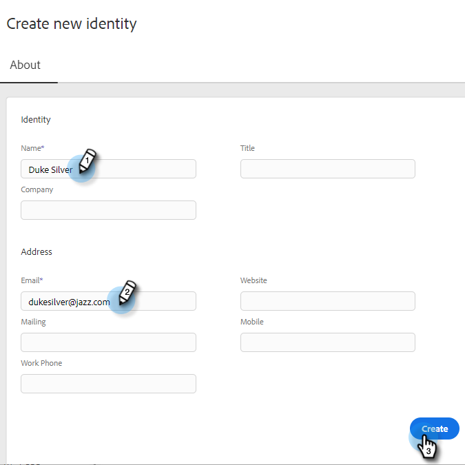

# Identiteit toevoegen {#add-identity}

Voeg een identiteit toe wanneer u meerdere e-mailadressen hebt om van te verzenden.

1. Klik op het pictogram Instellingen.

   

1. Klikken **E-mailinstellingen**.

   

1. Klikken **Identiteit toevoegen**.

   

1. Voer de gegevens in (e-mail en naam zijn verplichte velden) en klik op **Maken**.

   

1. Vervolgens ontvangt u een e-mail met het bericht &quot;Verifieer het e-mailadres&quot;. Klik op **E-mailadres verifiëren**.

   

Wanneer u een e-mail verzendt in Marketo Sales en meerdere identiteiten hebt, kunt u schakelen tussen beide.

>[!NOTE]
>
>Het aantal e-mailidentiteiten dat u kunt instellen, is onbeperkt.

>[!MORELIKETHIS]
>
>[Uw e-mailhandtekening toevoegen of bijwerken](/help/marketo/product-docs/marketo-sales-insight/actions/getting-started/email-settings/add-or-update-your-email-signature.md).
