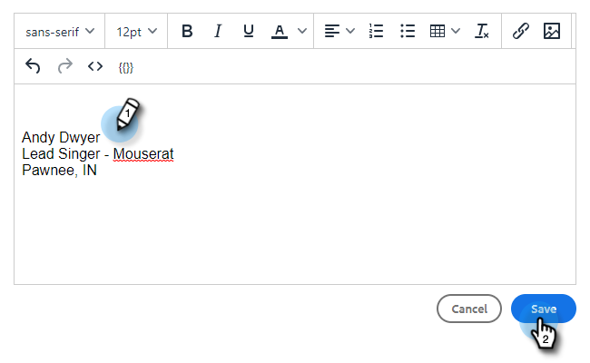

# Uw e-mailhandtekening toevoegen of bijwerken {#add-or-update-your-email-signature}

We willen dat e-mails van Marketo Sales een naadloze ervaring hebben wanneer we vanuit uw eigen e-mailclient verzenden. Een goede manier om dit te doen is uw e-mailhandtekening toe te voegen.

1. Klik op het tandwielpictogram en selecteer **[!UICONTROL Settings]** .

   

1. Selecteer onder [!UICONTROL My Account] de optie **[!UICONTROL Email Settings]** .

   

1. Selecteer op het tabblad **[!UICONTROL Address and Signature]** de e-mailidentiteit waarvoor u een handtekening wilt maken.

   

1. Klik op de [!UICONTROL Signature] -kaart op **[!UICONTROL Edit]** .

   

1. Voer de gewenste tekst (of afbeeldingen) in en klik op **[!UICONTROL Save]** .

   

   >[!TIP]
   >
   >Zorg ervoor dat uw handtekening in het samenstellingsscherm lijkt op de handtekening in uw e-mailclient.
