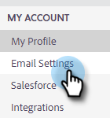

# Uw e-mail verifiëren {#verify-your-email}

Voer de onderstaande stappen uit als u een e-mailidentiteit hebt die niet is geverifieerd.

1. Klik op het tandwielpictogram rechtsboven en kies **[!UICONTROL Settings]** .

   

1. Klik onder [!UICONTROL My Account] op **[!UICONTROL Email Settings]** .

   

1. Zoek onder [!UICONTROL Address and Signature] het e-mailbericht dat u wilt controleren en klik op **[!UICONTROL Resend Verification Email]** . Er wordt een nieuw e-mailverificatiebericht verzonden.

   

1. Klik op **[!UICONTROL Resend]**.

   

1. De ontvanger opent vervolgens de e-mail en volgt de stappen om het e-mailadres te verifiëren.

   

>[!NOTE]
>
>Controleer de spammap als je geen verificatiebericht hebt ontvangen. Als het daar niet is, gelieve te contacteren {de Steun van 0} Marketo [.](https://nation.marketo.com/t5/Support/ct-p/Support)
