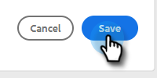

# Uw profiel beheren {#manage-your-profile}

Op de pagina Mijn profiel kunt u uw naam, de taal/landinstelling/tijdzone van uw account bijwerken en uw wachtwoord wijzigen.

## Accountgegevens {#account-details}

Hier kunt u uw naam en/of wachtwoord bijwerken.

1. Klik het tandwielpictogram en selecteer **Montages**.

   

1. De pagina Mijn profiel wordt standaard geopend. Om uw naam bij te werken, eenvoudig typ in de veranderingen en klik **sparen**.

   

>[!NOTE]
>
>Uw e-mailadres is ingesteld op Alleen weergeven. Als u dat ook nodig hebt veranderd, gelieve [ de Steun van Marketo ](https://nation.marketo.com/t5/Support/ct-p/Support) te contacteren.

U kunt uw wachtwoord in deze sectie ook veranderen. De stappen worden beschreven in dit document.

## Uw integratie {#your-integrations}

Rechts op de pagina wordt in de sectie Uw integratie de status van alle verbindingen van uw account weergegeven.

>[!NOTE]
>
>Als u Uitwisseling op Prem met de Verkoop van Marketo gebruikt, zal het niet het Kanaal van de Levering (1ste lijnpunt) of het Volgen van het Antwoord (tweede lijnpunt) integratiecontroles bijwerken. We werken eraan om dit in een toekomstige release te ondersteunen.

## Tijdzone {#time-zone}

Hieronder wordt beschreven hoe u de taal, landinstelling en/of tijdzone van uw account kunt wijzigen.

>[!NOTE]
>
>Ondersteunde talen: Engels, Frans, Duits, Japans, Portugees, Spaans.

1. Klik het tandwielpictogram en selecteer **Montages**.

   

1. Om uw taal te veranderen, klik de **drop-down Taal** en maak uw keus.

   

1. De landinstelling verwijst hier naar de regio waarin die taal wordt gesproken. Één zal door gebrek worden gekozen wanneer u uw taal verandert, maar om het manueel te veranderen, klik de **Slaggids van de Landinstelling** en maak uw keus.

   

1. Klik **Uw drop-down Tijdzone** en maak uw keus.

   

1. Klik **sparen** wanneer gedaan.

   

Et voilà!
