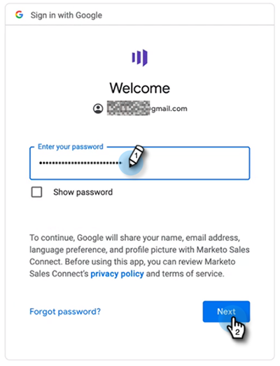

# MSI-handelingen Gebruikershandleiding aan boord {#msi-actions-user-onboarding-guide}

>[!PREREQUISITES]
>
>* Een beheerder moet een gebruiker uitnodigen om MSI-handelingen te gaan gebruiken.
>* Als u uw account met Salesforce wilt activeren, moet u API ingeschakeld hebben in de bevoegdheden voor het Salesforce-profiel.

Nieuwe gebruikers moeten de onderstaande stappen volgen.

1. Klik in de welkomstmail op **Aan de slag**.

   

1. Klikken **Account activeren met Salesforce**.

   

1. Als u al bij uw Salesforce-account bent aangemeld, wordt u automatisch naar het volgende scherm geleid. Als u niet bent aangemeld, doet u dit nu.

   

>[!NOTE]
>
>Je e-mailadres en e-mailadres van je verkoopaccount moeten hetzelfde zijn.

1. Klikken **Toestaan**.

   

1. Klikken **Start**.

   

1. Klikken **Volgende**.

   

1. Kies de e-mailclient die u gebruikt (Gmail of Outlook) en klik op **Volgende**.

   

1. Voer uw e-mailadres in en klik op **Volgende**.

   

1. Voer uw wachtwoord in en klik op **Volgende**.

   

1. Klikken **Doorgaan**.

   

>[!NOTE]
>
>Als u Vooruitzichten kiest, zult u een scherm van de Authentificatie van Vooruitzichten zien waar u uw e-mailadres zult ingaan.

1. U ziet het succesbericht E-mailverbinding instellen en u wordt naar het volgende scherm verzonden.

   

1. Voer uw aangepaste handtekening in en klik op **Opslaan** (als u dit later via de profielpagina wilt doen, klikt u op **Overslaan**).

   

1. Klikken **Voltooien**.

   

1. Je ziet de optie om een korte inleiding op Marketo-verkoopacties te bekijken. Klikken **Volgende** om te bekijken, of **Niet nu** opslaan voor later.

   

1. Als u klaar bent met de tour of als u deze hebt overgeslagen, kiest u of u zich rechtstreeks bij de webtoepassing of bij uw Salesforce-account aanmeldt, zodat u toegang hebt tot alle functies in het deelvenster MSI (in dit voorbeeld kiezen wij **Salesforce starten**).

   

1. Binnen Salesforce (Klassiek of Bliksem), kunt u aan om het even welke lood, contact, rekening, of kans navigeren. Al uw Handelingen van de Verkoop zullen door drop-down in het paneel MSI beschikbaar zijn.

   
