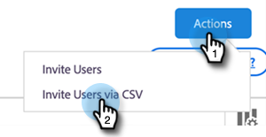

# Handleiding Insight Actions Admin Setup Guide {#sales-insight-actions-admin-setup-guide}

>[!NOTE]
>
>De Acties van Insight van de Verkoop van Marketo is een web-based toepassing die exclusief met Salesforce CRM via het [ pakket van Insight van de Verkoop van Marketo ](/help/marketo/product-docs/marketo-sales-insight/msi-for-salesforce/installation/install-marketo-sales-insight-package-in-salesforce-appexchange.md){target="_blank"} integreert. Het wordt soms bedoeld als &quot;Verkoop van Marketo,&quot;of eenvoudig &quot;Acties.&quot;

>[!PREREQUISITES]
>
>* Bevestig met het Team van de Rekening van Adobe (uw Manager van de Rekening) dat de Acties MSI voor uw Rekening van Marketo Engage (als u geen Manager van de Rekening hebt, contacteer [ de Steun van Marketo ](https://nation.marketo.com/t5/support/ct-p/Support){target="_blank"}) is toegelaten.
>* Uw Marketo/Salesforce-synchronisatie moet zijn ingesteld.

<table>
 <tr>
  <th>Persona</th>
  <th>Stap</th>
 </tr>
 <tr>
  <td>Marketo Admin</td>
  <td>Marketo-verkoopaccount instellen</td>
 </tr>
 <tr>
  <td>Marketo Admin of  [!DNL Salesforce] Admin</td>
  <td>Marketo Sales-account verbinden met [!DNL Salesforce]</td>
 </tr>
 <tr>
  <td>Marketo Admin</td>
  <td>Marketo-verkoopaccount verbinden met Marketo</td>
 </tr>
 <tr>
  <td>Marketo Admin</td>
  <td>Gegevenssynchronisatie starten van Marketo naar Marketo Sales Account</td>
 </tr>
 <tr>
  <td>Marketo Admin</td>
  <td>Gebruikers uitnodigen voor MSI-handelingen</td>
 </tr>
 <tr>
  <td>[!DNL Salesforce] Beheerder</td>
  <td>MSI-pakket installeren/upgraden in [!DNL Salesforce]</td>
 </tr>
 <tr>
  <td>[!DNL Salesforce] Beheerder</td>
  <td>MSI-handelingen configureren in [!DNL Salesforce]</td>
 </tr>
</table>

## Marketo-verkoopaccount instellen {#set-up-marketo-sales-account}

1. Klik in Marketo op **[!UICONTROL Admin]** .

   

   >[!NOTE]
   >
   >Als u geen identiteitskaart van de Cliënt en Geheim van de Cliënt op de kaart van de Informatie van de Integratie ziet, activeer uw instantie van Acties door de eerste gebruiker uit te nodigen, en u zult Cliënt ID en Geheim verschijnen Cliënt zien.

1. Klik **Insight van de Verkoop**, toen **Config van Acties**. Selecteer van een lijst van beheerders van Marketo om uit te nodigen en te klikken **verzendt Uitnodiging**.

   

De gebruiker zal een e-mail met stappen ontvangen om toegang tot de rekening te krijgen.

>[!NOTE]
>
>Extra gebruikers worden niet toegevoegd via Marketo en worden toegevoegd via de pagina Gebruikersbeheer van verkoopaccount. [ klik hier ](/help/marketo/product-docs/marketo-sales-connect/admin/invite-users.md){target="_blank"} om meer over het toevoegen van extra gebruikers te leren.

## Marketo-verkoopaccount verbinden met [!DNL Salesforce] {#connect-marketo-sales-account-to-salesforce}

1. Klik in je Marketo Sales-account op het tandwielpictogram en selecteer **[!UICONTROL Settings]** .

   

1. Klik onder [!UICONTROL Admin Settings] op **[!UICONTROL Salesforce]** .

   

1. Klik op het tabblad [!UICONTROL Connections & Customizations] op **[!UICONTROL Connect]** .

   

1. Klik op **[!UICONTROL OK]**.

   

Als u al bent aangemeld bij Salesforce, hebt u verbinding. Als je dat niet bent, wordt je gevraagd je aan te melden.

## Marketo verbinden met uw account voor verkoopapps {#connect-marketo-to-your-sales-apps-account}

1. Klik in je Marketo Sales-account op het tandwielpictogram en selecteer **[!UICONTROL Settings]** .

   

1. Onder [!UICONTROL Admin Settings], klik **Marketo**.

   

1. Klik op **[!UICONTROL connect]**. Uw account wordt dan verbonden.

   

>[!NOTE]
>
>Als er geen verbinding wordt gemaakt, kopieert u de gegevens van het tabblad &quot;Actions Config&quot; van Marketo Sales Insight en plakt u deze op het tabblad Set-up.

## Gegevenssynchronisatie starten {#initiate-data-sync}

Met de Data Unification field sync for Sales Insight Actions kan het systeem persoonlijke gegevens uit uw Marketo Engage-database ophalen in uw Sales Insight Actions-database, de gegevens van uw mensen up-to-date houden en ervoor zorgen dat activiteiten worden geregistreerd naar de juiste records in Marketo en [!DNL Salesforce] .

>[!CAUTION]
>
>Zodra u gegevenssynchronisatie in werking stelt, zou u **&#x200B;**&#x200B;niet de originele gebruiker op uw instantie van de Acties van Insight van de Verkoop moeten verwijderen. Dit is de gebruiker waarnaar de eerste uitnodiging is verzonden.

1. Klik in Marketo op **[!UICONTROL Admin]** .

   

1. Klik op **[!UICONTROL Sales Insight]**.

   

1. Klik op de tab **[!UICONTROL Actions Config]** . Klik op de synchronisatiekaart voor het actieveld op **[!UICONTROL Sync]** .

   

1. U ziet een voorvertoning van de velden die worden gesynchroniseerd. Klik op **[!UICONTROL Start Sync]**.

   

Persoonlijke records die in Marketo en [!DNL Salesforce] bestaan, worden gesynchroniseerd met je Marketo Sales Apps-account.

>[!NOTE]
>
>Om meer over te leren hoe de mensen en activiteitengegevens tussen de Acties van Insight van de Verkoop, Marketo, en Salesforce synchroniseren, [ klik hier ](/help/marketo/product-docs/marketo-sales-insight/actions/admin/sync-sales-action-data-with-marketo-and-salesforce.md){target="_blank"}.

## Individuele gebruikers uitnodigen voor MSI-handelingen {#invite-individual-users-to-msi-actions}

1. Klik in je Marketo Sales-account op het tandwielpictogram en selecteer **[!UICONTROL Settings]** .

   

1. Selecteer onder [!UICONTROL Admin Settings] de optie **[!UICONTROL User Management]** .

   

1. Klik op **[!UICONTROL Actions]** en selecteer **[!UICONTROL Invite Users]** .

   

1. Voer het e-mailadres of de e-mailadressen in en klik op **[!UICONTROL Invite]** .

   

>[!NOTE]
>
>Door gebrek, zullen alle nieuwe leden aan het Iedereen team worden toegevoegd.

Je ontvangt een bevestigingsbericht.

## Gebruikers via CSV uitnodigen voor MSI-handelingen {#invite-users-via-csv-to-msi-actions}

1. Klik in je Marketo Sales-account op het tandwielpictogram en selecteer **[!UICONTROL Settings]** .

   

1. Selecteer onder [!UICONTROL Admin Settings] de optie **[!UICONTROL User Management]** .

   

1. Klik op **[!UICONTROL Actions]** en selecteer **[!UICONTROL Invite Users via CSV]** .

   

1. Blader naar de CSV op de computer, selecteer deze en klik op **[!UICONTROL Next]** .

   

1. Controleer of de velden correct zijn toegewezen en klik op **[!UICONTROL Invite]** .

   

U zult een bevestigingsbericht ontvangen zodra de uitnodigingen worden verzonden.

>[!NOTE]
>
>Zodra dit wordt gedaan, kunt u of uw bestaand pakket bevorderen MSI of nieuwe installeren en zich op [ het vormen acties MSI in Salesforce ](/help/marketo/product-docs/marketo-sales-insight/actions/crm/salesforce-package-configuration/sales-insight-actions-configuration-in-salesforce.md){target="_blank"} bewegen.
