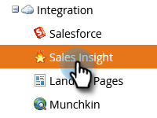

# Handleiding voor installatie van Admin Setup voor het inzicht in verkoop {#sales-insight-actions-admin-setup-guide}

>[!NOTE]
>
>Marketo Sales Insight Actions is een webtoepassing die via de [Marketo Sales Insight-pakket](/help/marketo/product-docs/marketo-sales-insight/msi-for-salesforce/installation/install-marketo-sales-insight-package-in-salesforce-appexchange.md){target="_blank"}. Het wordt soms bedoeld als &quot;Verkoop van Marketo,&quot;of eenvoudig &quot;Acties.&quot;

>[!PREREQUISITES]
>
>* Bevestig met het accountteam van Adobe (uw accountmanager) dat de MSI-handelingen zijn ingeschakeld voor uw Marketo Engage-account (als u geen accountmanager hebt, neemt u contact op met [Marketo-ondersteuning](https://nation.marketo.com/t5/support/ct-p/Support){target="_blank"}).
>* Uw Marketo/Salesforce-synchronisatie moet zijn ingesteld.

<table>
 <tr>
  <th>Persona</th>
  <th>Stap</th>
 </tr>
 <tr>
  <td>Marketo Admin</td>
  <td>Marketo-verkoopaccount instellen</td>
 </tr>
 <tr>
  <td>Marketo Admin of  Salesforce Admin</td>
  <td>Marketo-verkoopaccount verbinden met Salesforce</td>
 </tr>
 <tr>
  <td>Marketo Admin</td>
  <td>Marketo-verkoopaccount verbinden met Marketo</td>
 </tr>
 <tr>
  <td>Marketo Admin</td>
  <td>Gegevenssynchronisatie starten van Marketo naar Marketo Sales Account</td>
 </tr>
 <tr>
  <td>Marketo Admin</td>
  <td>Gebruikers uitnodigen voor MSI-handelingen</td>
 </tr>
 <tr>
  <td>Salesforce Admin</td>
  <td>MSI-pakket installeren/upgraden in Salesforce</td>
 </tr>
 <tr>
  <td>Salesforce Admin</td>
  <td>MSI-acties configureren in Salesforce</td>
 </tr>
</table>

## Marketo-verkoopaccount instellen {#set-up-marketo-sales-account}

1. Klik in Marketo op **Beheer**.

   

1. Klikken **Verkoopoverzicht** vervolgens **Handelingen configureren**. Kiezen uit een lijst met Marketo-beheerders die u wilt uitnodigen en klikken **Uitnodiging verzenden**.

   

De gebruiker zal een e-mail met stappen ontvangen om toegang tot de rekening te krijgen.

>[!NOTE]
>
>Extra gebruikers worden niet toegevoegd via Marketo en worden toegevoegd via de pagina Gebruikersbeheer van verkoopaccount. [Klik hier](/help/marketo/product-docs/marketo-sales-connect/admin/invite-users.md){target="_blank"} voor meer informatie over het toevoegen van extra gebruikers.

## Marketo-verkoopaccount verbinden met Salesforce {#connect-marketo-sales-account-to-salesforce}

1. Klik in je Marketo Sales-account op het tandwielpictogram en selecteer **Instellingen**.

   

1. Klik onder Beheerinstellingen op **Salesforce**.

   

1. Klik op het tabblad Verbindingen en aanpassingen op **Verbinden**.

   

1. Klikken **OK**.

   

Als u al bij Salesforce bent aangemeld, hebt u verbinding. Als je dat niet bent, wordt je gevraagd je aan te melden.

## Marketo verbinden met uw account voor verkoopapps {#connect-marketo-to-your-sales-apps-account}

1. Klik in je Marketo Sales-account op het tandwielpictogram en selecteer **Instellingen**.

   

1. Klik onder Beheerinstellingen op **Marketo**.

   

1. Klikken **verbinden**. Uw account wordt dan verbonden.

   

>[!NOTE]
>
>Als er geen verbinding wordt gemaakt, kopieert u de gegevens van het Marketo Sales Insight-tabblad &quot;Actions Config&quot; en plakt u deze op het tabblad Set-up.

## Gegevenssynchronisatie starten {#initiate-data-sync}

De het gebiedssynchronisatie van de gegevenseenmaking voor de Acties van het Inzicht van de Verkoop laat het systeem toe om persooninformatie van uw gegevensbestand van de Marketo Engage in uw gegevensbestand van de Acties van het Inzicht van de Verkoop te trekken, die uw gegevens van uw mensen bijgewerkt houden en ervoor zorgen de activiteiten aan de juiste verslagen over Marketo en Salesforce worden geregistreerd.

>[!CAUTION]
>
>Als u de gegevenssynchronisatie hebt gestart, moet u **niet** verwijder de originele gebruiker op uw instantie van de Acties van het Inzicht van de Verkoop. Dit is de gebruiker waarnaar de eerste uitnodiging is verzonden.

1. Klik in Marketo op **Beheer**.

   

1. Klikken **Verkoopoverzicht**.

   

1. Klik op de knop **Handelingen configureren** tab. Klik op de synchronisatiekaart van het veld Handeling op **Synchroniseren**.

   

1. U ziet een voorvertoning van de velden die worden gesynchroniseerd. Klikken **Synchronisatie starten**.

   

Persoonlijke gegevens die in Marketo en Salesforce bestaan, worden gesynchroniseerd met je Marketo Sales Apps-account.

>[!NOTE]
>
>Meer informatie over hoe mensen en activiteitengegevens tussen de Acties van het Inzicht van de Verkoop, Marketo, en Salesforce synchroniseren, [klik hier](/help/marketo/product-docs/marketo-sales-insight/actions/admin/sync-sales-action-data-with-marketo-and-salesforce.md){target="_blank"}.

## Individuele gebruikers uitnodigen voor MSI-handelingen {#invite-individual-users-to-msi-actions}

1. Klik in je Marketo Sales-account op het tandwielpictogram en selecteer **Instellingen**.

   

1. Selecteer onder Beheerinstellingen de optie **Gebruikersbeheer**.

   

1. Klikken **Handelingen** en selecteert u **Gebruikers uitnodigen**.

   

1. Voer het e-mailadres of de e-mailadressen in en klik op **Uitnodigen**.

   

>[!NOTE]
>
>Door gebrek, zullen alle nieuwe leden aan het Iedereen team worden toegevoegd.

Je ontvangt een bevestigingsbericht.

## Gebruikers via CSV uitnodigen voor MSI-handelingen {#invite-users-via-csv-to-msi-actions}

1. Klik in je Marketo Sales-account op het tandwielpictogram en selecteer **Instellingen**.

   

1. Selecteer onder Beheerinstellingen de optie **Gebruikersbeheer**.

   

1. Klikken **Handelingen** en selecteert u **Gebruikers uitnodigen via CSV**.

   

1. Blader naar de CSV op uw computer, selecteer deze en klik op **Volgende**.

   

1. Controleer of de velden correct zijn toegewezen en klik op **Uitnodigen**.

   

U zult een bevestigingsbericht ontvangen zodra de uitnodigingen worden verzonden.

>[!NOTE]
>
>Als dit is gebeurd, kunt u een upgrade uitvoeren van het bestaande MSI-pakket of een nieuw MSI-pakket installeren en doorgaan naar [MSI-handelingen configureren in Salesforce](/help/marketo/product-docs/marketo-sales-insight/actions/crm/salesforce-configuration/sales-insight-actions-configuration-in-salesforce.md){target="_blank"}.
