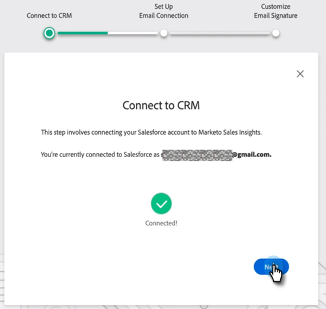
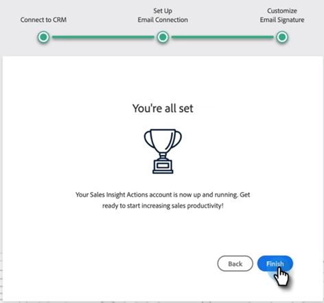

# Handelingen Insight verkopen Handboek voor gebruikers aan boord nemen {#sales-insight-actions-user-onboarding-guide}

>[!NOTE]
>
>De Acties van Insight van de Verkoop van Marketo is een web-based toepassing die exclusief met Salesforce CRM via het [&#x200B; pakket van Insight van de Verkoop van Marketo &#x200B;](/help/marketo/product-docs/marketo-sales-insight/msi-for-salesforce/installation/install-marketo-sales-insight-package-in-salesforce-appexchange.md){target="_blank"} integreert. Het wordt soms bedoeld als &quot;Verkoop van Marketo,&quot;of eenvoudig &quot;Acties.&quot;

>[!PREREQUISITES]
>
>* Een beheerder moet een gebruiker uitnodigen om MSI-handelingen te gaan gebruiken.
>* Als u uw account met [!DNL Salesforce] wilt activeren, moet u API ingeschakeld hebben in de [!DNL Salesforce] -profielmachtigingen.

Nieuwe gebruikers moeten de onderstaande stappen volgen.

1. Klik in de welkomstmail op **[!UICONTROL Get Started]** .

   

1. Klik op **[!UICONTROL Activate Account with Salesforce]**.

   

1. Als u al bent aangemeld bij uw [!DNL Salesforce] -account, wordt u automatisch naar het volgende scherm geleid. Als u niet bent aangemeld, doet u dit nu.

   

>[!NOTE]
>
>Uw e-mailadres en e-mailadres van uw [!DNL Salesforce] -verkoopaccount moeten hetzelfde zijn.

1. Klik op **[!UICONTROL Allow]**.

   

1. Klik op **[!UICONTROL Start]**.

   

1. Klik op **[!UICONTROL Next]**.

   

1. Kies de e-mailclient die u gebruikt (Gmail of [!DNL Outlook] ) en klik op **[!UICONTROL Next]** .

   

1. Voer uw e-mailadres in en klik op **[!UICONTROL Next]** .

   

1. Voer uw wachtwoord in en klik op **[!UICONTROL Next]** .

   

1. Klik op **[!UICONTROL Continue]**.

   

>[!NOTE]
>
>Als u Vooruitzichten kiest, zult u een scherm van de Authentificatie van Vooruitzichten zien waar u uw e-mailadres zult ingaan.

1. U ziet het succesbericht E-mailverbinding instellen en u wordt naar het volgende scherm verzonden.

   

1. Voer uw aangepaste handtekening in en klik op **[!UICONTROL Save]** (klik op **[!UICONTROL Skip]** als u dit later via de profielpagina wilt doen.)

   

1. Klik op **[!UICONTROL Finish]**.

   

1. Je ziet de optie om een korte inleiding op Marketo-verkoopacties te bekijken. Klik op **[!UICONTROL Next]** om weer te geven of op **[!UICONTROL Not Now]** om voor later op te slaan.

   

1. Wanneer u klaar bent met de rondleiding, of als u het overgeslagen hebt, verkies of om rechtstreeks aan te melden bij de Webtoepassing of uw [!DNL Salesforce] rekening waar u tot alle eigenschappen van het paneel MSI kunt toegang hebben (in dit voorbeeld kiezen wij **[!UICONTROL Launch Salesforce]**).

   

1. Binnen [!DNL Salesforce] (Klassiek of Bliksem), kunt u aan om het even welke lood, contact, rekening, of kans navigeren. Al uw Handelingen van de Verkoop zullen door drop-down in het paneel MSI beschikbaar zijn.

   
