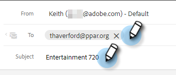

# Integratie van kenmerken {#highspot-integration}

De verkoop kan tot de mogelijkheden van de Markering van de Verkoop van de Acties van het Inzicht van de Verkoop toegang hebben en grotere zichtbaarheid, efficiency, en prestaties door de verkoopcyclus bereiken. Gebruikers van Handeling voor verkoopinzicht kunnen verkoopinhoud selecteren die is opgeslagen op het platform voor verkoopactivering van Highspot en deze rechtstreeks invoegen in e-mails, e-mailsjablonen en verkoopcampagnes, terwijl ze inhoud bijhouden en analyses vastleggen in Handelingen voor Marktmelding en Verkoopinzicht.

## Marktintegratie inschakelen {#enabling-highspot-integration}

>[!NOTE]
>
>U moet over beheerdersrechten beschikken om Highspot in te schakelen voor uw exemplaar Handelingen in het venster Handelingen in het oog op verkoopgegevens.

1. Klik op het tandwielpictogram en selecteer **Instellingen**.

   

1. Onder **Beheerinstellingen**, selecteert u **Algemeen**.

   

1. Schuiven naar **Integraties** en klik op de schuifregelaar om Markering in te schakelen.

   

Gebruikers zien nu een optie om Markering te selecteren wanneer ze de knop voor het uploaden van inhoud selecteren in het samenstellingsvenster, de sjablooneditor en de e-maileditor voor de campagne.

## Toegang krijgen tot inhoud van Highspot en inhoud delen via e-mail {#accessing-highspot-content}

U hebt toegang tot Markering en voegt inhoud toe aan uw e-mails vanuit het samenstellingvenster Handelingen voor het instellen van verkoopgegevens, de sjablooneditor en de e-maileditor voor verkoopcampagnes. Hieronder vindt u de stappen voor toegang tot inhoud vanuit het samenstellingsvenster.

1. Maak uw e-mailconcept (er zijn meerdere manieren om dit te doen, in dit voorbeeld selecteren we **Samenstellen** in de koptekst).

   

1. Vul het veld Aan en voer een onderwerp in.

   

1. Schrijf je bericht. Klik op de plaats in de e-mail waar u de inhoud voor hooglichten wilt invoegen. Klik op de vervolgkeuzelijst met pijlen (naast het afbeeldingspictogram) en selecteer **Highspot**.

   

1. Meld u aan bij uw Highspot-account (als u zich nog niet hebt aangemeld).

   

1. Selecteer de gewenste inhoud en klik op de knop **Inhoud toevoegen** knop.

   

   >[!TIP]
   >
   >Gebruik de zoekbalk boven aan het scherm als u de gewenste inhoud niet snel ziet.

   De inhoud wordt als een koppeling in uw e-mail weergegeven. De ontvanger kan op de koppeling klikken om deze weer te geven of te downloaden.

   

## Klikken bijhouden op hoge-steuninhoud {#tracking-clicks-on-highspot-content}

Wanneer ontvangers inhoud openen die u verzendt, wordt u op de hoogte gesteld in de live feed. De activiteit wordt weergegeven als een klik met details over de inhoudskoppeling. Bovendien worden de weergaven op de inhoud en downloads bijgehouden in Highspot.

