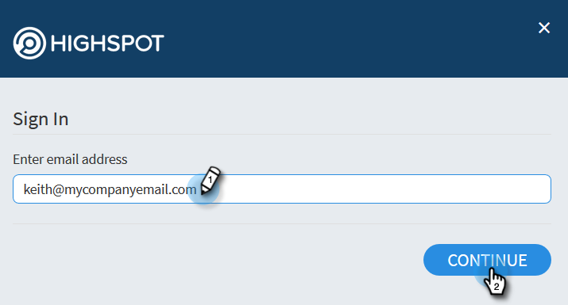

# Integratie van kenmerken {#highspot-integration}

De verkoop kan tot de mogelijkheden van de Marktprijs van de Acties van Insight van de Verkoop toegang hebben en grotere zichtbaarheid, efficiency, en prestaties door de verkoopcyclus bereiken. Gebruikers van Sales Insight Action kunnen verkoopinhoud selecteren die is opgeslagen op het platform voor verkoopactivering van Highspot en deze rechtstreeks invoegen in e-mails, e-mailsjablonen en verkoopcampagnes, terwijl ze de inhoud bijhouden en analyses vastleggen in de acties Highspot en Sales Insight.

## Marktintegratie inschakelen {#enabling-highspot-integration}

>[!NOTE]
>
>U moet beheerdersrechten hebben om Highspot in te schakelen voor uw exemplaar van Sales Insight Actions.

1. Klik het tandwielpictogram en selecteer **Montages**.

   

1. Onder **Montages Admin**, uitgezochte **Algemeen**.

   

1. De rol aan **kaart van de Integratie** en klikt de schuif om Hoogtepunt toe te laten.

   

Gebruikers zien nu een optie om Markering te selecteren wanneer ze de knop voor het uploaden van inhoud selecteren in het samenstellingsvenster, de sjablooneditor en de e-maileditor voor de campagne.

## Toegang krijgen tot inhoud van Highspot en inhoud delen via e-mail {#accessing-highspot-content}

U kunt Markering openen en inhoud toevoegen aan uw e-mailberichten via het samenstellingsvenster, de sjablooneditor en de e-maileditor voor verkoopcampagnes van Sales Insight. Hieronder vindt u de stappen voor toegang tot inhoud vanuit het samenstellingsvenster.

1. Creeer uw e-mailontwerp (er zijn veelvoudige manieren om dit te doen, in dit voorbeeld selecteren wij **samenstellen** in de kopbal).

   

1. Vul het veld Aan en voer een onderwerp in.

   

1. Schrijf je bericht. Klik op de plaats in de e-mail waar u de inhoud voor hooglichten wilt invoegen. Klik de pijldrop-down (naast het beeldpictogram) en selecteer **Hoogtepunt**.

   

1. Meld u aan bij uw Highspot-account (als u zich nog niet hebt aangemeld).

   

1. Selecteer uw gewenste inhoud en klik **toevoegen Inhoud** knoop.

   

   >[!TIP]
   >
   >Gebruik de zoekbalk boven aan het scherm als u de gewenste inhoud niet snel ziet.

   De inhoud wordt als een koppeling in uw e-mail weergegeven. De ontvanger kan op de koppeling klikken om deze weer te geven of te downloaden.

   

## Klikken bijhouden op hoge-steuninhoud {#tracking-clicks-on-highspot-content}

Wanneer ontvangers inhoud openen die u verzendt, wordt u op de hoogte gesteld in de live feed. De activiteit wordt weergegeven als een klik met details over de inhoudskoppeling. Bovendien worden de weergaven op de inhoud en downloads bijgehouden in Highspot.

