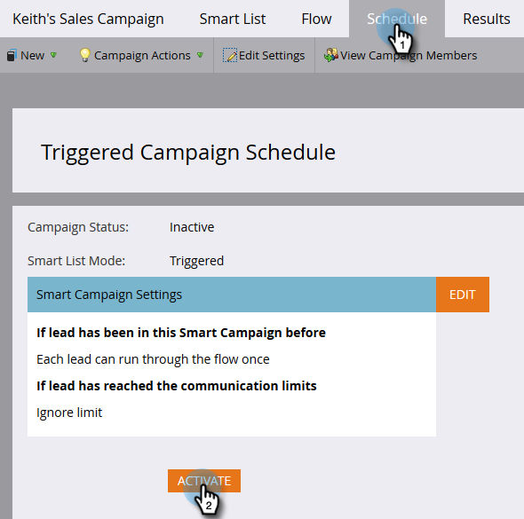

# Een marketingcampagne zichtbaar maken in Insight-acties voor verkoop {#make-a-marketing-campaign-visible-in-sales-insight-actions}

Campagnes kunnen alleen worden gedeeld als ze zichtbaar worden gemaakt.

Met Sales Insight Actions hebben gebruikers toegang tot een nieuwe verkoop-app met de naam toutapp.com. Deze app geeft hen een nieuwe reeks actiemogelijkheden, maar erft ook _toevoegt aan de Campagne van de Marketing_ eigenschap beschikbaar in de kernversie van de Inzichten van de Verkoop. Dit is belangrijk om in mening te houden, omdat afhankelijk van waar u gebruikers tot Add aan de eigenschap van de Campagne van de Marketing (toutapp.com of de het pakketervaring van MSI SFDC) wilt toegang hebben, uw campagnes van Marketo verschillend zullen moeten worden gevormd. Zie de nota in Stap 4 om meer te leren.

1. Selecteer (of maak) de campagne die u wilt delen.

   

1. Klik de **Slimme Lijst** tabel.

   

1. Voeg toe _Campagne wordt Gevraagde_ trekker.

   

1. Voor bron, kies &quot;is&quot; **de Dienst API van het Web**.

   

   >[!NOTE]
   >
   >Als u de marketing campagne aan gebruikers wilt tonen die _toevoegen aan de Campagne van de Marketing_ van toutapp.com (dit omvat ook als u Webtoepassing hebt ingebed in CRM via het voorwerp van de Verkoop van Marketo Outbox), plaats de Ontgevraagde bron van de Campagne aan &quot;de Dienst API van het Web.&quot; Als u wilt dat de marketingcampagne wordt weergegeven wanneer een gebruiker de acties in het MSI-deelvenster in Salesforce gebruikt op de lead, contact, accountpagina of de bulkactieknoppen in de weergaven van de lead- en contactlijst, werkt u de gevraagde bron van de campagne bij naar &quot;Sales Insight&quot;

1. Klik de **Stroom** tabel.

   

1. Voeg de _Interessant Moment_ stroomactie toe.

   

1. Voor Type, uitgezochte **Web**.

   

1. In de _doos van de Beschrijving_, schrijf een bericht aan uw verkoopteam. In dit voorbeeld gebruiken we tokens om het formulier op te geven dat is ingevuld.

   

1. Klik het **lusje van het 0&rbrace; Programma &lbrace;en** activeer **de campagne.**

   
