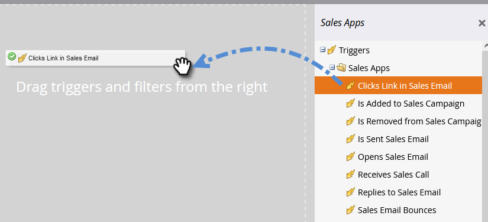

# Triggers en filters voor verkoopactiviteiten {#sales-activity-triggers-and-filters}

Als je de betrokkenheid van je verkoopteam beter wilt coördineren, of als je probeert een beter beeld te krijgen van hoe ze met klanten samenwerken over de heen-en-klantreis, zijn de inzichten in verkoopactiviteiten in Marketo nuttig voor je.

Volg de onderstaande stappen om te leren hoe u verkoopactiviteitfilters en -triggers kunt gebruiken in uw slimme campagnes.

1. Zoek en selecteer de gewenste slimme campagne.

   

1. Zoek op het tabblad **[!UICONTROL Smart List]** naar &quot;[!UICONTROL Sales Apps]&quot;.

   

1. Selecteer en sleep over het gewenste filter of de gewenste trigger.

   

1. Selecteer de gewenste restricties.

   

>[!NOTE]
>
>Voor een volledige lijst van activiteiten, beperkingen, en definities controleren onze [[!DNL Sales Insight Actions]  Verklarende woordenlijst van de Activiteit ](/help/marketo/product-docs/marketo-sales-insight/actions/marketo/sales-insight-actions-activity-glossary.md).
