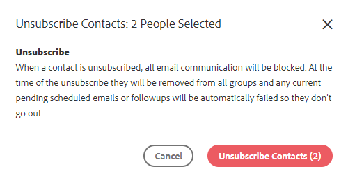

# Bulkacties op personen {#bulk-actions-on-people}

Er zijn een paar dingen u met uw contacten in bulk kunt doen om tijd te besparen.

De eerste stap voor alle beschikbare bulkacties is twee of meer contacten te selecteren, en de gegevens (drie verticale punten) te klikken.

## Personen aan groep toevoegen {#add-people-to-group}

Meerdere personen tegelijk aan een groep toevoegen.

## Bron {#source}

Wij wijzen automatisch een bron aan elk contact toe dat het gegevensbestand ingaat. Gebruik deze stap om die bron bij te werken.

>[!NOTE]
>
>Bronnen kunnen niet worden aangepast.

## Toestemming {#authorization}

In overeenstemming met [ GDPR ](https://eugdpr.org/), gebruik vergunning om erop te wijzen hoe u toestemming om met deze contacten in dienst te nemen ontving.

## Abonnement opzeggen {#unsubscribe}

Voer een bulksgewijs abonnement op contacten uit die niet meer correspondentie van u wensen te ontvangen.

