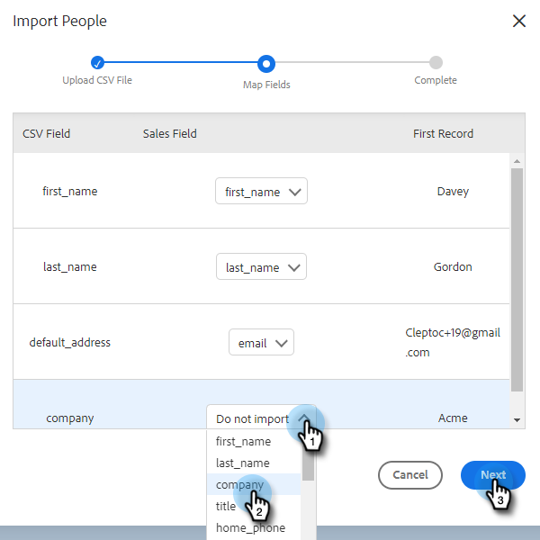

# Contacten importeren via CSV {#import-contacts-via-csv}

Het is belangrijk dat u contacten hebt op de pagina Personen, omdat wij hier automatisch persoonlijke gegevens invullen in de dynamische velden in uw sjablonen. Zorg ervoor dat u ten minste een naam en een e-mailadres hebt voor elke contactpersoon in de CSV en dat u een koppeling naar deze velden maakt.

1. Selecteer uw groep (of maak een nieuwe groep) op het tabblad Personen.

   

1. Klikken **Handelingen groeperen** en selecteert u **CSV importeren**.

   

1. Klikken **Bladeren**.

   

1. Zoek het gewenste bestand op de computer en selecteer het.

   >[!NOTE]
   >
   >Groepen zijn beperkt tot 1000 contacten.

1. Klikken **Volgende**.

   

1. Wijs de kolommen in uw CSV aan hun respectieve gebieden in Verkoop toe verbindt. Klikken **Volgende** wanneer gereed.

   
