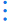
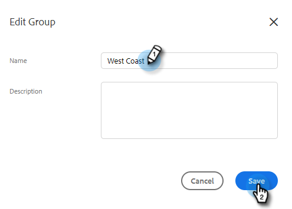

# Groepen beheren {#manage-groups}

Leer hoe u uw groepen beheert in [!DNL Sales Insight Actions] .

## Groepstypen {#group-types}

<table>
 <colgroup>
  <col>
  <col>
 </colgroup>
 <tbody>
  <tr>
   <th>Groep</th>
   <th>Beschrijving</th>
  </tr>
  <tr>
   <td>[!UICONTROL All People]</td>
   <td>Alle contacten van alle gebruikers die aan u zichtbaar zijn.</td>
  </tr>
  <tr>
   <td>[!UICONTROL Dynamic Groups]</td>
   <td>Mijn Contacten: Alle contacten u bezit.  Unsubscribes: Contacten die verkiesden-uit het ontvangen van correspondentie hebben.</td>
  </tr>
  <tr>
   <td>[!UICONTROL My Groups]</td>
   <td>Groepen die u hebt gemaakt. Zij kunnen uw contacten, of contacten bevatten die met u zijn gedeeld.</td>
  </tr>
  <tr>
   <td>[!UICONTROL Team Groups]</td>
   <td>Groepen die met en/of door u zijn gedeeld. Zij kunnen contacten uw teamgenoten, of contacten bevatten u met hen hebt gedeeld.</td>
  </tr>
 </tbody>
</table>

## Een groep maken {#create-a-group}

1. Klik op de pagina [!UICONTROL People] op **+** naast [!UICONTROL Groups] .

   

1. Geef de groep een naam en klik op **[!UICONTROL Create]** .

   

   Dat is het!

## Contactpersonen toevoegen aan een groep {#add-contacts-to-a-group}

1. Onder _Groepen_, uitgezochte **Alle Mensen**.

   

1. Zoek de persoon of personen die u wilt toevoegen.

   

1. Klik op het selectievakje naast hun naam om ze te selecteren.

   

1. Klik het meer actiepictogram () en selecteer **Voeg Mensen aan Groep** toe.

   

1. Selecteer de groep u hen aan wilt toevoegen en **klikken voegt** toe.

   

## Een groep delen {#share-a-group}

1. Zoek op de pagina [!UICONTROL People] naar de groep die u wilt delen en selecteer deze.

   

1. Klik op de gegevens (drie verticale stippen) en selecteer **[!UICONTROL Share]** .

   

1. Klik op de vervolgkeuzelijst, kies het team waarmee u de groep wilt delen en klik op **[!UICONTROL Share]** .

   

   U bezit nog de groep, maar het zal nu onder _Groepen van het Team_ verschijnen.

## Delen van een groep opheffen {#unshare-a-group}

1. Zoek op de pagina [!UICONTROL People] naar de groep waarvan u het delen wilt opheffen en selecteer deze.

   

1. Klik op de gegevens (drie verticale stippen) en selecteer **[!UICONTROL Share]** .

   

1. Klik **X** naast het team u de groep met deelde, dan klik uit modaal.

   

   De groep wordt nu niet gedeeld.

## De naam van een groep wijzigen {#rename-a-group}

1. Zoek op de pagina [!UICONTROL People] naar de groep waarvan u de naam wilt wijzigen en selecteer deze.

   

1. Klik op de gegevens (drie verticale stippen) en selecteer **[!UICONTROL Edit]** .

   

1. Typ de nieuwe naam en klik op **[!UICONTROL Save]** .

   

## Een groep verwijderen {#delete-a-group}

1. Zoek en selecteer op de pagina Personen de groep die u wilt verwijderen.

   

1. Klik op de gegevens (drie verticale stippen) en selecteer **[!UICONTROL Delete]** .

   

1. Klik op **[!UICONTROL Delete]** om te bevestigen.

   
