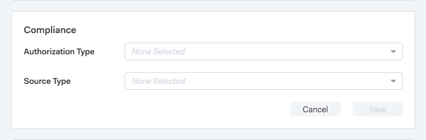
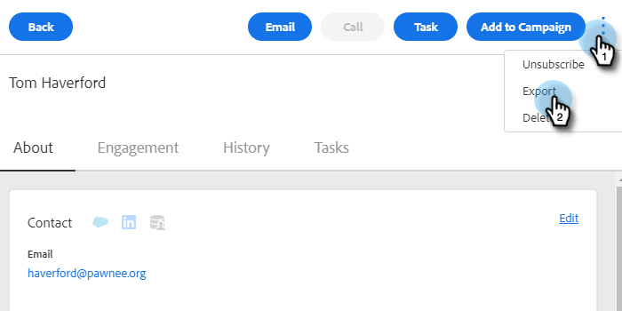

# Insight-acties voor verkoop en GDPR-compatibiliteit {#sales-insight-actions-and-gdpr-compliance}

De algemene gegevensbeschermingsverordening (GDPR) is wetgeving van de Europese Unie die op 25 mei 2018 in werking is getreden.

## Overzicht {#overview}

Het doel van de richtlijn is de rechten van betrokkenen binnen de Europese Unie (EU) en de Europese Economische Ruimte (EER) te versterken met betrekking tot de wijze waarop hun persoonsgegevens worden gebruikt en beschermd. &quot;Persoonsgegevens&quot; zijn gegevens die betrekking hebben op een geïdentificeerde of identificeerbare natuurlijke persoon.

De GDPR is gestructureerd rond zes basisbeginselen (nader omschreven in artikel 5 van de wetgeving):

1. Transparantie over de wijze waarop en waarvoor gegevens zullen worden gebruikt.
1. Ervoor zorgen dat de verzamelde gegevens alleen worden gebruikt voor de doeleinden die uitdrukkelijk op het tijdstip van de verzameling worden vermeld.
1. De gegevensverzameling beperken tot wat nodig is voor het doel waarvoor ze wordt verzameld.
1. Ervoor zorgen dat de gegevens correct zijn.
1. De gegevens worden slechts opgeslagen zolang als nodig is binnen het beoogde doel.
1. Preventie tegen ongeoorloofd gebruik of onopzettelijk verlies van gegevens door het nemen van passende beveiligingsmaatregelen.

Bovendien is er een nieuwe verantwoordingsplicht om te kunnen aantonen hoe naleving wordt beheerd en gevolgd. Dit betekent dat er een register moet worden bijgehouden van hoe en waarom persoonsgegevens zijn verzameld en van de processen die zijn ingevoerd om deze te beschermen.

## Op wie is het van toepassing? {#to-whom-does-it-apply}

De GDPR is van toepassing op elke organisatie binnen of buiten de EU die goederen of diensten verkoopt aan en/of het gedrag volgt van betrokkenen binnen de EU en de EER. Als je zaken doet met betrokkenen in Europa die de verwerking van hun persoonsgegevens impliceren, dan is deze wetgeving op jou van toepassing. De sancties wegens niet-naleving zijn aanzienlijk, met grote boetes voor degenen die de verordening overtreden; de maximumboete voor één enkele inbreuk bedraagt 20 miljoen euro of 4% van de wereldwijde jaaromzet, afhankelijk van wat het grootst is.

## Implicaties voor marketing {#implications-for-marketing}

De handelaars streven ernaar klantenervaringen tot stand te brengen die persoonlijk en menselijk voelen, gebaseerd op vertrouwen en met zorg geleverd. Hoewel de GDPR deze termen niet gebruikt, zijn de doelen hetzelfde: de rechten van klanten respecteren en hun vertrouwen verdienen. Om dat vertrouwen te kunnen opbouwen en behouden, moeten marketers zich houden aan de manier waarop, wanneer en waarom hun klanten betrokken willen zijn. Het is van essentieel belang dat de voorkeuren van de klant worden gerespecteerd, niet alleen als een wettelijke vereiste, maar ook als de basis van klantgerichte betrokkenheidspraktijken.

Hoe de marketeers deze hogere verwachtingen rond de inzameling, het gebruik, en de veiligheid van de persoonlijke gegevens richten die routinematig in de loop van hun werk worden gebruikt is zeer belangrijk, en Marketo kan helpen met het voldoen aan die verwachtingen.

Er zijn twee belangrijke aspecten van de GDPR waar marketers vroegere, huidige en toekomstige praktijken moeten herzien. Het eerste punt is de instemming van het individu om zijn persoonsgegevens te verwerken, en het tweede is de verantwoordingsplicht, namelijk het kunnen aantonen van de naleving van de beginselen van de GDPR.

Wij verstrekken uitgebreide informatie over toestemming en verantwoordingsplicht binnen het platform van Marketo in ons e-boek, [ GDPR en de Marketer ](https://www.marketo.com/ebooks/the-gdpr-and-the-marketer/). In dit artikel zullen we ons echter specifiek richten op de nieuwe functies in [!DNL Sales Insight Actions] die uw organisatie zullen helpen zich aan de GDPR-regels te houden.

## GDPR-compatibiliteit in [!DNL Sales Insight Actions] {#gdpr-compliance-in-marketo-sales-connect}

[!DNL Sales Insight Actions] is een krachtige toepassing—onderdeel van het Marketo Engagement Platform—die één workflow en weergave biedt voor verkoop en marketing, zodat de pijpleiding gezamenlijk sneller verloopt via collectieve betrokkenheid. Er is nieuwe functionaliteit in [!DNL Sales Insight Actions] gemaakt die specifiek is afgestemd op GDPR. Wij zullen alle drie functies schetsen en uitleggen hoe zij, wanneer correct gebruikt, de naleving van GDPR van uw organisatie zullen helpen.

## Compatibiliteitskaart {#compliance-card}

[!DNL Sales Insight Actions] omvat een Kaart van de Naleving in de Mening van het Detail van de Persoon om zeer belangrijke informatie over het Type van Vergunning van een contact, evenals hun Type van Source te verstrekken. Hierdoor kunnen gebruikers eenvoudig informatie toevoegen en bijhouden die essentieel is voor de privacy van gegevens en kunnen ze beter geïnformeerde beslissingen nemen over de strategie voor campagne en outreach.

**Type van Vergunning van het Contact**

Binnen de Kaart van de Naleving, kunnen de gebruikers de wettelijke basis voor de verwerking van de persoonsgegevens van een contact door de drop-down van de Vergunning volgen. Als u het autorisatietype van een contactpersoon begrijpt, kunnen [!DNL Sales Insight Actions] -gebruikers beter geïnformeerde beslissingen nemen over outreachepraktijken, zodat elke campagne of betrokkenheid legaal en geschikt is.

Gebruikers kunnen kiezen uit een groot aantal opties, waaronder:

* Toestemming
* Gewettigd belang
* Uitvoering van een opdracht
* Naleving van de wettelijke verplichting
* Bescherming van vitale belangen
* Openbaar belang/Overheidsinstantie
* Anders

**het Type van Source van het Contact**

Binnen de nieuwe Kaart van de Naleving, kunnen de gebruikers de bron van een contact volgen. Het Source-type definieert waar de contactgegevens vandaan komen wanneer deze voor het eerst worden geüpload naar [!DNL Sales Insight Actions] . Een goed begrip van het brontype van een contactpersoon helpt ook bij beslissingen over outreach-praktijken, en bepaalt welke andere systemen of locaties persoonsgegevens worden opgeslagen, zodat elke betrokkenheid in overeenstemming is met de GDPR-wetgeving.

Ook hier hebben gebruikers een groot aantal keuzemogelijkheden waaruit ze kunnen kiezen, waaronder:

* [!UICONTROL CRM Sync]
* [!UICONTROL Import]
* [!UICONTROL Manual Upload]
* [!UICONTROL Chrome Extension]
* [!UICONTROL Other]

**Uitgevend de Kaart van de Naleving**

Wanneer de weergave Details persoon is geopend, klikt u op **[!UICONTROL Edit]** in de compatibiliteitskaart.

Er worden twee keuzemenu&#39;s weergegeven: [!UICONTROL Authorization Type] en [!UICONTROL Source Type] .

Als u &quot;Toestemming&quot;als [!UICONTROL Authorization Type] kiest, zullen twee verplichte gebieden: &quot;[!UICONTROL Date of Consent]&quot;en &quot;[!UICONTROL Purpose of Processing]&quot;verschijnen. Deze twee velden zijn niet van toepassing op andere opties.

Als &quot;[!UICONTROL Other]&quot; is gekozen voor [!UICONTROL Authorization Type] of [!UICONTROL Source Type] , kunt u tekst invoeren om de [!UICONTROL Source Type] te beschrijven.

**Bulk Acties**

[!DNL Sales Insight Actions] staat ook voor het bijwerken van de Vergunning van een contact en de types van Source in bulk toe, die kostbare tijd in het nalevingsproces besparen.

Wanneer u een of meer contactpersonen op de pagina [!UICONTROL People] selecteert, wordt rechts een puntmenu weergegeven. Klik erop en je ziet Autorisatie en Source zijn opties. U kunt de Vergunning of Source van veelvoudige contacten tezelfdertijd plaatsen.

Wanneer u op de modaal van de Vergunning klikt, verschijnt een pop-up met drop-down opties die degenen in de Kaart van de Naleving aanpassen.

Nadat [!UICONTROL Authorization] Type wordt bijgewerkt, zult u een bevestigingspop-up ontvangen, en u zult de bijgewerkte details in de Kaart van de Naleving in de Mening van het Detail van de Persoon kunnen zien.

Het Source Type kan ook bulksgewijs worden bijgewerkt door op het Source-model te klikken.

Nadat u het juiste Source-type voor de geselecteerde contactpersonen hebt geselecteerd, wordt een bevestigingsvenster weergegeven ter bevestiging van de geslaagde update.

## Contactgegevens exporteren uit [!DNL Sales Insight Actions] {#exporting-contact-data-from-marketo-sales-connect}

U kunt contactgegevens exporteren uit de weergave Details persoon. Bij het exporteren wordt een CSV-bestand met de volgende kolommen gedownload:

<table>
 <colgroup>
  <col>
  <col>
  <col>
 </colgroup>
 <tbody>
  <tr>
   <td>[!UICONTROL First Name]</td>
   <td>[!UICONTROL Website]</td>
   <td>[!DNL Facebook]</td>
  </tr>
  <tr>
   <td>[!UICONTROL Last Name]</td>
   <td>[!UICONTROL Other]</td>
   <td>[!DNL Twitter]</td>
  </tr>
  <tr>
   <td>[!UICONTROL Company]</td>
   <td>[!UICONTROL Updated At]</td>
   <td>[!DNL LinkedIn]</td>
  </tr>
  <tr>
   <td>[!UICONTROL Title]</td>
   <td>[!UICONTROL Created At]</td>
   <td>[!UICONTROL Exported At]</td>
  </tr>
  <tr>
   <td>[!UICONTROL Email ID]</td>
   <td>[!DNL Salesforce] ID</td>
   <td> </td>
  </tr>
  <tr>
   <td>[!UICONTROL Phone Number]</td>
   <td>[!UICONTROL Person ID]</td>
   <td> </td>
  </tr>
 </tbody>
</table>

>[!NOTE]
>
>Dit kan slechts één contact tegelijkertijd worden gedaan. Er is momenteel geen functionaliteit die bulkexport van contacten toestaat.

Als u contactgegevens wilt exporteren, klikt u op de drie verticale punten in de koptekst van de Gedetailleerde weergave voor personen en selecteert u **[!UICONTROL Export]** . Het .CSV-bestand wordt automatisch gedownload.

>[!NOTE]
>
>De GDPR vereist ook de capaciteit om contacten van UI te schrappen, maar [!DNL Sales Insight Actions] bezit reeds deze functionaliteit.

## Abonnementen opzeggen {#unsubscribes}

Een algemeen verkeerd begrepen gebied van GDPR omvat contacten die van het gegevensbestand van de organisatie afmelden. Om aan nieuwe regels te voldoen rond de bescherming van de gegevens van degenen die verkiezen om af te melden, is de volgende functionaliteit inbegrepen in [!DNL Sales Insight Actions]:

**trekt Verbindingen af:** Unsubscribe de verbindingen zullen automatisch aan alle e-mail worden toegevoegd die van de het Webtoepassing van de Verkoop wordt verzonden Connect om ervoor te zorgen dat de contacten een toegankelijke manier aan opt-out worden gegeven.
**Unsubscribe Synchronisatie:** de gebruikers kunnen afmelden aan en van hun CRM (Salesforce) synchroniseren om ervoor te zorgen dat opt-outs bijgewerkt zijn.
**Unsubscribe Geschiedenis:** de gebruikers kunnen historische opt-outs en opt-ins in de Mening van het Detail van de Persoon zien.
**Unsubscribe Verwijderen:** het Opteren van een unsubscribed contact terug binnen vereist de gebruiker om admin voorrechten te hebben en aan te tonen dat het contact nieuwe toestemming heeft gegeven om hen te contacteren.

## Toekomstige updates {#future-updates}

Als een enthousiast pleitbezorger van de kracht en de klantgerichtheid van de service-economie begrijpt Marketo het belang van het in handen brengen van de betrokkene van privacy en gegevensbescherming. Net als bij andere wetten inzake gegevensbescherming vereist GDPR-naleving betrokkenheid van zowel Marketo als onze klanten. Dit artikel is bedoeld om u te helpen Marketo op een geschikte manier te gebruiken om de naleving van GDPR van uw organisatie te steunen.

We zullen de toepasselijke GDPR-richtsnoeren van regelgevende instanties en aanverwante wetgeving op de voet blijven volgen. De updates zullen aan ons Centrum van het Vertrouwen in [ trust.marketo.com ](https://trust.marketo.com) worden gepost.
