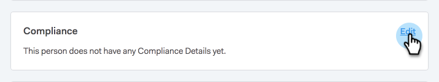

# Handelingen voor het toezicht op de verkoop en naleving van GDPR {#sales-insight-actions-and-gdpr-compliance}

De algemene gegevensbeschermingsverordening (GDPR) is wetgeving van de Europese Unie die op 25 mei 2018 in werking is getreden.

## Overzicht {#overview}

Het doel is de rechten van betrokkenen binnen de Europese Unie (EU) en de Europese Economische Ruimte (EER) te versterken met betrekking tot de wijze waarop hun persoonsgegevens worden gebruikt en beschermd. &quot;Persoonsgegevens&quot; zijn gegevens die betrekking hebben op een geïdentificeerde of identificeerbare natuurlijke persoon.

De GDPR is gestructureerd rond zes basisbeginselen (nader omschreven in artikel 5 van de wetgeving):

1. Transparantie over de wijze waarop en waarvoor gegevens zullen worden gebruikt.
1. Ervoor zorgen dat de verzamelde gegevens alleen worden gebruikt voor de doeleinden die uitdrukkelijk op het tijdstip van de verzameling worden vermeld.
1. De gegevensverzameling beperken tot wat nodig is voor het doel waarvoor ze wordt verzameld.
1. Ervoor zorgen dat de gegevens correct zijn.
1. De gegevens worden slechts opgeslagen zolang als nodig is binnen het beoogde doel.
1. Preventie tegen ongeoorloofd gebruik of onopzettelijk verlies van gegevens door het nemen van passende beveiligingsmaatregelen.

Bovendien is er een nieuwe verantwoordingsplicht om te kunnen aantonen hoe naleving wordt beheerd en gevolgd. Dit betekent dat er een register moet worden bijgehouden van hoe en waarom persoonsgegevens zijn verzameld en van de processen die zijn ingevoerd om deze te beschermen.

## Op wie is het van toepassing? {#to-whom-does-it-apply}

De GDPR is van toepassing op elke organisatie binnen of buiten de EU die goederen of diensten verkoopt aan en/of het gedrag volgt van betrokkenen binnen de EU en de EER. Als je zaken doet met betrokkenen in Europa die de verwerking van hun persoonsgegevens impliceren, dan is deze wetgeving op jou van toepassing. De sancties wegens niet-naleving zijn aanzienlijk, met grote boetes voor degenen die de verordening overtreden; de maximumboete voor één enkele inbreuk bedraagt 20 miljoen eur of 4 % van de wereldwijde jaaromzet , afhankelijk van welk bedrag het grootst is .

## Implicaties voor marketing {#implications-for-marketing}

De handelaars streven ernaar klantenervaringen tot stand te brengen die persoonlijk en menselijk voelen, gebaseerd op vertrouwen en met zorg geleverd. Hoewel de GDPR deze termen niet gebruikt, zijn de doelen hetzelfde: de rechten van klanten respecteren en hun vertrouwen verdienen. Om dat vertrouwen te kunnen opbouwen en behouden, moeten marketers zich houden aan de manier waarop, wanneer en waarom hun klanten betrokken willen zijn. Het is van essentieel belang dat de voorkeuren van de klant worden gerespecteerd, niet alleen als een wettelijke vereiste, maar ook als de basis van klantgerichte betrokkenheidspraktijken.

Hoe de marketeers deze hogere verwachtingen rond de inzameling, het gebruik, en de veiligheid van de persoonlijke gegevens richten die routinematig in de loop van hun werk worden gebruikt is zeer belangrijk, en Marketo kan helpen met het voldoen aan die verwachtingen.

Er zijn twee belangrijke aspecten van de GDPR waar marketers vroegere, huidige en toekomstige praktijken moeten herzien. Het eerste punt is de instemming van het individu om zijn persoonsgegevens te verwerken, en het tweede is de verantwoordingsplicht, namelijk het kunnen aantonen van de naleving van de beginselen van de GDPR.

Wij verstrekken uitgebreide informatie over instemming en verantwoordingsplicht binnen het Marketo-platform in ons e-boek, [GDPR en de Marketer](https://www.marketo.com/ebooks/the-gdpr-and-the-marketer/). In dit artikel, echter, zullen wij specifiek op de nieuwe eigenschappen in de Acties van het Inzicht van de Verkoop concentreren die uw organisatie zullen helpen zich aan de regels van GDPR houden.

## GDPR-conformiteit in Handelingen voor verkoopinzicht {#gdpr-compliance-in-marketo-sales-connect}

Handelingen van het Inzicht van de verkoop is een krachtige toepassing-deel van het Platform van de Betrokkenheid van Marketo-die één enkele werkschema en mening voor verkoop en marketing verstrekt om pijpleiding door samenwerkingsovereenkomst samen sneller te drijven. De nieuwe functionaliteit in de Acties van het Inzicht van de Verkoop is gecreeerd specifiek met naleving GDPR in mening. Wij zullen alle drie functies schetsen en uitleggen hoe zij, wanneer correct gebruikt, de naleving van GDPR van uw organisatie zullen helpen.

## Compatibiliteitskaart {#compliance-card}

De Acties van het Inzicht van de verkoop omvatten een Kaart van de Naleving in de Mening van het Detail van de Persoon om zeer belangrijke informatie over het Type van Vergunning van een contact, evenals hun Brontype te verstrekken. Hierdoor kunnen gebruikers eenvoudig informatie toevoegen en bijhouden die essentieel is voor de privacy van gegevens en kunnen ze beter geïnformeerde beslissingen nemen over de strategie voor campagne en outreach.

**Type contactautorisatie**

Binnen de Kaart van de Naleving, kunnen de gebruikers de wettelijke basis voor de verwerking van de persoonsgegevens van een contact door de drop-down van de Vergunning volgen. Als u het machtigingstype van een contactpersoon begrijpt, kunnen gebruikers van Sales Insight-acties beter geïnformeerde beslissingen nemen over outreach-praktijken, zodat elke campagne of betrokkenheid legaal en geschikt is.

Gebruikers kunnen kiezen uit een groot aantal opties, waaronder:

* Toestemming
* Gewettigd belang
* Uitvoering van een opdracht
* Naleving van de wettelijke verplichting
* Bescherming van vitale belangen
* Openbaar belang/Overheidsinstantie
* Anders

**Brontype van contactpersoon**

Binnen de nieuwe Kaart van de Naleving, kunnen de gebruikers de bron van een contact volgen. Het brontype bepaalt waar de informatie van een contact van kwam toen aanvankelijk geupload in de Acties van het Inzicht van de Verkoop. Een goed begrip van het brontype van een contactpersoon helpt ook bij beslissingen over outreach-praktijken, en bepaalt welke andere systemen of locaties persoonsgegevens worden opgeslagen, zodat elke betrokkenheid in overeenstemming is met de GDPR-wetgeving.

Ook hier hebben gebruikers een groot aantal keuzemogelijkheden waaruit ze kunnen kiezen, waaronder:

* CRM-synchronisatie
* Importeren
* Handmatig uploaden
* Chrome-extensie
* Anders

**De compatibiliteitskaart bewerken**

Wanneer de weergave Details persoon is geopend, klikt u op **Bewerken** in de compatibiliteitskaart.

Er worden twee keuzelijsten weergegeven: Type autorisatie en type bron.

Als u &quot;Toestemming&quot;als Type van Vergunning kiest, twee verplichte gebieden: &quot;Datum van toestemming&quot; en &quot;Doel van verwerking&quot; worden weergegeven. Deze twee velden zijn niet van toepassing op andere opties.

Als &quot;Andere&quot;voor of het Type van Vergunning of het Type Bron wordt gekozen, kunt u tekst ingaan om het Type Bron te beschrijven.

**Bulkhandelingen**

De Acties van het Inzicht van de verkoop staan ook voor het bijwerken van de Vergunning van een contact en Brontypes in bulk toe, die waardevolle tijd in het nalevingsproces besparen.

Wanneer u een of meer contactpersonen op de pagina Personen selecteert, wordt rechts een puntmenu weergegeven. Klik het, en u zult Authorization zien en de Bron zijn opties. U kunt de Vergunning of Bron van veelvoudige contacten gelijktijdig plaatsen.

Wanneer u op de modaal van de Vergunning klikt, verschijnt een pop-up met drop-down opties die degenen in de Kaart van de Naleving aanpassen.

Nadat het Type van Vergunning wordt bijgewerkt, zult u een bevestigingspop-up ontvangen, en u zult de bijgewerkte details in de Kaart van de Naleving in de Mening van het Detail van de Persoon kunnen zien.

Ook kan het Type Bron bulksgewijs worden bijgewerkt door de Bron modaal te klikken.

Na het selecteren van het correcte Brontype voor uw geselecteerde contacten, zal een bevestigingsvenster verschijnen om de succesvolle update te bevestigen.

## Het uitvoeren van contactgegevens van de Acties van het Inzicht van de Verkoop {#exporting-contact-data-from-marketo-sales-connect}

U hebt de capaciteit om contactinformatie van de Mening van het Detail van de Persoon uit te voeren. Bij het exporteren wordt een CSV-bestand met de volgende kolommen gedownload:

<table> 
 <colgroup> 
  <col> 
  <col> 
  <col> 
 </colgroup> 
 <tbody> 
  <tr> 
   <td>Voornaam</td> 
   <td>Website</td> 
   <td>Facebook</td> 
  </tr> 
  <tr> 
   <td>Achternaam</td> 
   <td>Anders</td> 
   <td>Twitter</td> 
  </tr> 
  <tr> 
   <td>Bedrijf</td> 
   <td>Bijgewerkt op</td> 
   <td>LinkedIn</td> 
  </tr> 
  <tr> 
   <td>Titel</td> 
   <td>Gemaakt op</td> 
   <td>Geëxporteerd op</td> 
  </tr> 
  <tr> 
   <td>E-mailid</td> 
   <td>Salesforce-id</td> 
   <td> </td> 
  </tr> 
  <tr> 
   <td>Telefoonnummer</td> 
   <td>Persoon-id</td> 
   <td> </td> 
  </tr> 
 </tbody> 
</table>

>[!NOTE]
>
>Dit kan slechts één contact tegelijkertijd worden gedaan. Er is momenteel geen functionaliteit die bulkexport van contacten toestaat.

Als u contactgegevens wilt exporteren, klikt u op de drie verticale stippen in de koptekst van de Gedetailleerde weergave voor personen en selecteert u **Exporteren**. Het .CSV-bestand wordt automatisch gedownload.

>[!NOTE]
>
>De GDPR vereist ook de capaciteit om contacten van UI te schrappen, maar de Acties van het Inzicht van de Verkoop bezit reeds deze functionaliteit.

## Abonnementen opzeggen {#unsubscribes}

Een algemeen verkeerd begrepen gebied van GDPR omvat contacten die van het gegevensbestand van de organisatie afmelden. Om aan nieuwe regels te houden rond het beschermen van de gegevens van degenen die verkiezen om af te melden, is de volgende functionaliteit inbegrepen in de Acties van het Inzicht van de Verkoop:

**Koppelingen opzeggen:** Koppelingen voor abonnementen worden automatisch toegevoegd aan alle e-mails die vanuit de webtoepassing Sales Connect worden verzonden om ervoor te zorgen dat contactpersonen een toegankelijke manier krijgen om te weigeren.\
**Synchronisatie opzeggen:** Gebruikers kunnen hun abonnement op en van hun CRM (Salesforce) synchroniseren om ervoor te zorgen dat de opt-outs up-to-date zijn.\
**Abonnementsgeschiedenis opzeggen:** Gebruikers kunnen historische opt-outs en opt-ins zien in de weergave Details persoon.\
**Abonnement verwijderen opzeggen:** Als u een niet-geabonneerd contact weer wilt openen, moet de gebruiker beschikken over beheerdersrechten en aantonen dat het contact nieuwe toestemming heeft gegeven om contact met hen op te nemen.

## Toekomstige updates {#future-updates}

Als een enthousiast pleitbezorger van de kracht en de klantgerichtheid van de service-economie begrijpt Marketo het belang van het in handen brengen van de betrokkene van privacy en gegevensbescherming. Net als bij andere wetten inzake gegevensbescherming vereist GDPR-naleving betrokkenheid van zowel Marketo als onze klanten. Dit artikel is bedoeld om u te helpen Marketo op een geschikte manier te gebruiken om de naleving van GDPR van uw organisatie te steunen.

We zullen de toepasselijke GDPR-richtsnoeren van regelgevende instanties en aanverwante wetgeving op de voet blijven volgen. Updates worden naar ons Trust Center gepost op [trust.marketo.com](https://trust.marketo.com).
