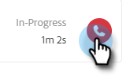

# Resultaten bellen {#call-outcomes}

Sta uw verkoopteams toe om vraagresultaten te selecteren wanneer het maken van vraag zodat kan uw team het effect van uw inspanningen van de klantenovereenkomst begrijpen.

>[!NOTE]
>
>**vereiste toestemmingen Admin**

## Laat de Resultaten van de Vraag toe {#enable-call-outcomes}

1. Klik op het tandwielpictogram en selecteer **Montages**.

   

1. Onder de Montages van Admin selecteren **Dialer**.

   

1. Selecteer **laat de Resultaten van de Vraag** toe.

   

1. Kies uw gewenste eis van het vraagresultaat.

   

## Creeer de Resultaten van de Vraag {#create-call-outcomes}

>[!NOTE]
>
>U kunt een maximum van 15 Resultaten van de Vraag tot stand brengen.

1. Klik op het tandwielpictogram en selecteer **Montages**.

   

1. Onder de Montages van Admin selecteren **Dialer**.

   

1. Klik **leiden de Resultaten van de Vraag**.

   

1. Ga uw gewenste naam van het vraagresultaat in het tekstgebied in.

   

1. Klik op de vervolgkeuzelijst Beantwoord en kies het resultaattype (in dit voorbeeld kiezen we Beantwoord). Dan klik **toevoegen**.

   

## Kies een Resultaat van de Vraag {#choose-a-call-outcome}

Zodra de vraagresultaten zijn toegelaten. De gebruikers kunnen één selecteren terwijl het maken van een vraag.

1. Klik de vraagknoop om dialer te lanceren.

   

1. Ga de vraaginformatie in dialer in en klik **Vraag**.

   

1. Selecteer het vraagresultaat dat het best de vraag beschrijft.

   

1. Beëindig de vraag.

   

1. Logboek de vraag.

   

>[!MORELIKETHIS]
>
>* [&#x200B; Redenen van de Vraag van het Logboek en de Resultaten van de Vraag aan Salesforce &#x200B;](/help/marketo/product-docs/marketo-sales-insight/actions/phone/log-call-reasons-and-call-outcomes-to-salesforce.md)
>* [&#x200B; Redenen van de Vraag &#x200B;](/help/marketo/product-docs/marketo-sales-insight/actions/phone/call-reasons.md)
