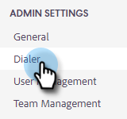
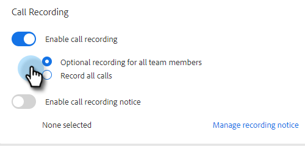

# Schakel Call Recording in {#enable-call-recording}

Als beheerder kunt u vraagopname voor uw [!DNL Sales Insight Actions] vraag toelaten. Het registreren van de vraag van uw team kan een grote manier zijn om uw verkoopvertegenwoordigers op de beste roepende praktijken te coderen.

1. Klik op het pictogram Instellingen en selecteer **[!UICONTROL Settings]** .

   

1. Klik onder [!UICONTROL Admin Settings] op **[!UICONTROL Dialer]** .

   

1. Selecteer de **[!UICONTROL Enable call recording]** -schakeloptie.

   

1. Als je verkopers de mogelijkheid wilt geven om het opnemen van oproepen voor zichzelf in of uit te schakelen, klik je op **[!UICONTROL Optional recording for all team members]** . Klik op **[!UICONTROL Record all calls]** als u alle aanroepen automatisch wilt laten opnemen.

   

>[!MORELIKETHIS]
>
>[ Twee-partij de Montages van de Toestemming ](/help/marketo/product-docs/marketo-sales-insight/actions/phone/two-party-consent-settings.md)
