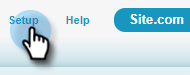
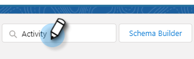

# De Redenen van de Vraag van het logboek en de Resultaten van de Vraag van Salesforce {#log-call-reasons-and-call-outcomes-to-salesforce}

Als u vraagresultaten en vraagredenen aan Salesforce voor het melden of zichtbaarheidsdoeleinden wilt registreren, kunt u een gebied van de douaneactiviteit voor elk tot stand brengen. Voor elk veld moet een specifieke API-naam worden gebruikt (in Salesforce wordt &#39;&#39;veldnaam&#39;&#39; genoemd).

* De Naam van het Gebied van Resultaten van de vraag: mktosales_call_result
* Naam veld Redenen aanroepen: mktosales_call_reason

Als u deze velden wilt gebruiken, moet u het veld eerst maken als een veld voor aangepaste activiteit. Als u deze zichtbaar wilt maken voor gebruikers, moet u deze toevoegen aan de pagina-indeling van het taakobject.

## Salesforce Classic {#salesforce-classic}

### Aangepast activiteitsveld maken in Salesforce Classic  {#create-custom-activity-field-in-salesforce-classic}

1. Klik in Salesforce op **Instellen**.

   

1. Typ &quot;Activiteiten&quot; in het vak Snel zoeken.

   

1. Klikken **Aangepaste velden activiteit**.

   

1. Klikken **Nieuw**.

   

1. Selecteer het gegevenstype &quot;Tekst&quot; en klik op **Volgende**.

   

1. Geef het aangepaste veld de veldnaam zoals hierboven gedefinieerd. De veldlengte mag niet langer zijn dan 255 tekens. Het Etiket van het gebied zal het gebied zichtbaar aan uw verkoopteam zijn en kan worden aangepast om aan de behoeften van uw team te voldoen.

   

1. De overige instellingen zijn optioneel. Zodra u de configuratie hebt voltooid, klik **Volgende**.

   

1. Selecteer de gewenste beveiligingsinstellingen op veldniveau voor dit veld en klik op **Volgende** (De onderstaande afbeelding is slechts een voorbeeld).

   

   >[!NOTE]
   >
   >Zorg ervoor het douanegebied aan het profiel zichtbaar is uw gebruikers van de Acties van het Inzicht van de Verkoop, samen met om het even welk ander u het zichtbaar zou willen.

1. Selecteer de paginalay-outs waaraan u het veld wilt toevoegen en klik op **Opslaan** (U kunt desgewenst op **Opslaan en nieuw** en herhaal het proces voor het gebied van de Reden van de Vraag).

   

### Aangepast activiteitenveld toevoegen aan taakpaginalay-out in Salesforce Classic {#add-custom-activity-field-to-task-page-layout-in-salesforce-classic}

>[!NOTE]
>
>U hoeft deze stappen alleen uit te voeren als u in Stap 9 hierboven de gewenste paginalay-out niet hebt geselecteerd.

1. Klik in Salesforce op **Instellen**.

   

1. Typ &quot;Taak&quot; in het vak Snel zoeken.

   

1. Klikken **Taakpagina-indelingen**.

   

1. Klikken **Bewerken** naast de indeling van de taakpagina waaraan u dit veld wilt toevoegen.

   

1. Sleep het veld naar het gewenste gedeelte van de taakpaginalay-out.

   

1. Klikken **Opslaan**.

   

## Salesforce Lightning {#salesforce-lightning}

### Aangepast activiteitenveld maken in Salesforce Lightning {#create-custom-activity-field-in-salesforce-lightning}

1. Klik in Salesforce op het tandwielpictogram rechtsboven en selecteer **Instellen**.

   

1. Klikken **Objectbeheer**.

   

1. Typ &quot;Activiteit&quot; in het vak Snel zoeken.

   

1. Klik op de knop **Activiteit** label.

   

1. Klikken **Velden en relaties**.

   

1. Klikken **Nieuw**.

   

### Aangepast activiteitenveld toevoegen aan taakpaginalay-out in Salesforce Lightning {#add-custom-activity-field-to-task-page-layout-in-salesforce-lightning}

1. Klik in Salesforce op het tandwielpictogram rechtsboven en selecteer **Instellen**.

   

1. Klikken **Objectbeheer**.

   

1. Typ &quot;Taak&quot; in het vak Snel zoeken.

   

1. Klik op de knop **Taak** label.

   

1. Klikken **Pagina-indelingen**.

   

1. Klik op de taakpaginalay-out waaraan u dit veld wilt toevoegen.

   

1. Sleep het veld naar het gewenste gedeelte van de taakpaginalay-out.

   

1. Klikken **Opslaan**.

   

>[!MORELIKETHIS]
>
>* [Resultaten bellen](/help/marketo/product-docs/marketo-sales-insight/actions/phone/call-outcomes.md)
>* [Redenen voor oproepen](/help/marketo/product-docs/marketo-sales-insight/actions/phone/call-reasons.md)
