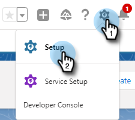

# Redenen van de Vraag van het logboek en de Resultaten van de Vraag van Salesforce {#log-call-reasons-and-call-outcomes-to-salesforce}

Als u vraagresultaten en vraagredenen aan Salesforce voor het melden of zicht doeleinden wilt registreren, kunt u een gebied van de douaneactiviteit voor elk tot stand brengen. Elk veld moet een specifieke API-naam gebruiken (in Salesforce bekend als &quot;veldnaam&quot;).

* De Naam van het Gebied van Resultaten van de vraag: mktosales_call_result
* De Naam van het Gebied van de Redenen van de vraag: mktosales_call_reason

Als u deze velden wilt gebruiken, moet u het veld eerst maken als een veld voor aangepaste activiteit. Als u deze zichtbaar wilt maken voor gebruikers, moet u deze toevoegen aan de pagina-indeling van het taakobject.

## Salesforce Classic {#salesforce-classic}

### Aangepast activiteitsveld maken in Salesforce Classic  {#create-custom-activity-field-in-salesforce-classic}

1. In Salesforce, klik **Opstelling**.

   

1. Typ &quot;Activiteiten&quot; in het vak Snel zoeken.

   

1. Klik {de Gebieden van de Douane van de Activiteit 0} **.**

   

1. Klik **Nieuw**.

   

1. Selecteer het gegevenstype &quot;Tekst&quot;en klik **daarna**.

   

1. Geef het aangepaste veld de veldnaam zoals hierboven gedefinieerd. De veldlengte mag niet langer zijn dan 255 tekens. Het Etiket van het gebied zal het gebied zichtbaar aan uw verkoopteam zijn en kan worden aangepast om aan de behoeften van uw team te voldoen.

   

1. De overige instellingen zijn optioneel. Zodra u de configuratie hebt voltooid, klik **daarna**.

   

1. Selecteer de gewenste gebied-vlakke veiligheidsmontages voor dit gebied en klik **daarna** (het beeld hieronder is slechts een voorbeeld).

   

   >[!NOTE]
   >
   >Zorg ervoor dat het aangepaste veld zichtbaar is voor het profiel dat de gebruikers van Verkoopacties gebruiken, samen met alle andere acties die u wilt weergeven.

1. Selecteer welke paginalay-outs u het gebied wilt dat aan wordt toegevoegd en **klikt sparen** (naar keuze, kunt u **klikken sparen &amp; Nieuw** en het proces voor het gebied van de Reden van de Vraag herhalen).

   

### Aangepast activiteitenveld toevoegen aan taakpaginalay-out in Salesforce Classic {#add-custom-activity-field-to-task-page-layout-in-salesforce-classic}

>[!NOTE]
>
>U hoeft deze stappen alleen uit te voeren als u in Stap 9 hierboven de gewenste paginalay-out niet hebt geselecteerd.

1. In Salesforce, klik **Opstelling**.

   

1. Typ &quot;Taak&quot; in het vak Snel zoeken.

   

1. Klik **Lay-outs van de Pagina van de Taak**.

   

1. Klik **uitgeven** naast de lay-out van de taakpagina u dit gebied aan wilt toevoegen.

   

1. Sleep het veld naar het gewenste gedeelte van de taakpaginalay-out.

   

1. Klik **sparen**.

   

## Salesforce Lightning {#salesforce-lightning}

### Veld voor aangepaste activiteit maken in Salesforce Lightning {#create-custom-activity-field-in-salesforce-lightning}

1. In Salesforce, klik op het tandwielpictogram op het hoogste recht en selecteer **Opstelling**.

   

1. Klik **Manager van Objecten**.

   

1. Typ &quot;Activiteit&quot; in het vak Snel zoeken.

   

1. Klik het **etiket van de Activiteit**.

   

1. Klik **Gebieden &amp; Verhoudingen**.

   

1. Klik **Nieuw**.

   

### Aangepast activiteitenveld toevoegen aan taakpaginalayout in Salesforce Lightning {#add-custom-activity-field-to-task-page-layout-in-salesforce-lightning}

1. In Salesforce, klik op het tandwielpictogram op het hoogste recht en selecteer **Opstelling**.

   

1. Klik **Manager van Objecten**.

   

1. Typ &quot;Taak&quot; in het vak Snel zoeken.

   

1. Klik het **etiket van de Taak**.

   

1. Klik **Lay-outs van de Pagina**.

   

1. Klik op de taakpaginalay-out waaraan u dit veld wilt toevoegen.

   

1. Sleep het veld naar het gewenste gedeelte van de taakpaginalay-out.

   

1. Klik **sparen**.

   

>[!MORELIKETHIS]
>
>* [ Resultaten van de Vraag ](/help/marketo/product-docs/marketo-sales-insight/actions/phone/call-outcomes.md)
>* [ Redenen van de Vraag ](/help/marketo/product-docs/marketo-sales-insight/actions/phone/call-reasons.md)
