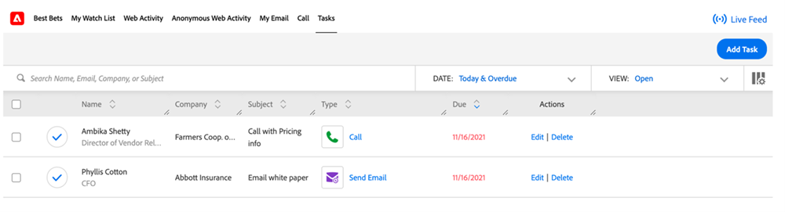

# Overzicht Insight-handelingstaken {#msi-actions-feature-overview}

Versnel de prospectie-inspanningen met marketing-aangedreven intelligentie en betrokkenheidshulpmiddelen in één enkele werkschema gebruikend de Acties van de Insight van de Verkoop.

>[!NOTE]
>
>De Acties van Insight van de Verkoop van Marketo is een web-based toepassing die exclusief met Salesforce CRM via het [ pakket van Insight van de Verkoop van Marketo ](/help/marketo/product-docs/marketo-sales-insight/msi-for-salesforce/installation/install-marketo-sales-insight-package-in-salesforce-appexchange.md){target="_blank"} integreert. Het wordt soms bedoeld als &quot;Verkoop van Marketo,&quot;of eenvoudig &quot;Acties.&quot;

Voor een videooverzicht van de Acties van Insight van de Verkoop, [ klik hier ](https://experienceleague.adobe.com/docs/marketo-learn/tutorials/sales-insight-actions/overview.html?lang=nl-NL){target="_blank"}.

## Leidinglayout en contactlay-out {#lead-layout-and-contact-layout}

De volgende acties zijn beschikbaar in de vervolgkeuzelijst &quot;Handelingen kiezen&quot; in de bovenste navigatiebalk:

* Verkoop-e-mail verzenden
   * E-mails over verkoop bevatten weergave, klikken en antwoorden bijhouden (wanneer het leveringskanaal is ingesteld)
   * Inclusief e-mail Personalization, aangepaste handtekening en bijlagen
   * Sjablonen delen en rapporten
   * Team delen, groep e-mails en CC/BCC-mogelijkheden
   * Verkoop-e-mailactiviteiten worden aangemeld bij de persoonlijke gegevens van Marketo
   * Overeenkomende filters en triggers in Marketo Smart Campaigns (zie de volgende details)

* Toevoegen aan verkoopcampagne
   * Voeg lood aan verkoopplaybooks toe die een opeenvolging van e-mail en taken is
   * Omvat teamtoegang en delen, het creëren van taken, overslaan weekends, negeer OOO e-mails als antwoorden, en auto eind
   * Campagne-activiteiten worden in de persoonlijke gegevens van Marketo geregistreerd
   * Overeenkomende filters en triggers in Marketo Smart Campaigns (zie de volgende details)

* Verkoopmanager
   * Maak verkoopvraag gebruikend dialer binnen CRM
   * Inclusief lokale aanwezigheid, vooraf opgenomen
   * Resultaat van de logboekaanroep, opname van oproepen in het deelvenster en activiteitenhistorie
   * De activiteit van de vraag zal in het persoonverslag van Marketo worden geregistreerd
   * Filters en triggers in slimme Marketo-campagnes

* Taak toevoegen
   * E-mail, Vraag, InMail, en de taken van de Douane voor uw lood creëren
   * Automatiseer het creëren van taken met de Campagnes van de Verkoop
   * Taken synchroniseren met [!DNL Salesforce]
   * Taken vastleggen in de sectie [!DNL Salesforce] Activiteitenoverzicht

U hebt toegang tot Live Feed door op het pictogram ((0)) in de bovenste nav te klikken. Dit omvat de mogelijkheid om live updates van verkoopactiviteiten te bekijken, samen met mogelijkheden voor schermdocking.

De volgende gegevens zijn beschikbaar op de tabbladen in het deelvenster MSI:

* Insights-dashboard
   * Het Net van de Snelheid van de Aansluiting zal activiteiten van de Verkoop E-mail, de Acties van de Campagne van de Verkoop, en de Vraag van de Verkoop omvatten
   * Aankomende verkoopcampagnes - Als een lead onderdeel is van een lopende campagne, is deze informatie beschikbaar op het tabblad voor verkoopcampagnes
   * Opkomende Taken - Wanneer er een aanstaande taak met betrekking tot een lood is, zal deze informatie op het aanstaande takenlusje beschikbaar zijn

* Tabblad E-mail
   * Alle verzonden e-mails worden hier geregistreerd. De activiteiten worden ook geregistreerd in de persoonlijke gegevens van Marketo
   * De kolommen omvatten Onderwerp, Open, Klikken, Geantwoord (beschikbaar slechts voor verkoop e-mail met leveringskanaal opstelling), Afzender, Datum
   * Bevat een uitschuifkaart met aanvullende gegevens zoals Afzender, Sjabloon, Verkoopcampagne en E-mailvoorvertoning

* Tabblad Aanroepen
   * Alle vraag die gebruikend de eigenschap van verkoopdialer wordt geplaatst zal hier worden geregistreerd. De activiteiten worden ook geregistreerd in de persoonlijke gegevens van Marketo
   * De kolommen omvatten Naam, Resultaat, Nota&#39;s, genoemd bij, Duur, en verbinding aan opname
   * Omvat dia uit kaart met extra details zoals Vraag die door wordt gemaakt, Vraag die door, Aantal van de Telefoon, en Status wordt beantwoord

## Account- en opportuniteitsindeling {#account-and-opportunity-layout}

De volgende acties zijn beschikbaar bij de hoogste nav:

* E-mail over verkoop verzenden - Mogelijkheid om gepersonaliseerde of getemplatificeerde groepse e-mails te verzenden met weergave, klik en antwoord het volgen aan alle contacten verbonden aan een rekening/kans
   * E-mails over verkoop bevatten weergave, klikken en antwoorden bijhouden (wanneer het leveringskanaal is ingesteld)
   * Inclusief e-mail Personalization, aangepaste handtekening en bijlagen
   * Sjablonen delen en rapporten
   * Team delen, groep e-mails en CC/BCC-mogelijkheden
   * Verkoop-e-mailactiviteiten worden aangemeld bij de persoonlijke gegevens van Marketo
   * Overeenkomende filters en triggers in Marketo Smart Campaigns (zie de volgende details)

* Toevoegen aan verkoopcampagne - Alle contactpersonen toevoegen die zijn gekoppeld aan een account/mogelijkheid om af te spelen in verkoopboeken. Dit is een reeks e-mails en taken
   * Voeg lood aan verkoopplaybooks toe die een opeenvolging van e-mail en taken is
   * Omvat teamtoegang en delen, het creëren van taken, overslaan weekends, negeer OOO e-mails als antwoorden, en auto eind
   * Campagne-activiteiten worden in de persoonlijke gegevens van Marketo geregistreerd
   * Overeenkomende filters en triggers in Marketo Smart Campaigns (zie de volgende details)

U hebt toegang tot Live Feed door op het pictogram ((0)) boven in de navigatiebalk te klikken. Dit omvat de mogelijkheid om live updates van verkoopactiviteiten te bekijken, samen met mogelijkheden voor schermdocking.

De volgende gegevens zijn beschikbaar op de tabbladen:

* Insights-dashboard
   * Het Net van de Snelheid van de Aansluiting zal activiteiten van de Verkoop E-mail, de Acties van de Campagne van de Verkoop, en de Vraag van de Verkoop omvatten
   * Aankomende verkoopcampagnes - Wanneer een contact van de account/de mogelijkheid deel uitmaakt van een lopende campagne, is deze informatie beschikbaar op het volgende tabblad voor verkoopcampagnes
   * De komende Taken - wanneer er een aanstaande taak met betrekking tot een contact van de rekening/de kans is, zal deze informatie op het aanstaande takenlusje beschikbaar zijn

* Tabblad E-mail
   * Alle e-mails over verkopen die naar contactpersonen van de account/gelegenheid worden verzonden, worden hier geregistreerd. De activiteiten worden ook geregistreerd in de persoonlijke gegevens van Marketo
   * De kolommen omvatten Onderwerp, Open, Klikken, Geantwoord (beschikbaar slechts voor verkoop-e-mail met leveringskanaal opstelling), Afzender, en Datum
   * Bevat een uitschuifkaart met aanvullende gegevens zoals Afzender, Sjabloon, Verkoopcampagne en E-mailvoorvertoning

* Tabblad Aanroepen
   * Alle die vraag aan contacten van de rekening/de kans wordt gemaakt gebruikend de eigenschap van verkoopdialer zal hier worden geregistreerd. De activiteiten worden ook geregistreerd in de persoonlijke gegevens van Marketo
   * De kolommen omvatten Naam, Resultaat, Nota&#39;s, genoemd bij, Duur en verbinding aan opname
   * Omvat dia uit kaart met extra details zoals Vraag die door wordt gemaakt, Vraag die door, Aantal van de Telefoon, en Status wordt beantwoord

## Weergave voor lead- en contactlijst (Bulkhandelingen) {#lead-and-contact-list-view}

* [!UICONTROL Send Sales Email] - Mogelijkheid om gepersonaliseerde of getemplatificeerde e-mails te verzenden met weergave, klik en antwoord bijhouden op een lijst met contactpersonen/leads
* [!UICONTROL Add to Sales Campaign] - Toevoegen aan verkoopafspeelboeken. Dit is een reeks e-mails en taken aan een lijst met contactpersonen/leads

## Marketo Global Tab {#marketo-global-tab}

**[!UICONTROL Best Bets]Tab**

De volgende bulkacties zijn beschikbaar in de keuzelijst op het tabblad [!UICONTROL Best Bets] :

* [!UICONTROL Send Sales Email] - Mogelijkheid om persoonlijke of getemplatificeerde e-mails te verzenden met weergave, klikken en antwoorden bijhouden
* [!UICONTROL Add to Sales Campaign] - Voeg leads toe aan verkoopafspeelboeken. Dit is een reeks e-mails en taken

  

De volgende inline acties zijn beschikbaar voor individuele leads/contactpersonen op het tabblad [!UICONTROL Best Bets] :

* [!UICONTROL Send Sales Email] - Mogelijkheid om persoonlijke of getemplatificeerde e-mails te verzenden met weergave, klikken en antwoorden bijhouden
* [!UICONTROL Add to Sales Campaign] - Voeg leads toe aan verkoopafspeelboeken. Dit is een reeks e-mails en taken
* [!UICONTROL Sales Call] - maak verkoopvraag gebruikend dialer binnen CRM
* [!UICONTROL Add Task] - Maak e-mail, vraag, klant of Verbonden in taken voor prospectieve leads

  

**E-mailLusje**

* Alle verzonden e-mails worden hier geregistreerd. De activiteiten worden ook geregistreerd in de persoonlijke gegevens van Marketo
* De kolommen omvatten Onderwerp, Open, Klikken, Geantwoord (beschikbaar slechts voor verkoop-e-mail met leveringskanaal opstelling), Afzender, en Datum
* Bevat een uitschuifkaart met aanvullende gegevens zoals Afzender, Sjabloon, Verkoopcampagne en E-mailvoorvertoning

**het Lusje van de Vraag**

* Alle vraag die gebruikend de eigenschap van verkoopdialer wordt geplaatst zal hier worden geregistreerd. De activiteiten worden ook geregistreerd in de persoonlijke gegevens van Marketo
* De kolommen omvatten Naam, Resultaat, Nota&#39;s, genoemd bij, Duur en verbinding aan opname
* Omvat dia uit kaart met extra details zoals Vraag die door wordt gemaakt, Vraag die door, Aantal van de Telefoon, en Status wordt beantwoord

**Lusje van de Taak**

* E-mail, Vraag, InMail, en de taken van de Douane die worden gecreeerd en worden voltooid zullen voor taakbeheer op dit lusje beschikbaar zijn. Bevat de mogelijkheid om taak toe te voegen
* Automatiseer het creëren van taken met de Campagnes van de Verkoop
* Taken synchroniseren met [!DNL Salesforce]
* Taken vastleggen in de sectie [!DNL Salesforce] Activiteitenoverzicht

  

**Levend voer**

* Mogelijkheid om live updates van verkoopactiviteiten te bekijken, samen met mogelijkheden voor schermdocking
* Met de ingesloten knoppen voor e-mail, bellen en schrijven kunnen alle klanten insight activeren

## Functies beschikbaar in Marketo {#features-available-in-marketo}

Verkoopactiviteiten die in Marketo worden gevangen:

* Verkoop-e-mail verzenden - De gebruiker heeft een e-mail naar een lead gestuurd
* Verkoopbericht openen - Lezing heeft e-mail over verkoop geopend
* Klik op E-mail verkopen - Lead heeft geklikt op een koppeling in een e-mailbericht over verkopen
* E-mailadres voor verkoop heeft gereageerd - Lead heeft op een e-mail met verkopen gereageerd
* Ontvang de Vraag van de Verkoop - Lead ontving een vraag van een verkoper gebruikend de Vraag van de Verkoop.
* Toevoegen aan verkoopcampagne - Lead is toegevoegd aan een verkoopcampagne die is gemaakt
* Verwijderd uit verkoopcampagne - Lead is verwijderd uit een gemaakte verkoopcampagne

Tot de filters en triggers behoren:

* [!UICONTROL Is Sent Sales Email]
* [!UICONTROL Opens Sales Email]
* [!UICONTROL Clicks Sales Email]
* [!UICONTROL Replies to Sales Email]
* [!UICONTROL Receives Sales Call]
* [!UICONTROL Added to Sales Campaign]
* [!UICONTROL Removed from Sales Campaign]

  
