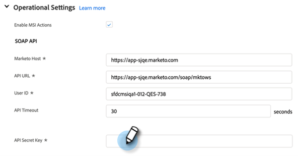

# Configuratie MSI-handelingen in Salesforce {#msi-actions-configuration-in-salesforce}

>[!PREREQUISITES]
>
>Installeren/upgraden naar de [MSI-handelingspakket](/help/marketo/product-docs/marketo-sales-insight/msi-for-salesforce/configuration/configure-marketo-sales-insight-in-salesforce-enterprise-unlimited.md) in uw Salesforce-exemplaar.

## Het toelaten van MSI-Acties over CRM {#enabling-msi-actions-across-the-crm}

1. Klik in Salesforce op de knop **Marketo Sales Insight Config** tab.

   

   >[!NOTE]
   >
   >Als u &quot;Marketo Sales Insight Config&quot; niet ziet in de bovenste balk, klikt u op de knop **+** ondertekenen en zoeken onder All Tabs.

1. Selecteer **MSI-handelingen inschakelen** selectievakje.

   

1. Voer de geheime API-sleutel in.

   

   >[!NOTE]
   >
   >Als u niet over uw API Secrey Key handig beschikt, kunt u het vinden door de stappen in [dit artikel](/help/marketo/product-docs/marketo-sales-insight/msi-for-salesforce/configuration/configure-marketo-sales-insight-in-salesforce-enterprise-unlimited.md).

1. Klikken **Opslaan** wanneer gereed.

Hierdoor worden automatisch alle functies van MSI-handelingen ingeschakeld die in het artikel met het overzicht van functies worden beschreven.

>[!NOTE]
>
>U kunt alle functies van MSI-acties uitschakelen door het selectievakje MSI-acties inschakelen uit te schakelen.

## Beheer van MSI-acties {#msi-actions-governance}

1. U kunt verkoopcampagnes en/of het lusje van de Taak in de aanstaande sectie onbruikbaar maken. Dit is van toepassing op de deelvensters lood, contact, account en opportunity.

   

1. U kunt MSI-handelingen uitschakelen door de bijbehorende functies onder Handelingen uit te schakelen.

   

>[!NOTE]
>
>De montages van de governance zijn van toepassing op alle gebruikers MSI.
