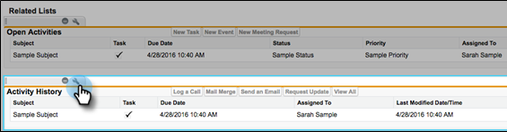
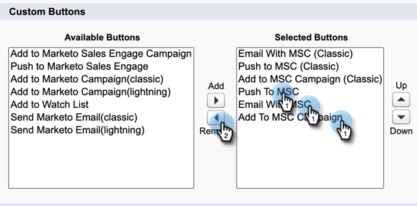

# Aanpassingspakket voor Salesforce Lightning verwijderen {#uninstall-salesforce-lightning-customization-package}

Verwijder het Marketo Sales Connect-pakket van uw Salesforce-account als u het MSI-handelingspakket gebruikt.

## Verkoop Connect-velden verwijderen uit paginalayout {#remove-sales-connect-fields-from-page-layout}

1. Klik in Salesforce Lightning op het tandwielpictogram en selecteer **Instellen**.

   

1. Klikken **Objectbeheer**.

   

1. Omlaag schuiven naar en selecteren **Lood**.

   

1. Klikken **Pagina-indelingen**.

   

1. Klikken **Layout lead**.

   

   >[!NOTE]
   >
   >De lay-outweergave Pagina bewerken is nog niet bijgewerkt in Salesforce Lightning.

1. Selecteer in de console de optie **Velden**. Zoek in Snel zoeken naar &quot;MSC.&quot; Alle grijze velden zijn toegevoegd aan de pagina-indeling. U moet ze verwijderen.

   

   >[!NOTE]
   >
   >If none of the fields are grayed out, it means you haven&#39;t added them to your page layout. U kunt deze sectie overslaan.

1. Blader naar de sectie met uw aangepaste verkoopvelden voor Connect.

   

1. Er zijn 10 types van gebieden MSC die aan deze sectie kunnen worden toegevoegd. Verwijder alle velden die u hebt toegevoegd of verwijder gewoon de volledige sectie.

1. Klikken **Snel opslaan** wanneer gereed.

   

## Knoppen Verkoop verbinden verwijderen uit pagina-indelingen {#remove-sales-connect-buttons-from-page-layouts}

1. Selecteer in de console (stap 4 hierboven) de optie **Knoppen**. Zoeken naar MSC. Alle grijze knoppen zijn toegevoegd aan de sectie Aangepaste knoppen. U moet ze verwijderen.

   

   >[!NOTE]
   >
   >Als geen van de knoppen grijs wordt weergegeven, betekent dit dat u ze niet hebt toegevoegd. U kunt deze sectie overslaan.

1. Sleep de knopen MSC van de sectie van de Knopen van de Douane aan de console.

   

1. Klikken **Snel opslaan** wanneer gereed.

   

## Verkoop Connect-velden verwijderen uit sectie Activiteitenoverzicht {#remove-sales-connect-fields-from-activity-history-section}

1. Blader naar de onderkant van de pagina en klik op het pictogram Sleutel.

   

1. Selecteer de velden Verkoop Connect in het gebied Geselecteerde velden en klik op de pijl Verwijderen. Klikken **OK** wanneer gereed.

   

   >[!NOTE]
   >
   >De afkorting MSE _is_ Sales Connect. Het is gewoon de vorige naam, &quot;Marketo Sales Engage&quot;.

1. Klikken **Opslaan** als u klaar bent met de pagina Leads.

## Knoppen Handeling bulksgewijs verkopen verwijderen uit de koplijstweergave {#remove-sales-connect-bulk-action-buttons-from-lead-list-view}

1. Klik in Salesforce Lightning op het tandwielpictogram en selecteer **Instellen**.

   

1. Klikken **Objectbeheer**.

   

1. Omlaag schuiven naar en selecteren **Lood**.

   

1. Klikken **Schermindelingen zoeken**.

   

1. Klik op de pijl naast Lijstweergave en selecteer **Bewerken**.

   

1. Selecteren **Toevoegen aan MSC-campagne**, **E-mailen met MSC**, en **Naar MSC duwen** en klikt u op de pijl Verwijderen. Klik vervolgens op **Opslaan**.

   

De knoppen in de weergave voor de lijst met leads worden niet meer weergegeven.

## MSC-configuratie verwijderen voor contactpersonen {#remove-msc-configuration-for-contacts}

1. Klik in Salesforce Lightning op het tandwielpictogram en selecteer **Instellen**.

1. Klikken **Objectbeheer**.

1. Omlaag schuiven naar en selecteren **Contact**.

1. Click **Page Layouts**.

1. Klikken **Contactlay-out**.

1. Herhaal de stappen van alle drie de secties.

## MSC-configuratie voor opportunity verwijderen {#remove-msc-configuration-for-opportunity}

1. In Salesforce Lightning, click the gear icon and select **Setup**.

1. Click **Object Manager**.

1. Scroll down to and select **Opportunity**.

1. Klikken **Pagina-indelingen**.

1. Click **Opportunity Layout**.

De opportuniteitsweergave heeft slechts één knop - &quot;MSE-mail verzenden&quot; en de volgende velden:

## MSC-configuratie voor account verwijderen {#remove-msc-configuration-for-account}

1. Klik in Salesforce Lightning op het tandwielpictogram en selecteer **Instellen**.

1. Klikken **Objectbeheer**.

1. Omlaag schuiven naar en selecteren **Account**.

1. Klikken **Pagina-indelingen**.

1. Klikken **Accountlay-out**.

De accountweergave heeft slechts één knop - &quot;MSE-mail verzenden&quot; en de volgende velden:

## Postvak UIT Marketo-verkoop verwijderen {#remove-marketo-sales-outbox}

1. Klik in Salesforce op de knop **+** boven aan het scherm.

1. Klikken **Mijn tabbladen aanpassen**.

1. Selecteer aan de rechterkant de optie Postvak UIT verkopen van Marketo. Klik op de pijl Verwijderen en klik vervolgens op **Opslaan**.

## Sales Connect-pakket verwijderen {#delete-sales-connect-package}

Nadat u alle objecten van uw Salesforce-account hebt verwijderd, voert u de onderstaande stappen uit.

1. Klik in Salesforce Lightning op het tandwielpictogram en selecteer **Instellen**.

1. Typ &quot;Apex-klassen&quot; in het vak Snel zoeken.

1. Klikken **Verwijderen** naast alle vermeldingen &quot;MarketoSalesConnectionCustomization&quot; of &quot;MarketoSalesEngageCustomization&quot; in uw lijst.

U bent klaar!

Hier volgt een lijst met alle objecten die uit uw Salesforce-instantie moeten worden verwijderd:

## Aanpassingsgegevens van Sales Connect {#sales-connect-customization-details}

<table>
 <tr>
  <th>Aangepaste activiteitsvelden</th>
  <th>Beschrijving</th>
  <th>Type</th>
  <th>Gegevenstype</th>
 </tr>
 <tr>
  <td>Lokale Aanwezigheidsidentiteitskaart van de Vraag MSC</td>
  <td>Als gebruiker, kan ik Lokale Aanwezigheid als optie kiezen wanneer ik vraag van Telefoon MSC. De inkomende vraag zal een lokaal aantal voor de ontvanger tonen</td>
  <td>Activiteit</td>
  <td>Tekst</td>
 </tr>
 <tr>
  <td>MSC-URL voor opnamen van oproepen</td>
  <td>De vraag kan worden geregistreerd en een verbinding voor de opname zal hier worden geregistreerd </td>
  <td>Activiteit</td>
  <td>Tekst</td>
 </tr>
 <tr>
  <td>MSC-campagne</td>
  <td>Logs naam van de MSC campagne de contact/lood is op</td>
  <td>Activiteit</td>
  <td>Tekst</td>
 </tr>
 <tr>
  <td>URL voor MSC-campagne</td>
  <td>Logs URL aan de campagne die in MSC werd gecreeerd. Als u hierop klikt, wordt de campagne geopend in de MSC-webtoepassing</td>
  <td>Activiteit</td>
  <td>Tekst</td>
 </tr>
 <tr>
  <td>Huidige stap MSC-campagne</td>
  <td>Als een contact/lood op een campagne is, zal dit gebied de naam van de stap registreren zij momenteel op zijn</td>
  <td>Activiteit</td>
  <td>Selectievakje</td>
 </tr>
 <tr>
  <td>MSC-e-mailbijlage weergegeven</td>
  <td>Hiermee worden gegevens geregistreerd wanneer een e-mailbericht wordt verzonden met een bijlage die door de ontvanger wordt weergegeven</td>
  <td>Activiteit</td>
  <td>Selectievakje</td>
 </tr>
 <tr>
  <td>MSC-e-mail geklikt</td>
  <td>Hiermee wordt een vinkje geregistreerd wanneer de ontvanger op een koppeling in de e-mail klikt</td>
  <td>Activiteit</td>
  <td>Selectievakje</td>
 </tr>
 <tr>
  <td>MSC-e-mail gereageerd</td>
  <td>Logt een vinkje in wanneer de ontvanger op e-mail antwoordt</td>
  <td>Activity</td>
  <td>Text</td>
 </tr>
 <tr>
  <td>MSC-e-mailstatus</td>
  <td>Geeft aan of een e-mail is verzonden/bezig/teruggestuurd (het bijhouden van teruggestuurde e-mails is afhankelijk van het gebruikte leveringskanaal)</td>
  <td>Activiteit</td>
  <td>Tekst</td>
 </tr>
 <tr>
  <td>MSC-e-mailsjabloon</td>
  <td>Logs naam van het malplaatje MSC dat in e-mail werd gebruikt die naar de lood/de contact wordt verzonden</td>
  <td>Activiteit</td>
  <td>Tekst</td>
 </tr>
 <tr>
  <td>URL MSC-e-mailsjabloon</td>
  <td>Logs URL aan het malplaatje dat in MSC werd gecreeerd. Als u hierop klikt, wordt de sjabloon geopend in de MSC-webtoepassing</td>
  <td>Activiteit</td>
  <td>Tekst</td>
 </tr>
 <tr>
  <td>MSC-e-mailURL</td>
  <td>Als u op deze URL klikt, wordt het opdrachtcentrum in MSC geopend en wordt het tabblad Historie van Personendetails weergegeven, waar de gebruiker de verzonden e-mail kan zien</td>
  <td>Activiteit</td>
  <td>Tekst</td>
 </tr>
 <tr>
  <td>MSC-e-mail weergegeven</td>
  <td>Logt een vinkje in wanneer de ontvanger een e-mail bekijkt</td>
  <td>Activiteit</td>
  <td>Selectievakje</td>
 </tr>
</table>

<table>
 <tr>
  <th>MSC Logboekveld voor oprollen</th>
  <th>Beschrijving</th>
  <th>Type</th>
  <th>Gegevenstype</th>
 </tr>
 <tr>
  <td>MSC - Last Marketing Engagement</td>
  <td>Last incoming engagement from Marketing</td>
  <td>
  
Account
  
Contact
  
Lood
  
Opportunity</td>
  <td>Gegevens en tijd</td>
 </tr>
 <tr>
  <td>MSC - Datum laatste marketingservice</td>
  <td>Tijdstempel voor betrokkenheid bij marketing</td>
  <td>
  
Account 
  
Contact 
  
Lood 
  
Opportunity</td>
  <td>Gegevens en tijd</td>
 </tr>
 <tr>
  <td>MSC - Laatste marketingservice</td>
  <td>Beschrijving van de betrokkenheid</td>
  <td>
  
Account 
  
Contact 
  
Lood 
  
Opportunity</td>
  <td>Tekst</td>
 </tr>
 <tr>
  <td>MSC - Last Marketing Engagement Source</td>
  <td>Bron van marketingovereenkomst</td>
  <td>
  
Account 
  
Contact 
  
Lead 
  
Opportunity</td>
  <td>Text</td>
 </tr>
 <tr>
  <td>MSC - Laatste type marketingservice</td>
  <td>Type of Engagement (ex: Web activity)</td>
  <td>
  
Account 
  
Contact 
  
Lood 
  
Opportunity</td>
  <td>Tekst</td>
 </tr>
 <tr>
  <td>MSC - Laatste activiteit door verkoop</td>
  <td>Laatste uitgaande activiteit uitgevoerd door het verkoopteam</td>
  <td>
  
Account 
  
Contact 
  
Lood 
  
Opportunity</td>
  <td>Gegevens en tijd</td>
 </tr>
 <tr>
  <td>MSC - Laatste reactie</td>
  <td>Last email reply to Sales email</td>
  <td>
  
Account 
  
Contact 
  
Lood 
  
Opportunity</td>
  <td>Gegevens en tijd</td>
 </tr>
 <tr>
  <td>MSC - Huidige verkoopcampagne</td>
  <td>Logs naam van de MSC campagne de contact/lood is op</td>
  <td>
  
Account 
  
Contact 
  
Lood 
  
Opportunity</td>
  <td>Tekst</td>
 </tr>
 <tr>
  <td>MSC - Laatste verkoopservice</td>
  <td>Laatste inkomende betrokkenheid van Sales</td>
  <td>
  
Account
  
Contact
  
Lood
  
Opportunity</td>
  <td>Gegevens en tijd</td>
 </tr>
 <tr>
  <td>MSC - Weigeren</td>
  <td>Opt out field</td>
  <td>
  
Account 
  
Contact 
  
Lood 
  
Opportunity</td>
  <td>Selectievakje</td>
 </tr>
</table>

<table>
 <tr>
  <th>MSC Buttons</th>
  <th>Beschrijving</th>
  <th>Type</th>
 </tr>
 <tr>
  <td>Send MSC Email</td>
  <td>Send sales emails from Salesforce</td>
  <td>
  
Account 
  
Contact 
  
Lood 
  
Opportunity</td>
 </tr>
 <tr>
  <td>Toevoegen aan MSC-campagne</td>
  <td>Add to MSC campaigns from Salesforce</td>
  <td>
  
Contact
  
Lood</td>
 </tr>
 <tr>
  <td>Naar MSC duwen</td>
  <td>Zet contact op van Salesforce naar MSC</td>
  <td>
  
Contact
  
Lood</td>
 </tr>
 <tr>
  <td>Vraag met MSC</td>
  <td>Make sales calls from Salesforce</td>
  <td>
  
Contact
  
Lood</td>
 </tr>
</table>

<table>
 <tr>
  <th>MSC Bulk Action Buttons</th>
  <th>Beschrijving</th>
  <th>Type</th>
 </tr>
 <tr>
  <td>Add to MSC Campaign</td>
  <td>Toevoegen aan MSC-campagnes van Salesforce</td>
  <td>
  
Contact
  
Lead</td>
 </tr>
 <tr>
  <td>Naar MSC duwen</td>
  <td>Zet contact op van Salesforce naar MSC</td>
  <td>
  
Contact
  
Lood</td>
 </tr>
 <tr>
  <td>E-mailen met MSC</td>
  <td>Email with MSC from Salesforce</td>
  <td>
  
Contact
  
Lood</td>
 </tr>
</table>
