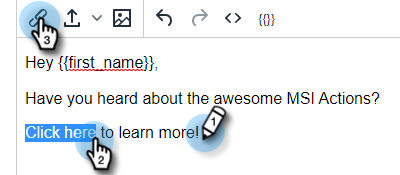

# Hyperlinktekst toevoegen {#add-hyperlinked-text}

Volg de onderstaande stappen om te leren hoe u hyperlinks aan uw e-mailsjablonen kunt toevoegen.

1. Selecteer op de pagina Sjablonen de gewenste sjabloon (of maak een nieuwe sjabloon).

   

1. Klikken **Bewerken**.

   

1. Typ de tekst die u aan hyperlinks wilt koppelen (klik hier dus). Markeer het en klik op de koppelingsknop in de editor.

   

1. Voer de URL in waarnaar u een koppeling wilt maken (bijvoorbeeld `https://experienceleague.adobe.com/docs/marketo/using/home.html`). Kies of u de URL in hetzelfde of een nieuw venster wilt openen en klik op **Opslaan**.

   

1. Klikken **Opslaan** opnieuw.

   

>[!NOTE]
>
>Als de sjabloon die u bewerkt momenteel wordt gebruikt als een e-mailstap in campagnes, kunt u de formulering voor specifieke (of alle) campagnes bijwerken.
