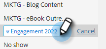
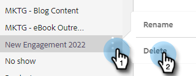

# Sjablooncategorieën beheren {#manage-template-categories}

## Een categorie maken {#create-a-category}

1. Klik op de tab **[!UICONTROL Templates]** .

   

1. Klik op het pictogram **+** naast **[!UICONTROL Categories]** .

   

1. Voer een naam in voor de nieuwe categorie en klik op **[!UICONTROL Create]** .

   

## De naam van een sjablooncategorie wijzigen {#rename-a-template-category}

1. Klik op de tab **[!UICONTROL Templates]** .

   

1. Houd de cursor boven de sjabloon waarvan u de naam wilt wijzigen en klik op de gegevens (drie punten). Selecteer **[!UICONTROL Rename]**.

   

1. Typ de nieuwe naam. Druk op Enter (of klik ergens anders op het scherm) om op te slaan.

   

## Een sjablooncategorie verwijderen {#delete-a-template-category}

1. Klik op de tab **[!UICONTROL Templates]** .

   

1. Houd de cursor boven de sjabloon waarvan u de naam wilt wijzigen en klik op de gegevens (drie punten). Selecteer **[!UICONTROL Delete]**.

   

1. Klik op **[!UICONTROL Delete]** om te bevestigen.

   

>[!NOTE]
>
>Categorieën kunnen niet worden verwijderd als ze sjablonen bevatten. Verplaats of verwijder alle sjablonen voordat u een categorie verwijdert.
