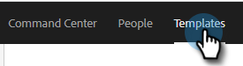
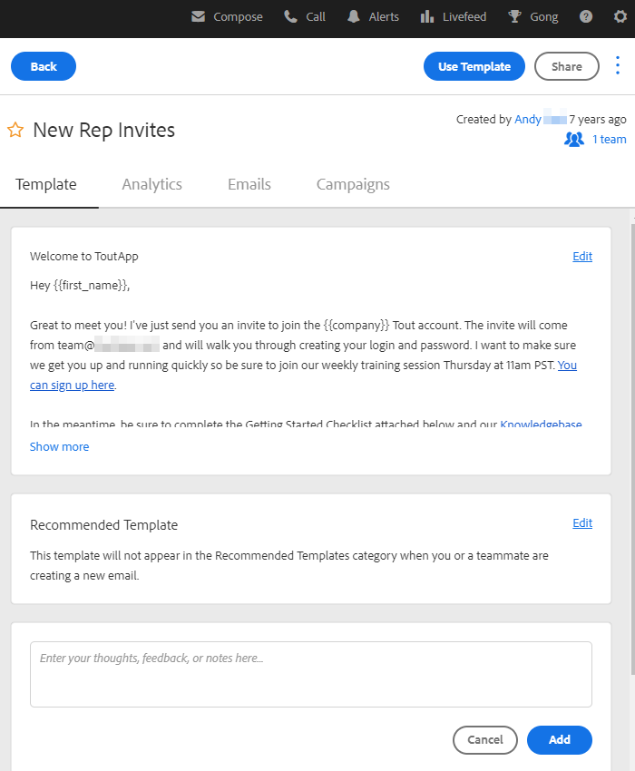
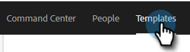
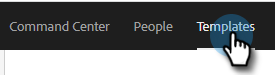

# Sjablonen beheren {#manage-templates}

## Een sjabloon maken {#create-a-new-template}

1. Ga naar het tabblad **[!UICONTROL Templates]**.

   

1. Klik op **[!UICONTROL Create Template]**.

   

1. Kies een **[!UICONTROL Name]** en **[!UICONTROL Category]** voor uw e-mailsjabloon en klik op **[!UICONTROL Create]** .

   

1. Maak in de sjablooneditor een onderwerpregel voor uw e-mail en typ het gewenste bericht. Gebruik de bewerkingsgereedschappen (lettertype, tekstgrootte, enz.) om de weergave aan te passen. Klik op **[!UICONTROL Save]** om de wijzigingen te voltooien.

   

>[!TIP]
>
>Typ altijd tekst rechtstreeks in de sjabloon of kopieer tekst vanuit een teksteditor zonder opmaak (bijvoorbeeld [!DNL Notepad] of [!DNL TextEdit] ). Het kopiëren en plakken vanuit een RTF-editor (bijvoorbeeld MS [!DNL Word]) kan leiden tot onregelmatigheden in de opmaak.

## Sjabloondetails weergeven {#view-template-details}

Het gebied Sjabloondetails bevat meerdere tabbladen.

<table>
 <tr>
  <td><strong>[!UICONTROL Template]</strong></td>
  <td>Reviseren en bewerken, criteria instellen om van de sjabloon een aanbevolen sjabloon te maken, notities toevoegen</td>
 </tr>
 <tr>
  <td><strong>Analytics</strong></td>
  <td>Evalueer de betrokkenheidsanalyse voor de sjabloon. Voer een gefilterde zoekopdracht uit.</td>
 </tr>
 <tr>
  <td><strong>[!UICONTROL Emails]</strong></td>
  <td>Alle e-mails bekijken die met deze template zijn verzonden. Voer een gefilterde zoekopdracht uit.</td>
 </tr>
 <tr>
  <td><strong>[!UICONTROL Campaigns]</strong></td>
  <td>Zie in welke campagnes de sjabloon wordt gebruikt.</td>
 </tr>
</table>

## Een sjabloon delen {#share-a-template}

Als u één van onze teamrekeningen gebruikt, zijn al uw malplaatjes nog privé door gebrek.

1. Ga naar het tabblad **[!UICONTROL Templates]**.

   

1. Zoek en kies de gewenste sjabloon.

   

1. Klik op **[!UICONTROL Share]** .

   

   >[!NOTE]
   >
   >Sjablonen die met u zijn gedeeld, worden links op de pagina **[!UICONTROL Team Templates]** onder de koptekst [!UICONTROL Templates] weergegeven. Teams zijn alleen beschikbaar voor Premium-gebruikers.

1. Klik op de vervolgkeuzelijst [!UICONTROL Share With] en selecteer het team of de teams waarmee u de bestanden wilt delen.

   

1. U kunt de sjabloon in de huidige categorie laten of verplaatsen naar een andere categorie. In dit voorbeeld houden we het in het huidige. Klik op **[!UICONTROL Share]** als u klaar bent.

   

## Een sjabloon favorieten {#favorite-a-template}

U kunt sjablonen vanuit elke gewenste categorie toevoegen aan de lijst Favorieten. Hiermee wordt automatisch een nieuwe categorie boven aan de lijst gegenereerd, zodat u snel toegang kunt krijgen tot de sjablonen die u het meest gebruikt.

1. Ga naar het tabblad **[!UICONTROL Templates]**.

   

1. Zoek de gewenste sjabloon en houd de muisaanwijzer boven de sjabloon. Klik op de ster die links van de sjabloonnaam wordt weergegeven.

   

   Als de sterretje gunstig is, zal de ster blijven.

   

## Sjabloonweergave aanpassen {#customize-template-view}

In de vervolgkeuzelijst **[!UICONTROL View]** kunt u kiezen of u wilt zien: alle sjablonen, uw sjablonen, favoriete sjablonen, gedeelde sjablonen, niet-gedeelde sjablonen of ongebruikte sjablonen (sjablonen die de afgelopen 90 dagen niet zijn gebruikt).

>[!NOTE]
>
>Daarnaast kunt u kolommen toevoegen aan of verwijderen uit de sjabloonweergave door te klikken op het instellingenpictogram rechts van de weergavemkeuzelijst.

## Een sjabloon archiveren {#archive-a-template}

Sjablonen archiveren om uw verkoopinhoud overzichtelijk en gefocust te houden zonder dat er sjabloongegevens verloren gaan.

1. Schakel het selectievakje naast de sjabloon die u wilt archiveren in.

   

1. Klik op **[!UICONTROL Archive]**.

   

1. Klik op **[!UICONTROL Archive]** om te bevestigen.

   

>[!NOTE]
>
>Als een sjabloon eenmaal is gearchiveerd, kan het niet worden bewerkt of gebruikt. Als u de sjabloon opnieuw wilt gebruiken, verplaatst u de sjabloon uit Archief en naar een andere categorie.

U kunt ook het filter Ongebruikt selecteren om sjablonen weer te geven en te archiveren die in meer dan 90 dagen niet zijn gebruikt.

## Een sjabloon verwijderen {#delete-a-template}

Voer de onderstaande stappen uit om een sjabloon te verwijderen.

>[!CAUTION]
>
>Als u een sjabloon verwijdert, worden ook ALLE bijgehouden en bijbehorende analyses verwijderd.

1. Schakel het vakje naast de sjabloon die u wilt verwijderen in.

   

1. Klik op **[!UICONTROL Delete]**.

   

1. Klik op **[!UICONTROL Delete]** om te bevestigen.

   
