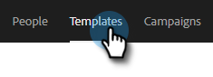
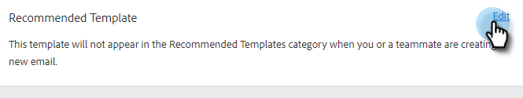

# Aanbevolen sjablonen {#recommended-templates}

Met de aanbevolen sjablonen van [!DNL Sales Insight Action] krijgt u het juiste bericht en bespaart u tijd. Dit geeft u meer stroom bij het verzenden van e-mails en vermindert de onzekerheid bij het zoeken naar de juiste e-mail voor de juiste persoon.

1. Ga naar de tab **[!UICONTROL Templates]** .

   

1. Selecteer de sjabloon die u wilt aanbevelen.

   

1. Klik op de [!UICONTROL Recommended Template] -kaart op **[!UICONTROL Edit]** .

   

1. Selecteer het selectievakje **[!UICONTROL Make a Recommended Template]** en klik op **[!UICONTROL Save]** .

   

>[!NOTE]
>
>Zie hieronder voor meer informatie over sjablooncriteria.

## Alle vs. alle {#all-vs-any}

Selecteer **[!UICONTROL All]** als u wilt dat de sjabloon wordt aanbevolen als aan alle criteria wordt voldaan. Selecteer **[!UICONTROL Any]** als u wilt dat de sjabloon wordt aanbevolen wanneer aan een van de criteria wordt voldaan.

## Criteria instellen {#setting-criteria}

Aan de hand van uw criteria stelt u de voorwaarden in waarvoor sjablonen worden aanbevolen. U kunt maximaal drie criteria instellen. Selecteer eerst de dynamische velden waarop u wilt wijzen in de sjabloon.

## Voorwaarden {#conditions}

Selecteer nu uw voorwaarde. Als aan uw voorwaarden voor het dynamische veld is voldaan, wordt de sjabloon aanbevolen. U kunt kiezen uit vier verschillende voorwaarden.

**[!UICONTROL Equals]**: de waarde moet exact overeenkomen (Marketo is bijvoorbeeld gelijk aan Marketo)

**[!UICONTROL Does not Equal]**: waarde moet alles zijn behalve een exacte overeenkomst (Marketing Nation is bijvoorbeeld niet gelijk aan Marketing)

**[!UICONTROL Contains]**: alleen de waarde hoeft te bevatten (bijvoorbeeld Marketo Rocks! bevat Marketo)

**[!UICONTROL Does Not Contain]**: De waarde mag zich niet in het dynamische veld bevinden (bijvoorbeeld Marketo Rocks! bevat geen enkel (letter (f)

## Hoe ziet een aanbevolen sjabloon eruit {#what-a-recommended-template-looks-like}

Nu u uw eerste sjabloon hebt toegewezen, is het tijd om de rest in kaart te brengen. Doorloop je meest succesvolle templates en beveel deze aan. Vergeet niet de sjabloon ook met uw team te delen. Uw aanbevolen instellingen voor sjablonen worden ook door uw team gedeeld.
