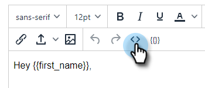

# HTML gebruiken {#using-html}

1. Kopieer de broncode uit uw e-mails in het gereedschap dat u gebruikt om e-mails te maken in HTML (bijvoorbeeld de Marketo Email Editor).

1. Selecteer een sjabloon waaraan u de HTML wilt toevoegen.

   

1. Klik op de kaart in de Sjablooneditor op **Bewerken**.

   

1. Klik op de knop **Bron** in uw sjablooneditor.

   

1. Plak de broncode en klik op **Opslaan**.

   

>[!NOTE]
>
>Als de fout &quot;Error - to remove the style/java/html tags&quot; wordt weergegeven, betekent dit dat u enige opmaak hebt die we niet ondersteunen. Zoek in de broncode naar de woordstijl en verwijder alles uit ``.
