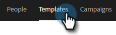
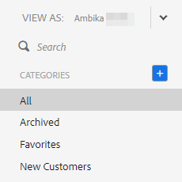

# Sjabloonlijst weergeven als een andere gebruiker {#view-template-list-as-another-user}

Als beheerder kunt u sjablonen weergeven als elke gebruiker.

>[!NOTE]
>
>**Vereiste Bevoegdheden Admin**

1. Klik op **[!UICONTROL Templates]**.

   

1. Klik op de vervolgkeuzelijst **[!UICONTROL View As]** en selecteer de gewenste gebruiker.

   

1. U bekijkt nu sjablonen als de geselecteerde gebruiker.

   

   >[!NOTE]
   >
   >U kunt ook filters of de zoekfunctie gebruiken in combinatie met _[!UICONTROL View As]_om te zien wat voor u het meest relevant is.
