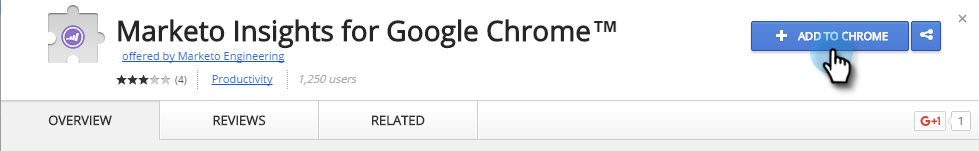

# Marketo Insights installeren voor [!DNL Google Chrome] {#install-marketo-insights-for-google-chrome}

Voer de volgende stappen uit om de krachtige Chrome-add-in te gaan gebruiken. U hoeft geen Marketo-beheerder te zijn om de extensie te installeren.

>[!NOTE]
>
>De mogelijkheden van Handelingen van Insight van de verkoop, met inbegrip van Verkoop E-mail verzenden, toevoegen aan de Campagne van de Verkoop, en Taken, zijn niet beschikbaar in de de e-mailplug-ins van de Verkoop Insight voor Gmail en Vooruitzichten. Op dit moment kunnen gebruikers alleen een e-mailbericht met of zonder Marketo-sjabloon van hun e-mailclient verzenden als ze de e-mailplug-ins voor Insight kopen gebruiken.

1. Installeer de [ Inzichten van Marketo voor Google Chrome toevoegen in uitbreiding ](https://chrome.google.com/webstore/detail/marketo-for-google-mail/jjkfbhajlmoeegbjgjipliamplidmbjb){target="_blank"} van de Opslag van het Web van Chrome.

   

1. Klik met de rechtermuisknop op het Marketo-logo in [!DNL Chrome] en selecteer **[!UICONTROL Options]** .

   

1. Voer de **[!UICONTROL Reg code]**, **[!UICONTROL Email Address]**, **[!UICONTROL First Name]** en **[!UICONTROL Last Name]** in. Klik op **[!UICONTROL Verify and Save]**.

   

   >[!CAUTION]
   >
   >Ben zeker om uw **primaire e-mailrekening** te gebruiken wanneer het registreren, aangezien wij niet het gebruik van aliassen voor deze stop steunen.

   >[!NOTE]
   >
   >De code van Reg zal in e-mail zijn die wordt verzonden nadat een Admin van Marketo [ u een Vergunning van de E-mail toe:voegen-binnen van Marketo ](/help/marketo/product-docs/marketo-sales-insight/msi-outlook-plugin/issue-a-marketo-email-add-in-license.md){target="_blank"} uitgeeft. **het verloopt na 14 dagen**.

1. Klik op **[!UICONTROL Allow]** om offline toegang toe te staan.

   

>[!MORELIKETHIS]
>
>[ Gebruikend de Inzichten van Marketo voor Google Chrome ](/help/marketo/product-docs/marketo-sales-insight/msi-chrome-plugin/using-marketo-insights-for-google-chrome.md){target="_blank"}
