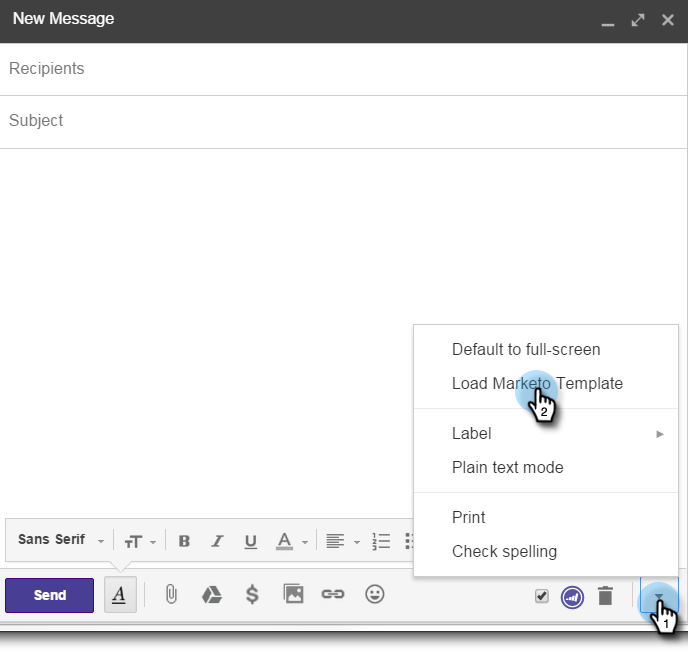

# Marketo Insights gebruiken voor [!DNL Google Chrome] {#using-marketo-insights-for-google-chrome}

Verzend en traceer Google-e-mailberichten met Marketo Insights for [!DNL Google Chrome] .

>[!PREREQUISITES]
>
>[ installeer de Inzichten van Marketo voor  [!DNL Google Chrome]](/help/marketo/product-docs/marketo-sales-insight/msi-chrome-plugin/install-marketo-insights-for-google-chrome.md)

>[!NOTE]
>
>De mogelijkheden van Handelingen van Insight van de verkoop, met inbegrip van Verkoop E-mail verzenden, toevoegen aan de Campagne van de Verkoop, en Taken, zijn niet beschikbaar in de de e-mailplug-ins van de Verkoop Insight voor Gmail en Vooruitzichten. Op dit moment kunnen gebruikers alleen een e-mailbericht met of zonder Marketo-sjabloon van hun e-mailclient verzenden als ze de e-mailplug-ins voor Insight kopen gebruiken.

## Een e-mail verzenden met Marketo Insights {#send-an-email-with-marketo-insights}

1. Klik in het venster Samenstellen op het Marketo-pictogram.

   

1. De knop Verzenden heeft Marketo paars gemaakt! Dit e-mailbericht wordt nu verzonden met Marketo, alle koppelingen worden bijgehouden en er wordt een pixel voor het bijhouden van de gegevens in het e-mailbericht ingevoegd. Dit wordt opgenomen als een e-mailactiviteit voor verzonden verkoop.

   

   >[!NOTE]
   >
   >Met een pixel voor bijhouden weet u wie uw e-mail heeft geopend.

   >[!TIP]
   >
   >Klik indien nodig op de dubbele pijl om deze uit te breiden naar een volledige schermweergave.

1. Als u uw e-mail met een gepubliceerd malplaatje van Marketo wilt vooraf invullen, klik **Meer Opties** en selecteer **[!UICONTROL Load Marketo Template]**.

   

1. Selecteer een **[!UICONTROL Available template]** en klik op **[!UICONTROL Ok]** .

   

1. Voer uw inhoud, een e-mailadres en klik op **[!UICONTROL Send]** .

   

   >[!NOTE]
   >
   >Berichten worden alleen bijgehouden wanneer de knop **[!UICONTROL Send]** paars is.

1. Het e-mailbericht wordt binnenkort weergegeven in je Marketo Sales Insight en eventuele geopende berichten en klikken worden bijgehouden.

   

## Log E-mailantwoorden bij Marketo {#log-email-replies-with-marketo}

U kunt antwoorden en oude activiteit in de activiteitengeschiedenis van een lood registreren.

1. Klik in het voorvertoningsvenster van Google Mail op **[!UICONTROL Log with Marketo]** .

   

1. Dat is alles! Het e-mailbericht wordt binnenkort weergegeven in [!DNL Marketo Sales Insight] .

   

   >[!MORELIKETHIS]
   >
   >* [ installeer de Inzichten van Marketo voor  [!DNL Google Chrome]](/help/marketo/product-docs/marketo-sales-insight/msi-chrome-plugin/install-marketo-insights-for-google-chrome.md)
   >* [ de Persoon van de Mening en de Informatie van de Rekening en Activiteiten in de Post van Google ](/help/marketo/product-docs/marketo-sales-insight/msi-chrome-plugin/view-person-and-account-information-and-activities-in-google-mail.md)
