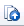
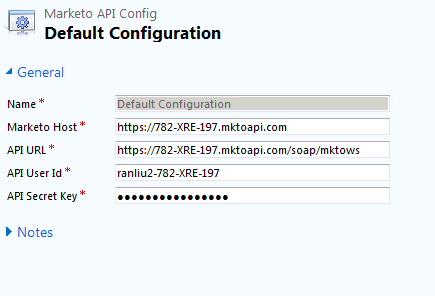

# Installeren en configureren [!DNL Marketo Sales Insight] in [!DNL Microsoft Dynamics 2011] {#install-and-configure-marketo-sales-insight-in-microsoft-dynamics}

[!DNL Marketo Sales Insight] is een fantastisch hulpmiddel voor uw verkoopteam. Hier volgt een stapsgewijze instructie over het installeren en configureren van de software in [!DNL Microsoft Dynamics 2011] Op locatie.

>[!PREREQUISITES]
>
>Voltooi uw integratie tussen Marketo en Microsoft.
>
>[ Download de correcte oplossing ](/help/marketo/product-docs/marketo-sales-insight/msi-for-microsoft-dynamics/installing/download-the-marketo-sales-insight-solution-for-microsoft-dynamics.md) voor uw versie van [!DNL Microsoft Dynamics] CRM.

## Oplossing importeren {#import-solution}

1. Log in bij [!DNL Microsoft Dynamics] CRM. Klik op **[!UICONTROL Settings]** in het menu linksonder.

   

1. Selecteer **[!UICONTROL Solutions]** in de structuur.

   

1. Klik **Invoer** ( ).

   

   >[!NOTE]
   >
   >U zou reeds [ geïnstalleerd en gevormd moeten hebben ](/help/marketo/product-docs/marketo-sales-insight/msi-for-microsoft-dynamics/installing/install-and-configure-marketo-sales-insight-in-microsoft-dynamics-2011.md) de oplossing van Marketo alvorens zich vooruit te bewegen.

1. Klik op **[!UICONTROL Browse]**. Selecteer de [!DNL Marketo Sales Insight] oplossing u  downloadde. Klik op **[!UICONTROL Next]**.

   

1. Controleer de details van de oplossing en klik op **[!UICONTROL Next]** .

   

1. Controleer of de optie SDK-bericht is ingeschakeld. Klik op **[!UICONTROL Next]**.

   

1. Wacht nu tot het importeren is voltooid.

   

1. Klik op **[!UICONTROL Close]**.

   

1. [!DNL Marketo Sales Insight] wordt nu weergegeven in de lijst met oplossingen. Yay!

   

1. Selecteer [!DNL Marketo Sales Insight] en klik op **publiceren Alle Aanpassingen** ( ).

   

## Connect Marketo en Sales Insight  {#connect-marketo-and-sales-insight}

>[!NOTE]
>
>**Vereiste Bevoegdheden Admin**

1. Meld u aan bij Marketo en klik op **[!UICONTROL Admin]** .

   

1. Klik onder de sectie **[!UICONTROL Sales Insight]** op **[!UICONTROL Edit API Configuration]** .

   

1. Kopieer **[!UICONTROL Marketo Host]** , **[!UICONTROL API URL]** en **[!UICONTROL API User Id]** voor gebruik in een latere stap. Voer een **[!UICONTROL API Secret Key]** van uw keuze in en klik op **[!UICONTROL Save]** .

   >[!CAUTION]
   >
   >Gebruik geen en-teken (&amp;) in de geheime API-sleutel.

   

   >[!NOTE]
   >
   >De volgende gebieden moeten met Marketo voor _zowel Lood als Contact_ voor Verkoop Insight worden gesynchroniseerd om te werken:
   >
   >* Prioriteit
   >* Urgentie
   >* Relatieve score
   >
   >Als een van deze velden ontbreekt, wordt in Marketo een foutbericht weergegeven met de naam van de ontbrekende velden. Om dit te bevestigen, voer [ deze procedure ](/help/marketo/product-docs/marketo-sales-insight/msi-for-microsoft-dynamics/setting-up-and-using/required-fields-for-syncing-marketo-with-dynamics.md) uit.

1. Ga terug naar Dynamiek, selecteer **[!UICONTROL Settings]**.

   

1. Selecteer **[!UICONTROL Marketo API Config]** in de structuur.

   

1. Klik op **[!UICONTROL Default Configuration]**.

   

1. Voer de gegevens in die je eerder van Marketo hebt ontvangen.

   

1. Klik op **[!UICONTROL Save]**.

   

## Gebruikerstoegang instellen {#set-user-access}

Stel gebruikersrollen in om specifieke gebruikers toegang te geven tot [!DNL Sales Insight] .

1. Selecteer **[!UICONTROL Settings]** .

   

1. Selecteer **[!UICONTROL Administration]** in de structuur.

   

1. Klik op **[!UICONTROL Users]**.

   

1. Selecteer de gebruiker(s) aan wie u toegang wilt verlenen en klik op **[!UICONTROL Manage Roles]** .

   

1. Selecteer de **[!UICONTROL Marketo Sales Insight]** rol en klik op **[!UICONTROL OK]** .

   

   En dat is het! Alle gebruikers hebben nu toegang tot de sectie Sales insight in de detailweergave voor leads/contactpersonen.

   

   Gefeliciteerd. U hebt nu de kracht van [!DNL Marketo Sales Insight] ontketend.

>[!MORELIKETHIS]
>
>[ de Sterren en Flames van de Opstelling voor Lood/de Verslagen van het Contact ](/help/marketo/product-docs/marketo-sales-insight/msi-for-microsoft-dynamics/setting-up-and-using/setting-up-stars-and-flames-for-lead-contact-records.md)
