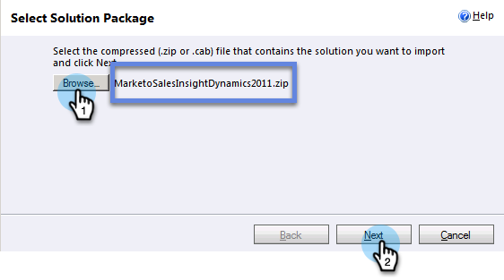

# Het Inzicht van de Verkoop van de Marketo in de Dynamica 2011 van Microsoft installeren en vormen {#install-and-configure-marketo-sales-insight-in-microsoft-dynamics}

Marketo Sales Insight is een fantastisch hulpmiddel voor uw verkoopteam. Hier is de geleidelijke instructie van hoe te om het in de Dynamica 2011 van Microsoft te installeren en te vormen On-Premises.

>[!PREREQUISITES]
>
>Voltooi uw [Marketo-Microsoft integratie](http://docs.marketo.com/x/DoA2).
>
>[Download de correcte ](http://docs.marketo.com/x/LoJo) oplossing voor uw versie van CRM van de Dynamica van Microsoft.

## Oplossing {#import-solution} importeren

1. Meld u aan bij Microsoft Dynamics CRM. Klik op **Instellingen** linksonder in het menu.

   

1. Selecteer **Oplossingen** in de boom.

   

1. Klik **Importeren** ( ).

   

   >[!NOTE]
   >
   >**Herinnering**
   >
   >
   >U zou [reeds moeten hebben geïnstalleerd en gevormd ](install-and-configure-marketo-sales-insight-in-microsoft-dynamics-2011.md) de oplossing van het Marketo alvorens zich vooruit te bewegen.

1. Klik **Bladeren**. Selecteer de oplossing van het Inzicht van de Verkoop van de Marketo u [downloadde](download-the-marketo-sales-insight-solution-for-microsoft-dynamics.md). Klik **Volgende**.

   

1. Verifieer de details van de oplossing, en klik **Next**.

   

1. Controleer of de optie voor het SDK-bericht is ingeschakeld. Klik **Volgende**.

   

1. Wacht nu tot het importeren is voltooid.

   

1. Klik **Close**.

   

1. Het Inzicht van de Verkoop van de Marketo zal nu in de oplossingslijst verschijnen. Yay!

   

1. Selecteer Marktverkoop Inzicht en klik op **Alle aanpassingen publiceren** ( ).

   

## {#connect-marketo-and-sales-insight}

>[!NOTE]
>
>**Beheerdersmachtigingen vereist**

1. Meld u aan bij Marketo en klik op **Admin**.

   

1. Onder **het Inzicht van de Verkoop **sectie klikt **geef API Configuratie** uit.

   

1. Kopieer **Marketo Host**, **API URL**, en **API Gebruiker ID** voor gebruik in een recentere stap. Voer een **API-beveiligingssleutel** van uw keuze in en klik op **OPSLAAN**.

   >[!CAUTION]
   >
   >Gebruik geen en-teken (&amp;) in de geheime API-sleutel.

   

   >[!NOTE]
   >
   >De volgende gebieden moeten met Marketo voor *zowel Lood als Contact* voor het Inzicht van de Verkoop worden gesynchroniseerd om te werken:
   >
   >    
   >    
   >    * Prioriteit
   >    * Urgentie
   >    * Relatieve score

   >    
   >    
   >Als een van deze velden ontbreekt, wordt in Marketo een foutbericht weergegeven met de naam van de ontbrekende velden. Om dit te bevestigen, voer [deze procedure](../../../../product-docs/marketo-sales-insight/msi-for-microsoft-dynamics/setting-up-and-using/required-fields-for-syncing-marketo-with-dynamics.md) uit.

1. Ga terug naar Dynamiek, uitgezochte **Montages**.

   

1. Selecteer **Marketo API Config** in de boomstructuur.

   

1. Klik **Standaardconfiguratie**.

   

1. Voer de gegevens in die u eerder van Marketo hebt ingevoerd.

   

1. Klik **Opslaan.**

   ** 

   **

## Gebruikerstoegang {#set-user-access} instellen

De gebruikersrollen van de opstelling om specifieke gebruikers toegang tot het Inzicht van de Verkoop te geven.

1. Selecteer **Instellingen**.

   

1. Selecteer **Beheer** in de boom.

   

1. Klik **Users**.

   

1. Selecteer de gebruiker(s) aan wie u toegang wilt verlenen en klik **Rollen beheren**.

   

1. Selecteer de rol **Marketo Sales Insight** en klik **OK**.

   

   En dat is het! Alle gebruikers hebben toegang zal nu de sectie van het verkoopinzicht in de lood/contactdetailmening kunnen zien.

   

   Gefeliciteerd. Je hebt nu de kracht van Marketo Sales Insight vrijgemaakt.

>[!MORELIKETHIS]
>
>[Sterren en vlammen instellen voor lead/contact-records](http://docs.marketo.com/x/BICMAg)

