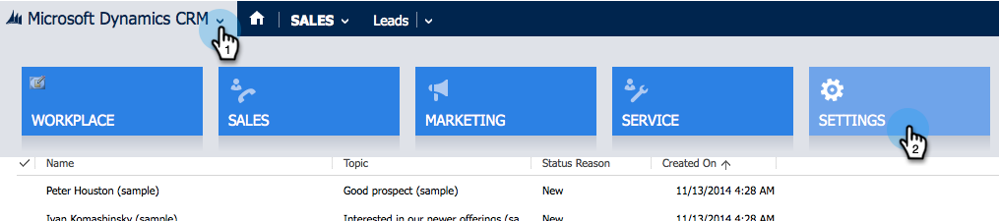

# Installeren en configureren [!DNL Marketo Sales Insight] in [!DNL Microsoft Dynamics 2015] {#install-and-configure-marketo-sales-insight-in-microsoft-dynamics}

Marketo Sales Insight is een fantastisch hulpmiddel om uw verkoopteam een &quot;venster&quot;in de rijkdom aan gegevens te geven het team van de Marketing heeft. Hieronder wordt beschreven hoe u de toepassing installeert en configureert in [!DNL Microsoft Dynamics 2015]

>[!PREREQUISITES]
>
>Voltooi uw integratie tussen Marketo en Microsoft.
>
>[ Download de correcte oplossing ](/help/marketo/product-docs/marketo-sales-insight/msi-for-microsoft-dynamics/installing/download-the-marketo-sales-insight-solution-for-microsoft-dynamics.md) voor uw versie van [!DNL Microsoft Dynamics CRM].

## Oplossing importeren {#import-solution}

Nu is het tijd om de [!DNL Marketo Sales Insight] -oplossing te importeren in [!DNL Microsoft Dynamics] . Hieronder wordt beschreven hoe:

1. Klik onder [!UICONTROL Microsoft Dynamics CRM] op **[!UICONTROL Settings]** .

   

1. Klik onder [!UICONTROL SETTINGS] op **[!UICONTROL Customizations]** .

   

1. Klik op **[!UICONTROL Solutions]**.

   

   >[!NOTE]
   >
   >U had de Marketo-oplossing al moeten installeren en configureren voordat u verdergaat.

1. Klik op **[!UICONTROL Import]**.

   

1. Klik in het nieuwe venster op **[!UICONTROL Browse]** .

   

1. Zoek en selecteer de hierboven gedownloade oplossing.

   

1. Klik op **[!UICONTROL Next]**.

   

1. De oplossing zal uploaden. U kunt de inhoud van het pakket desgewenst weergeven. Klik op **[!UICONTROL Next]**.

   

1. Zorg dat het selectievakje ingeschakeld blijft en klik op **[!UICONTROL Import]** .

   

1. U kunt het logbestand vrij downloaden en vervolgens op **[!UICONTROL Close]** klikken.

   

1. Geweldig! U moet nu de oplossing zien. Als het er niet is, vernieuw uw scherm.

   

## Connect Marketo en Sales Insight {#connect-marketo-and-sales-insight}

Laten we uw Marketo-instantie koppelen aan [!DNL Sales Insight] in [!DNL Dynamics] . Hieronder wordt beschreven hoe:

>[!NOTE]
>
>Beheerdersrechten vereist.

1. Meld u aan bij Marketo en ga naar de sectie **[!UICONTROL Admin]** .

   

1. Klik onder de sectie [!UICONTROL Sales Insight] op **[!UICONTROL Edit API Configuration]** .

   

1. Kopieer **[!UICONTROL Marketo Host]** , **[!UICONTROL API URL]** en **[!UICONTROL API User Id]** voor gebruik in een latere stap. Voer de gewenste API-beveiligingssleutel in en klik op **[!UICONTROL Save]** .

   >[!CAUTION]
   >
   >Gebruik geen en-teken (&amp;) in de geheime API-sleutel.

   

   >[!NOTE]
   >
   >De volgende gebieden moeten met Marketo voor *zowel Lood als Contact* voor [!DNL Sales Insight] worden gesynchroniseerd om te werken:
   >
   >* Prioriteit
   >* Urgentie
   >* Relatieve score
   >
   >Als een van deze velden ontbreekt, wordt in Marketo een foutbericht weergegeven met de naam van de ontbrekende velden. Om dit te bevestigen, voer [ deze procedure ](/help/marketo/product-docs/marketo-sales-insight/msi-for-microsoft-dynamics/setting-up-and-using/required-fields-for-syncing-marketo-with-dynamics.md) uit.

1. Ga terug in [!DNL Microsoft Dynamics] en ga naar **[!UICONTROL Settings]** .

   

1. Klik onder **[!UICONTROL Settings]** op **[!UICONTROL Marketo API Config]** .

   

1. Klik op **[!UICONTROL New]**.

   

1. Voer de informatie in die u eerder van Marketo hebt ontvangen en klik op **[!UICONTROL Save]** .

   

## Gebruikerstoegang instellen {#set-user-access}

Tot slot moet je specifieke gebruikers toegang geven tot Marketo Sales Insight.

1. Ga naar **[!UICONTROL Settings]** .

   

1. Ga naar **[!UICONTROL Security]** .

   

1. Klik op **[!UICONTROL Users]**.

   

1. Selecteer de gebruikers tot wie u toegang wilt geven [!DNL Sales Insight] en klik **[!UICONTROL Manage Roles]**.

   

1. Selecteer de [!DNL Marketo Sales Insight] rol en klik op **[!UICONTROL OK]** .

   

   En jullie moeten allemaal klaar zijn! Als u ten slotte een test wilt uitvoeren, meldt u zich aan bij [!DNL Dynamics] als een gebruiker die toegang heeft tot [!DNL Marketo Sales Insight] en bekijkt u een lead of contactpersoon.

   

U hebt nu de kracht van [!DNL Marketo Sales Insight] voor uw verkoopteam ontgrendeld.

>[!MORELIKETHIS]
>
>[ de Sterren en Flames van de Opstelling voor Lood/de Verslagen van het Contact ](/help/marketo/product-docs/marketo-sales-insight/msi-for-microsoft-dynamics/setting-up-and-using/setting-up-stars-and-flames-for-lead-contact-records.md)
