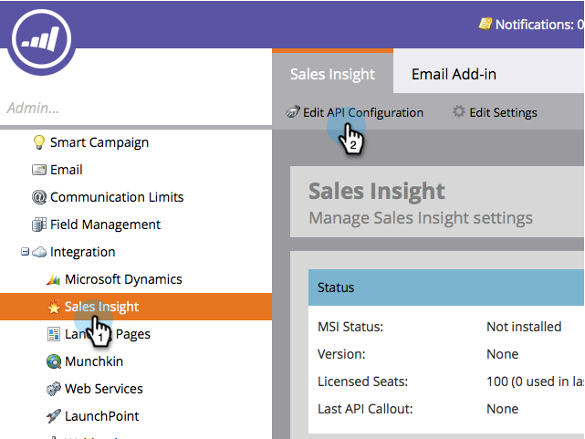
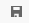

# Installeren en configureren [!DNL Marketo Sales Insight] in [!DNL Microsoft Dynamics 365] {#install-and-configure-marketo-sales-insight-in-microsoft-dynamics}

[!DNL Marketo Sales Insight] is een fantastisch hulpmiddel om uw verkoopteam een &quot;venster&quot;in de rijkdom van gegevens te geven het team van de Marketing heeft. Hier is hoe te installeren en te vormen.

>[!PREREQUISITES]
>
>Voltooi uw integratie tussen Marketo en Microsoft.
>
>[ Download de correcte oplossing ](/help/marketo/product-docs/marketo-sales-insight/msi-for-microsoft-dynamics/installing/download-the-marketo-sales-insight-solution-for-microsoft-dynamics.md) voor uw versie van [!DNL Microsoft Dynamics CRM].

## Oplossing importeren {#import-solution}

1. Meld u aan bij [[!DNL Microsoft Office 365] ](https://login.microsoftonline.com/) .

   

1. Klik  menu en selecteer **CRM**.

   

1. Klik op het menu  . Selecteer in de vervolgkeuzelijst **[!DNL Settings]** en selecteer vervolgens **[!DNL Solutions]** .

   

   >[!NOTE]
   >
   >U zou reeds [ geïnstalleerd en de oplossing van Marketo ](/help/marketo/product-docs/crm-sync/microsoft-dynamics-sync/sync-setup/microsoft-dynamics-365-with-ropc-connection/step-1-of-4-install.md) moeten gevormd hebben alvorens zich vooruit te bewegen.

1. Klik op **[!UICONTROL Import]**.

   

1. Klik in het nieuwe venster op **[!UICONTROL Browse]** . Kies de [ oplossing van Insight van de Verkoop van Marketo u in stap 1 ](#msi) downloadde. Klik op **[!UICONTROL Next]**.

   

1. De oplossing zal uploaden. U kunt de inhoud van het pakket desgewenst weergeven. Klik op **[!UICONTROL Next]**.

   

1. Laat het vak **[!UICONTROL checked]** staan en klik op **[!UICONTROL Import]** .

   

1. U kunt het logbestand vrij downloaden. Klik op **[!UICONTROL Close]**.

   

1. Geweldig! U moet nu de oplossing zien. Als het er niet is, vernieuw uw scherm.

   

1. Klik op **[!UICONTROL Publish All Customizations]**.

   

## Connect Marketo en [!DNL Sales Insight] {#connect-marketo-and-sales-insight}

Laten we uw Marketo-instantie koppelen aan [!DNL Sales Insight] in [!DNL Dynamics] . Hieronder wordt beschreven hoe:

>[!NOTE]
>
>**Vereiste Bevoegdheden Admin**

1. Meld u aan bij Marketo en ga naar de sectie **[!UICONTROL Admin]** .

   

1. Onder de **[!UICONTROL Sales Insight]** sectie, geeft de klik **API Configuratie** uit.

   

1. Kopieer de **[!UICONTROL Marketo Host]** , **[!UICONTROL API URL]** en **[!UICONTROL API User Id]** voor gebruik in een latere stap. Voer een **[!UICONTROL API Secret Key]** van uw keuze in en klik op **[!UICONTROL Save]** .

   >[!CAUTION]
   >
   >Gebruik geen en-teken (&amp;) in de geheime API-sleutel.

   

   >[!NOTE]
   >
   >De volgende gebieden moeten met Marketo voor _zowel Lood als Contact_ voor [!DNL Sales Insight] worden gesynchroniseerd om te werken:
   >
   > * Prioriteit
   > * Urgentie
   > * Relatieve score
   >
   >Als een van deze velden ontbreekt, wordt in Marketo een foutbericht weergegeven met de naam van de ontbrekende velden. Om dit te bevestigen, voer [ deze procedure ](/help/marketo/product-docs/marketo-sales-insight/msi-for-microsoft-dynamics/setting-up-and-using/required-fields-for-syncing-marketo-with-dynamics.md) uit.

1. Klik in [!DNL Microsoft Dynamics] weer op het pictogram  naast [!UICONTROL Settings] en selecteer vervolgens **[!UICONTROL Marketo API Config]** in het vervolgkeuzemenu.

   

1. Klik op **[!UICONTROL Default Configuration]**.

   

1. Voer de gegevens in die u eerder uit Marketo hebt gekopieerd.

   

1. Klik op het pictogram  in de rechterbenedenhoek om de wijzigingen op te slaan.

## Gebruikerstoegang instellen {#set-user-access}

U moet gebruikers machtigingen geven om [!DNL Sales Insight] te gebruiken.

1. Klik op het menu  . Selecteer **[!UICONTROL Settings]** in het vervolgkeuzemenu en selecteer vervolgens **[!UICONTROL Security]** .

   

1. Klik op **[!UICONTROL Users]**.

   

1. Selecteer de gebruiker(s) tot wie u toegang wilt geven [!DNL Sales Insight] en klik op **[!UICONTROL Manage Roles]** .

   

1. Selecteer de **[!UICONTROL Marketo Sales Insight]** rol en klik op **[!UICONTROL OK]** .

   

   En jullie moeten allemaal klaar zijn! Als u ten slotte een test wilt uitvoeren, meldt u zich aan bij [!DNL Dynamics] als een gebruiker die toegang heeft tot [!DNL Marketo Sales Insight] en bekijkt u een lead of contactpersoon.

   

U hebt nu de kracht van [!DNL Marketo Sales Insight] voor uw verkoopteam ontgrendeld.

>[!MORELIKETHIS]
>
>[ de Sterren en Flames van de Opstelling voor Lood/de Verslagen van het Contact ](/help/marketo/product-docs/marketo-sales-insight/msi-for-microsoft-dynamics/setting-up-and-using/setting-up-stars-and-flames-for-lead-contact-records.md)
