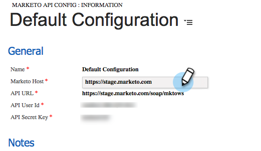

# Het Inzicht van de Verkoop van de Marketo in de Dynamica 365 van Microsoft installeren en vormen {#install-and-configure-marketo-sales-insight-in-microsoft-dynamics}

Marketo Sales Insight is een fantastisch hulpmiddel om uw verkoopteam een &quot;venster&quot;in de rijkdom aan gegevens te geven het team van de Marketing heeft. Hier is hoe te installeren en te vormen.

>[!PREREQUISITES]
>
>Voltooi uw integratie [van](http://docs.marketo.com/x/E4A2)Marketo-Microsoft.
>
>[Download de correcte oplossing](http://docs.marketo.com/x/LoJo) voor uw versie van CRM van de Dynamica van Microsoft.

## Oplossing importeren {#import-solution}

1. Meld u aan bij [Microsoft Office 365](https://login.microsoftonline.com/).

   

1. Klik  menu en selecteer **CRM**.

   

1. Klik op het  menu. Selecteer **Instellingen** in de vervolgkeuzelijst en selecteer **Oplossingen**.

   

   >[!NOTE]
   >
   >**Herinnering**
   >
   >
   >U zou reeds de oplossing [van de Marketo moeten hebben](../../../../product-docs/crm-sync/microsoft-dynamics-sync/sync-setup/microsoft-dynamics-365/step-1-of-3-install.md) geïnstalleerd en gevormd alvorens zich vooruit te bewegen.

   Klik op Importeren.
   

1. Klik in het nieuwe venster op **Bladeren**. Kies de oplossing van het Inzicht van de Verkoop van de [Marketo u in stap 1](#msi)downloadde. Klik op **Volgende**.

   

1. De oplossing wordt geüpload. U kunt de inhoud van het pakket desgewenst weergeven. Klik op **Volgende**.

   

1. Zorg ervoor dat het vak **ingeschakeld** blijft en klik op **Importeren**.

   

1. U kunt het logbestand vrij downloaden. Klik op **Sluiten**.

   

1. Geweldig! U moet nu de oplossing zien. Als het er niet is, vernieuw uw scherm.

   

1. Klik op Alle aanpassingen **publiceren**.

   

## Connect Marketo en Sales Insight {#connect-marketo-and-sales-insight}

Laten we je Marketo-instantie aan Sales Insight in Dynamics koppelen. Hieronder wordt beschreven hoe:

>[!NOTE]
>
>**Beheerdersmachtigingen vereist**

1. Meld u aan bij Marketo en ga naar de sectie **Admin** .

   

1. Klik onder de sectie **Verkoopoverzicht** op API-configuratie **** bewerken.

   

1. Kopieer de **Marketo-host**, de **API-URL** en de **API-gebruikersnaam** voor gebruik in een latere stap. Voer een **API-beveiligingssleutel** van uw keuze in en klik op **OPSLAAN**.

   >[!CAUTION]
   >
   >Gebruik geen en-teken (&amp;) in de geheime API-sleutel.

   

   >[!NOTE]
   >
   >De volgende velden moeten worden gesynchroniseerd met Marketo, zodat *zowel de Lead als de Contact* voor Verkoopinzicht kunnen werken:
   >
   > * Prioriteit
   > * Urgentie
   > * Relatieve score

   >
   >Als een van deze velden ontbreekt, wordt in Marketo een foutbericht weergegeven met de naam van de ontbrekende velden. Om dit te bevestigen, voer [deze procedure](../../../../product-docs/marketo-sales-insight/msi-for-microsoft-dynamics/setting-up-and-using/required-fields-for-syncing-marketo-with-dynamics.md)uit.

1. Klik in Microsoft Dynamics op het  pictogram naast Instellingen en selecteer vervolgens Config **van** Marketo API in het vervolgkeuzemenu.

   

1. Klik op **Standaardconfiguratie**.

   

1. Voer de informatie in die u van Marketo eerder hebt gekopieerd.

   

1. Klik op het  pictogram in de rechterbenedenhoek om de wijzigingen op te slaan.

## Gebruikerstoegang instellen {#set-user-access}

U moet gebruikers toestemmingen geven om het Inzicht van de Verkoop te gebruiken.

1. Klik op het  menu. Selecteer **Instellingen** in het vervolgkeuzemenu en selecteer **Beveiliging**.

   

1. Klik op **Gebruikers**.

   

1. Selecteer de gebruiker(s) die u toegang wilt geven tot Sales Insight en klik op **Rollen** beheren.

   

1. Selecteer de rol **Marketo Sales Insight** en klik op **OK**.

   

   En jullie moeten allemaal klaar zijn! Tot slot om te testen, login als gebruiker die toegang tot het Inzicht van de Verkoop van de Marketo heeft en bekijk een lood of een contact.

   

U hebt nu de macht van het Inzicht van de Verkoop van de Marketo voor uw verkoopteam ontgrendeld.

>[!NOTE]
>
>**Verwante artikelen**
>
>[Sterren en vlammen instellen voor lead/contact-records](http://docs.marketo.com/x/BICMAg)