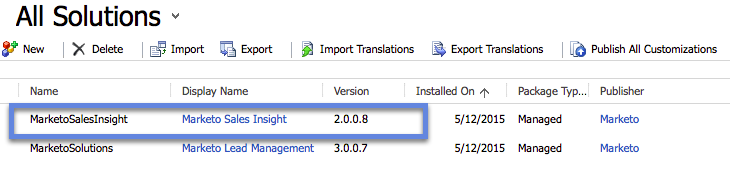

# Marketo Sales Insight installeren en configureren in Microsoft Dynamics 365 {#install-and-configure-marketo-sales-insight-in-microsoft-dynamics}

Marketo Sales Insight is een fantastisch hulpmiddel om uw verkoopteam een &quot;venster&quot; te geven in de schat aan gegevens die het marketingteam heeft. Hier is hoe te installeren en te vormen.

>[!PREREQUISITES]
>
>Voltooi uw integratie tussen Marketo en Microsoft.
>
>[Download de juiste oplossing](/help/marketo/product-docs/marketo-sales-insight/msi-for-microsoft-dynamics/installing/download-the-marketo-sales-insight-solution-for-microsoft-dynamics.md) voor uw versie van Microsoft Dynamics CRM.

## Oplossing importeren {#import-solution}

1. Aanmelden bij [Microsoft Office 365](https://login.microsoftonline.com/).

   

1. Klik op de knop  en selecteert u **CRM**.

   

1. Klik op de knop  -menu. Selecteer in de vervolgkeuzelijst de optie **Instellingen** selecteert u vervolgens **Oplossingen**.

   

   >[!NOTE]
   >
   >U moet al [De Marketo-oplossing installeren en configureren](/help/marketo/product-docs/crm-sync/microsoft-dynamics-sync/sync-setup/microsoft-dynamics-365-with-ropc-connection/step-1-of-4-install.md) voordat u verder gaat.

1. Klikken **Importeren**.

   

1. Klik in het nieuwe venster op **Bladeren**. Kies de optie [Marketo Sales Insight-oplossing die u in stap 1 hebt gedownload](#msi). Klikken **Volgende**.

   

1. De oplossing wordt geüpload. U kunt de inhoud van het pakket desgewenst weergeven. Klikken **Volgende**.

   

1. Zorg ervoor dat u de doos verlaat **ingeschakeld** en klik op **Importeren**.

   

1. U kunt het logbestand vrij downloaden. Klikken **Sluiten**.

   

1. Geweldig! U moet nu de oplossing zien. Als het er niet is, vernieuw uw scherm.

   

1. Klikken **Alle aanpassingen publiceren**.

   

## Connect Marketo en Sales Insight {#connect-marketo-and-sales-insight}

Laten we je Marketo-exemplaar koppelen aan Sales Insight in Dynamics. Hieronder wordt beschreven hoe:

>[!NOTE]
>
>**Beheerdersmachtigingen vereist**

1. Meld u aan bij Marketo en ga naar de **Beheer** sectie.

   

1. Onder de **Verkoopoverzicht** sectie, klikt u op **API-configuratie bewerken**.

   

1. Kopieer de **Marketo-host**, **API-URL** en **API-gebruikersnaam** voor gebruik in een latere stap. Voer een **API-beveiligingssleutel** van uw keuze en klik op **Opslaan**.

   >[!CAUTION]
   >
   >Gebruik geen en-teken (&amp;) in de geheime API-sleutel.

   

   >[!NOTE]
   >
   >De volgende velden moeten met Marketo worden gesynchroniseerd voor _Zowel lead als contact_ voor Sales Insight om te werken:
   >
   > * Prioriteit
   > * Urgentie
   > * Relatieve score

   >
   >Als een van deze velden ontbreekt, wordt in Marketo een foutbericht weergegeven met de naam van de ontbrekende velden. Om dit te verhelpen, voert u [deze procedure](/help/marketo/product-docs/marketo-sales-insight/msi-for-microsoft-dynamics/setting-up-and-using/required-fields-for-syncing-marketo-with-dynamics.md).

1. Klik in Microsoft Dynamics op de knop  pictogram naast Instellingen en selecteer vervolgens **Marketo API Config** in de vervolgkeuzelijst.

   

1. Klikken **Standaardconfiguratie**.

   

1. Voer de gegevens in die u eerder uit Marketo hebt gekopieerd.

   

1. Klik op de knop  in de rechterbenedenhoek om de wijzigingen op te slaan.

## Gebruikerstoegang instellen {#set-user-access}

U moet gebruikers toestemmingen geven om het Inzicht van de Verkoop te gebruiken.

1. Klik op de knop  -menu. Selecteer in het vervolgkeuzemenu **Instellingen** selecteert u vervolgens **Beveiliging**.

   

1. Klikken **Gebruikers**.

   

1. Selecteer de gebruiker(s) aan wie je toegang wilt geven tot Verkoopoverzicht en klik op **Rollen beheren**.

   

1. Selecteer **Marketo Sales Insight** rol en klik **OK**.

   

   En jullie moeten allemaal klaar zijn! Tot slot om te testen, login als gebruiker die toegang tot het Inzicht van de Verkoop van Marketo heeft en bekijk een lood of een contact.

   

Je hebt nu de kracht van Marketo Sales Insight voor je verkoopteam ontgrendeld.

>[!MORELIKETHIS]
>
>[Sterren en vlammen instellen voor lead/contact-records](/help/marketo/product-docs/marketo-sales-insight/msi-for-microsoft-dynamics/setting-up-and-using/setting-up-stars-and-flames-for-lead-contact-records.md)
