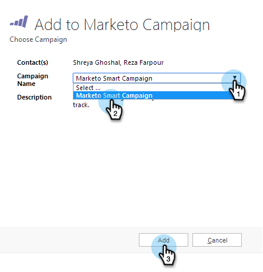

# Een lead/contactpersoon toevoegen aan een Marketo-campagne vanuit [!DNL Microsoft Dynamics] {#add-a-lead-contact-to-a-marketo-campaign-from-microsoft-dynamics}

U kunt snel en eenvoudig rechtstreeks vanuit [!DNL Microsoft Dynamics] leads/contactpersonen toevoegen aan slimme Marketo-campagnes. Zo gaat het.

1. Ga in [!DNL Dynamics] naar het **[!UICONTROL Sales]** -gebied.

   

1. Selecteer een weergave.

   

1. Selecteer een of meer leads of contactpersonen.

   

1. Klik op **...** en selecteer **[!UICONTROL Add to Marketo Campaign]** .

   

1. Selecteer de Marketo-campagne waaraan u de leads of contactpersonen wilt toevoegen en klik op **[!UICONTROL Add]** .

   

   >[!NOTE]
   >
   >Voor de campagne om in drop-down te verschijnen, gebruik de [**Campagne wordt Gevraagd** trekker ](/help/marketo/product-docs/core-marketo-concepts/smart-campaigns/using-smart-campaigns/setting-up-a-trigger-smart-campaign-for-sales-using-campaign-is-requested.md), met [!DNL Sales Insight] als bron, wanneer u opstelling de campagne.

En dat zijn allemaal mensen! U hebt nu de kracht van Marketo Smart-campagnes rechtstreeks vanuit [!DNL Dynamics] in uw handen.
