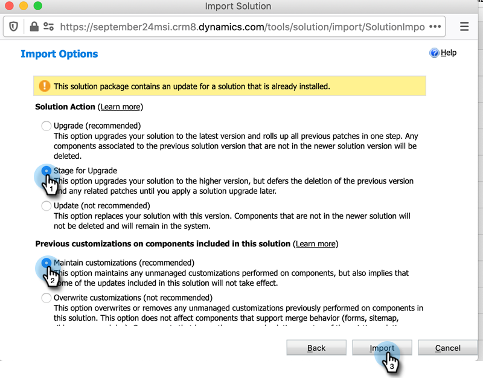

# Upgrade de [!DNL Marketo Sales Insight] oplossing voor [!DNL Microsoft Dynamics] {#upgrade-the-marketo-sales-insight-solution-for-microsoft-dynamics}

Wanneer nieuwe [!DNL Microsoft Dynamics] -oplossingen worden uitgebracht voor [!DNL Sales Insight] , kunt u de Upgrade downloaden vanuit het gebied [!UICONTROL Admin] in uw account.

>[!NOTE]
>
>**Vereiste Bevoegdheden Admin**

1. Ga naar het **[!UICONTROL Admin]** -gebied.

   

1. Klik op **[!UICONTROL Microsoft Dynamics]**.

   

1. Selecteer **[!UICONTROL Download Marketo Solution]** .

   

1. Selecteer de geschikte oplossing voor uw [!DNL Microsoft Dynamics] -versie.

   

   Geweldig! Een ZIP-bestand van de oplossing wordt nu naar het apparaat gedownload.

## De upgrade uitvoeren {#performing-the-upgrade}

1. Importeer de recentste versie van de oplossing over de bestaande versie van uw [!DNL Dynamics CRM] (bijvoorbeeld: als uw [!DNL Dynamics CRM] versie 1.4 heeft en de recentste versie 1.5 is, zou u _over_ versie 1.4 invoeren).

2. De volgende pop-up wordt weergegeven. Selecteer **[!UICONTROL Stage for Upgrade]** en **[!UICONTROL Maintain customizations]** en klik op **[!UICONTROL Import]** .

