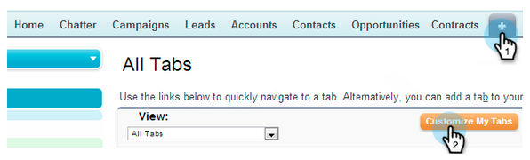

# Marketo-tab toevoegen aan [!DNL Salesforce] {#add-marketo-tab-to-salesforce}

1. Klik in [!DNL Salesforce] op **+** en klik op **[!UICONTROL Customize My Tabs]** .

   

1. Selecteer Marketo in de linkerlijst. Klik vervolgens op **[!UICONTROL Add]** om het toe te voegen aan de **[!UICONTROL Selected]tabbladen** .

   >[!TIP]
   >
   >Gebruik de pijltoetsen **[!UICONTROL Up]** en **[!UICONTROL Down]** om de tabvolgorde te wijzigen.

   

   En hier is je Marketo tab!

   
