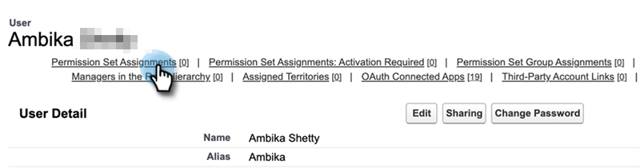

# Toestemming voor verkoopinzicht toevoegen {#add-sales-insight-permission-set}

Gebruik de volgende stappen om toegang tot de eigenschappen van het Inzicht van de Verkoop in Salesforce toe te voegen. Van toepassing op Salesforce Classic en Lightening

>[!PREREQUISITES]
>
>[Het Salesforce-pakket voor verkoopinzicht bijwerken](/help/marketo/product-docs/marketo-sales-insight/msi-for-salesforce/upgrading/upgrading-your-msi-package.md){target="_blank"} naar versie 1.8000 of hoger om deze functie te gebruiken.

>[!IMPORTANT]
>
>Als u al eerder toegang hebt gegeven tot alle profielen en/of Sales Insight voor al uw gebruikers hebt geïmplementeerd, moet u [toegang tot profielniveau verwijderen](/help/marketo/product-docs/marketo-sales-insight/msi-for-salesforce/configuration/remove-sales-insight-access.md){target="_blank"} om deze rechtenset te gebruiken.

## Overzicht {#overview}

De &quot;Marketo App&quot;-machtiging maakt deel uit van het Salesforce-pakket voor het instellen van verkoopgegevens. Dit omvat toegang tot de hieronder vermelde objecten, apex-klassen en pagina&#39;s voor visuele kracht. Deze zijn vereist om tot alle eigenschappen van het Inzicht van de Verkoop toegang te hebben.

**Objectinstellingen**

<table> 
 <tbody> 
 <tr> 
   <td>BestBetsCache</td> 
   <td>Alles lezen, maken, bewerken, verwijderen, bekijken, wijzigen</td> 
  </tr> 
  <tr> 
   <td>Gegevens beste biets</td> 
   <td>Alles lezen, maken, bewerken, verwijderen, bekijken, wijzigen</td> 
  </tr> 
  <tr> 
   <td>Weergaven beste ets</td> 
   <td>Alles lezen, maken, bewerken, verwijderen, bekijken, wijzigen</td> 
  </tr> 
  <tr> 
   <td>EmailActivityCache</td> 
   <td>Alles lezen, maken, bewerken, verwijderen, bekijken, wijzigen</td> 
  </tr> 
  <tr> 
   <td>GetMethodArgus</td> 
   <td>Alles lezen, maken, bewerken, verwijderen, bekijken, wijzigen</td> 
  </tr> 
  <tr> 
   <td>GroupedWebActivityCache</td> 
   <td>Alles lezen, maken, bewerken, verwijderen, bekijken, wijzigen</td> 
  </tr> 
  <tr> 
   <td>InterestingMomentsCache</td> 
   <td>Alles lezen, maken, bewerken, verwijderen, bekijken, wijzigen</td> 
  </tr> 
  <tr> 
   <td>Marketo Sales Insight Config</td> 
   <td>Alles lezen, maken, bewerken, verwijderen, bekijken, wijzigen</td> 
  </tr> 
  <tr> 
   <td>ScoringCache</td> 
   <td>Alles lezen, maken, bewerken, verwijderen, bekijken, wijzigen</td> 
  </tr> 
  <tr> 
   <td>Waarden</td> 
   <td>Alles lezen, maken, bewerken, verwijderen, bekijken, wijzigen</td> 
  </tr> 
  <tr> 
   <td>WebActivityCache</td> 
   <td>Alles lezen, maken, bewerken, verwijderen, bekijken, wijzigen</td> 
  </tr> 
 </tbody> 
</table>

* Toegang tot Apex-klasse: 159 Apex-klassen die beginnen met &quot;mkto_si&quot;
* Toegang tot visuale pagina: 64 Visuale pagina&#39;s die beginnen met &quot;mkto_si&quot;
* Definities aangepaste instelling: mkto_si.Marketo Settings &amp; mkto_si.User Preferences

## Marketo App Permission Set toevoegen aan gebruikers {#adding-marketo-app-permission-set-to-users}

1. Meld u aan bij uw Salesforce-account.

1. Klikken **Instellen**.

   

1. Klik onder Beheerder om de bewerking ongedaan te maken **Gebruikers beheren** vervolgens **Gebruikers**.

   

1. Selecteer onder Alle gebruikers de gebruiker tot wie u toegang wilt verlenen en klik vervolgens op **Toewijzingen machtigingsset**.

   

1. Klikken **Toewijzingen bewerken**.

   

1. Selecteren **Marketo App Access** uit de beschikbare rechtensets, dan **Toevoegen**. Klikken **Opslaan**.

   

1. Wanneer u nu naar beneden schuift op de pagina Gebruikersdetails, ziet u &quot;Marketo App Access&quot; onder Toewijzingen machtigingsset.

   

>[!NOTE]
>
>Gebruikers die geen toegang tot het Inzicht van de Verkoop hebben zullen dit bericht zien: &quot;U hebt onvoldoende rechten om dit tabblad te openen.&quot;

Dat is het! U hebt met succes toegang tot het Inzicht van de Verkoop toegevoegd. Herhaal dezelfde stappen voor elk ander profiel waarvoor u toegang wilt toevoegen.
