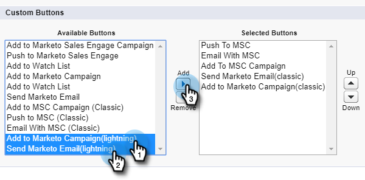

# Bulkhandelingen in [!DNL Salesforce Lightning] {#bulk-actions-in-salesforce-lightning}

Hieronder wordt beschreven hoe u bulkacties instelt in [!DNL Salesforce Lightning] .

1. Klik in [!DNL Salesforce] op het pictogram Setup en selecteer **[!UICONTROL Setup]** .

   

1. Klik op de tab **[!UICONTROL Object Manager]** .

   

1. Zoek en selecteer het label **[!UICONTROL Lead]** .

   

1. Klik op **[!UICONTROL Search Layouts for Salesforce Classic]**.

   

   Zoek de lay-out Lijstweergave. Klik op de vervolgkeuzelijst rechts en selecteer **[!UICONTROL Edit]** .

   

1. Zoek en selecteer **[!UICONTROL Add to Marketo Campaign (lightning)]** en **[!UICONTROL Send Marketo Email (lightning)]** onder Aangepaste knoppen. Klik op **[!UICONTROL Add]** .

   

1. Klik op **[!UICONTROL Save]**.

   

   U kunt nu bulksgewijze actieknoppen weergeven in de weergave Lijst met leads.

   >[!NOTE]
   >
   >Herhaal dezelfde stappen om acties voor grote hoeveelheden toe te voegen in de lijstweergave van uw contactpersoon.
