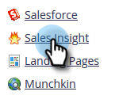

# Configuratie voor bestaande klanten {#configuration-for-existing-customers}

Stel de volgende configuratie in om te beginnen met het gebruik van het nieuwe dashboard Inzichten.

>[!PREREQUISITES]
>
>Zorg ervoor dat u het Salesforce-pakket hebt bijgewerkt naar de nieuwste versie

## Verkoopinzicht configureren in Marketo {#configure-sales-insight-in-marketo}

1. Open een nieuw tabblad in uw browser om de gegevens van Marketo Sales Insights van uw Marketo-account op te halen.

1. Ga naar de **Beheer** gebied.

   

1. Klikken **Verkoopoverzicht**.

   

1. Klikken **Weergave** om referenties voor de rest-API te vullen.

   

1. Er verschijnt een bevestigingspop-up. Klikken **OK**.

## Verkoopinzicht configureren in Salesforce {#configure-sales-insight-in-salesforce}

1. Klik in Salesforce op **Instellen**.

   

1. Zoeken naar en selecteren **Instellingen voor externe site**.

   

1. Klikken **Nieuwe externe site**.

   

1. Voer de naam van de externe site in (dit kan bijvoorbeeld &quot;MarketoRestAPI&quot; zijn) en de URL van de externe site (uw API-URL vanuit het configuratievenster voor de rest van de API in Marketo).

   

1. Klikken **Opslaan**.

   

   U hebt nu een externe site-instelling voor de rest-API gemaakt.

## Marketo Sales Insight openen {#access-marketo-sales-insight}

1. Kopieer de gegevens vanuit het venster Rest API in de pagina Sales Insight Admin van Marketo. Plak ze in de sectie Rest API in de pagina Configuration van het Inzicht van de Verkoop van Salesforce.

1. Voer de geheime API-sleutel in.

   
