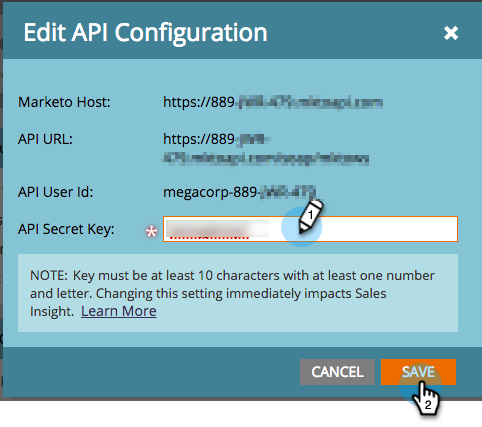

# Marketo Sales Insight configureren in Salesforce Enterprise/Onbeperkt {#configure-marketo-sales-insight-in-salesforce-enterprise-unlimited}

Configureer Marketo Sales Insight in Salesforce Enterprise/Unlimited-edities door de volgende stappen uit te voeren.

>[!PREREQUISITES]
>
>[Marketo Sales Insight Package installeren in Salesforce AppExchange](/help/marketo/product-docs/marketo-sales-insight/msi-for-salesforce/installation/install-marketo-sales-insight-package-in-salesforce-appexchange.md)

>[!NOTE]
>
>**Beheerdersmachtigingen zijn vereist.**

## Verkoopcontrole in Marketo Engage configureren {#configure-sales-insight-in-marketo}

1. Ga naar de **[!UICONTROL Admin]** gebied en selecteer **[!UICONTROL Sales Insight]**.

   

1. Klik op **[!UICONTROL Edit API Configuration]**.

   

1. Voer een door u gekozen API-beveiligingssleutel in en klik op **[!UICONTROL Save]**. Gebruik GEEN ampersand (`&`) in uw API geheime sleutel.

   

   >[!NOTE]
   >
   >De geheime sleutel van uw API is als een wachtwoord voor uw organisatie en zou veilig moeten zijn.

1. Als u de referenties wilt vullen, klikt u op **[!UICONTROL View]** in de _[!UICONTROL Rest API Configuration]_&#x200B;deelvenster.

   

1. Als er een bevestigingsvenster verschijnt, klikt u op **[!UICONTROL OK]**.

   

   >[!TIP]
   >
   >Laat dit venster open. U hebt deze informatie later voor configuratie Salesforce nodig.

## Verkoopinzicht configureren in Salesforce {#configure-sales-insight-in-salesforce}

1. Klik in Salesforce op **[!UICONTROL Setup]**.

   

1. Zoeken naar &quot;externe site&quot; en selecteren **[!UICONTROL Remote Site Settings]**.

   

1. Klik op **[!UICONTROL New Remote Site]**.

   

1. Voer de naam van de externe site in (dit kan iets gelijkaardigs zijn `MarketoSoapAPI`). Voer de URL van de externe site in. Dit is de URL van de Marketo-host in het dialoogvenster _[!UICONTROL Soap API Configuration]_&#x200B;in Marketo Engage. Klik op **[!UICONTROL Save]**. U hebt nu externe site-instellingen voor de Soap API gemaakt.

   

1. Klikken **[!UICONTROL New Remote Site]** opnieuw.

   

1. Voer de naam van de externe site in (dit kan iets gelijkaardigs zijn `MarketoAPI`). Voer de URL van de externe site in. Dit is de API-URL van _[!UICONTROL Rest API Configuration]_&#x200B;in Marketo Engage. Klik op **[!UICONTROL Save]**. U hebt nu externe site-instellingen voor de rest-API gemaakt.

   >[!NOTE]
   >
   >_U_ kies uw **[!UICONTROL Remote Site Name]** (`MarketoAPI` wordt hier gebruikt). De **[!UICONTROL Remote Site URL]** U vindt dit in het veld Marketo-host van het dialoogvenster API-configuratie bewerken in stap 3 van de sectie &quot;Sales Insight configureren in Marketo&quot;.

## De gebruikers van het Inzicht van de Verkoop van de Toekenning toegang tot standaard voorwerpen van Salesforce {#grant-sales-insight-users-profile-access}

Vanwege beveiligingsverbeteringen in Salesforce kunnen pakketten voor AppExchanges geen toestemming meer verlenen voor standaardobjecten en moet toegang worden verleend aan de desbetreffende Salesforce-objecten vanuit het profiel van de Salesforce-gebruiker. Voer de volgende stappen uit om de vereiste machtigingen te verlenen.

1. Klik op **[!UICONTROL Setup]**.

1. Zoek in Snel zoeken naar &quot;Profielen&quot;.

1. Klikken **[!UICONTROL Edit]** naast het profiel dat uw Salesforce-gebruikers gebruiken.

1. Onder de _[!UICONTROL Standard Object Permission]_&#x200B;sectie, inschakelen **[!UICONTROL Read]**&#x200B;toegang voor de volgende objecten: [!UICONTROL Lead], [!UICONTROL Contact], [!UICONTROL Account], en [!UICONTROL Opportunity].

1. Klik op **[!UICONTROL Save]**.

## Paginalay-outs aanpassen {#customize-page-layouts}

1. Klik op **[!UICONTROL Setup]**.

   

1. Zoek naar &quot;paginalay-out&quot;en selecteer **[!UICONTROL Page Layout]** krachtens **[!UICONTROL Leads]**.

   

1. Klikken **[!UICONTROL Visualforce Pages]** links. Slepen **[!UICONTROL Section]** op de layout onder de _[!UICONTROL Custom Links]_&#x200B;sectie.

   

1. Voer &quot;Marketo Sales Insight&quot; in als de **[!UICONTROL Section Name]**, selecteert u **[!UICONTROL 1-Column]** en klik op **[!UICONTROL OK]**.

   

1. Slepen en slepen **[!UICONTROL Lead]** in de nieuwe sectie.

   

   >[!TIP]
   >
   >De naam van dit vak verandert op basis van het objecttype. Als u bijvoorbeeld de paginalay-out voor Contactpersonen wijzigt, wordt Contactpersoon weergegeven.

1. Dubbelklik op de knop **[!UICONTROL Lead]** blokkeren die u zojuist hebt toegevoegd.

   

1. Hoogte bewerken tot **450** pixels en klik op **[!UICONTROL OK]**.

   

   >[!NOTE]
   >
   >Controleren **[!UICONTROL Show scrollbars]** als u toegang tot scroll-through activiteiten nodig hebt.

   >[!TIP]
   >
   >De aanbevolen hoogte voor de objecten Accounts en Opportunity is 410 pixels.

1. Klikken **[!UICONTROL Fields]** links. Zoek en sleep vervolgens het gereedschap **[!UICONTROL Urgency]** in de **[!UICONTROL Marketo Sales Insight]** layout.

   

1. Herhaal bovenstaande stap ook voor deze velden.

   * Laatste interessant moment
   * Datum laatste interessant moment
   * Laatste interessante momentele beschrijving
   * Laatste interessante mompbron
   * Type laatst interessant moment
   * Laatste activiteit per verkoop
   * Laatste betrokkenheid bij verkoop
   * MSI-contact-id
   * Relatieve score
   * Relatieve score
   * Urgentie
   * Urgentiewaarde
   * Weergeven in Marketo

1. Klikken **[!UICONTROL Save]** wanneer gereed.

   

1. Herhaal stap 5-7 om Visualforce paginagedeelten en de gebieden van het Inzicht van de Verkoop voor toe te voegen **[!UICONTROL Contact]**, **[!UICONTROL Account]**, en **[!UICONTROL Opportunity]**.

1. Herhaal stap 8-10 om deze velden van het Inzicht van de Verkoop toe te voegen voor **[!UICONTROL Contact]**. Sla eventuele wijzigingen op.

   * Laatste interessant moment
   * Datum laatste interessant moment
   * [!UICONTROL Last Interesting Moment Desc]
   * [!UICONTROL Last Interesting Moment Source]
   * [!UICONTROL Last Interesting Moment Type]
   * [!UICONTROL Last Marketo Activity by Sales]
   * [!UICONTROL Last Marketo Engagement by Sales]
   * [!UICONTROL MKTO Lead Score]
   * [!UICONTROL Relative Score]
   * [!UICONTROL Relative Score Value]
   * [!UICONTROL Sales Insight] - Opent contact volledige lijstpagina
   * [!UICONTROL Urgency]
   * [!UICONTROL Urgency Value]

## Aangepaste persoonlijke velden toewijzen {#map-custom-person-fields}

Marketo-persoonvelden moeten worden toegewezen aan Salesforce-contactvelden om ervoor te zorgen dat de conversie goed werkt. Voer de volgende stappen uit om deze toe te wijzen.

1. Klik op **[!UICONTROL Setup]**.

   

1. Zoek naar &quot;gebieden&quot;in de onderzoeksbar en klik **[!UICONTROL Fields]** krachtens **[!UICONTROL Leads]**.

   

1. Klik op **[!UICONTROL Map Lead Fields]**.

   

1. Klik op het vervolgkeuzemenu rechts voor **[!UICONTROL Engagement]**.

   

1. Selecteren **[!UICONTROL Contact.Engagement]** in de lijst.

   

1. U kunt deze velden ook herhalen en toewijzen.

   | Aangepast veld voor Marketo-persoon | Aangepast veld voor Salesforce-contact |
   |--- |--- |
   | `Engagement` | `Contact.Engagement` |
   | `Relative Score Value` | `Contact.Relative Score Value` |
   | `Urgency Value` | `Contact.Urgency Value` |
   | `Last Interesting Moment Date` | `Contact.Last Interesting Moment Date` |
   | `Last Interesting Moment Desc` | `Contact.Last Interesting Moment Desc` |
   | `Last Interesting Moment Source` | `Contact.Last Interesting Moment Source` |
   | `Last Interesting Moment Type` | `Contact.Last Interesting Moment Type` |

1. Klikken **[!UICONTROL Save]** als je klaar bent.

## Het tabblad Marketo Sales Insight-configuratie {#marketo-sales-insight-configuration-tab}

1. Klik in Salesforce op de knop **+** aan het einde van de tabbalk en klik op **[!UICONTROL Marketo Sales Insight Config]**.

1. Kopieer de referenties vanuit het deelvenster Soap API in [Admin-pagina Marketo Sales Insight](/help/marketo/product-docs/marketo-sales-insight/msi-for-salesforce/configuration/configure-marketo-sales-insight-in-salesforce-professional-edition.md#set-up-marketo-sales-insight){target="_blank"} en plak ze in de sectie Soap API van de pagina Configuratie van het Inzicht van de Verkoop Salesforce.

1. Kopieer de referenties vanuit het deelvenster Rest API in [Admin-pagina Marketo Sales Insight](/help/marketo/product-docs/marketo-sales-insight/msi-for-salesforce/configuration/configure-marketo-sales-insight-in-salesforce-professional-edition.md#set-up-marketo-sales-insight){target="_blank"} en plak hen in de Rest API sectie van de pagina van de Configuratie van het Inzicht van de Verkoop Salesforce.

   

U zou de gebieden van het Inzicht van de Verkoop van Marketo voor Leads, Contacten, Rekeningen, en Kansen moeten kunnen zien.

>[!NOTE]
>
>Indien de diagnostische test mislukt, [toevoegen van meer velden aan uw pagina-indeling](https://nation.marketo.com:443/t5/knowledgebase/how-to-repair-marketo-sales-insight-setup-configuration-problems/ta-p/248218){target="_blank"} kan het probleem verhelpen.

>[!NOTE]
>
>Voor accounts omvat Verkoopinzicht alle e-mailberichten, maar alleen de meest recente interessante momenten, webactiviteit en scorewijzigingen.

>[!MORELIKETHIS]
>
>* [Prioriteit, Urgentie, Relatieve Score en Beste Bets](/help/marketo/product-docs/marketo-sales-insight/msi-for-salesforce/features/stars-and-flames/priority-urgency-relative-score-and-best-bets.md)
>* [Marketo Tab toevoegen aan Salesforce](/help/marketo/product-docs/marketo-sales-insight/msi-for-salesforce/configuration/add-marketo-tab-to-salesforce.md)
>* [Toegang tot verkoopinzicht toevoegen aan profielen](/help/marketo/product-docs/marketo-sales-insight/msi-for-salesforce/configuration/add-sales-insight-access-to-profiles.md){target="_blank"}
