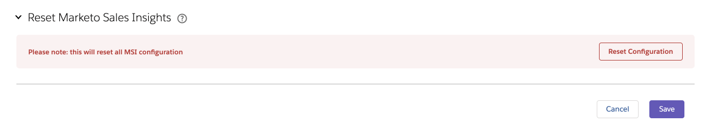

# [!DNL Marketo Sales Insight] Tabblad Configuratie in [!DNL Salesforce] {#marketo-sales-insight-configuration-tab-in-salesforce}

## Operationele instellingen {#operational-settings}

U moet deze instelling hebben om [!DNL Sales Insight] in SFDC te kunnen gebruiken.

* MSI gebruikt zowel Soap- als Rest-API
* De pagina Sales Insight in uw Marketo-account heeft twee corresponderende deelvensters met Soap- en Rest API-referenties die u hier kunt kopiëren en plakken
* De Soap and Rest API beschikt over afzonderlijke time-outs die u kunt instellen op basis van de behoeften van uw organisatie. De maximaal toegestane tijd is 120 seconden
* Disabled Insights Dashboard: U kunt de gegevens van de Rest API verwijderen en alleen de Soap API gebruiken. Als u dit doet, wordt het tabblad Inhoudsdashboard in al uw MSI-deelvensters voor visualkracht uitgeschakeld

## MSI-configuratie {#msi-configuration}

Configuraties zijn van toepassing op alle MSI-gebruikers en zijn niet specifiek voor profielen.

**visualforce de Montages van de Pagina**

* Vervolgkeuzelijst Handeling inschakelen:
   * Mogelijkheid om Marketo-e-mail verzenden te verbergen in vervolgkeuzelijst voor lead en contact met MSI-indeling
   * Mogelijkheid om de opties voor Toevoegen aan Marketo-campagne te verbergen in de vervolgkeuzelijst Lood en Contact opnemen met MSI-indeling
* Volgende gebeurtenissen: Mogelijkheid om uitgenodigde gebeurtenissen, alle gebeurtenissen aan gebruikers te tonen of dit tabblad volledig te verbergen
* Opkomende campagnes: de mogelijkheid om alle e-mailcampagnes weer te geven of dit tabblad volledig te verbergen
* Laad de Aankomende Campagnes en Gebeurtenissen: Mogelijkheid om het aantal vraag van de Rest API te verminderen die door gebruikers door gebeurtenissen en campagnemolusje achter een &quot;Laad Opkomende Punten&quot;te plaatsen wordt gemaakt
* Tabinstellingen: alle vijf tabbladen zijn standaard beschikbaar. U kunt de tabvolgorde kiezen in het deelvenster Verkoopmanager Insight. Dezelfde volgorde geldt voor alle indelingen (Lead, Contact, Account, Opportunity)

**Marketo Globale Lusje**

* RSS-feed ingeschakeld: als deze optie is ingeschakeld, kunnen MSI-gebruikers hun lead feed in een RSS-feed bekijken (naast de lead feed in Salesforce). De RSS-feed kan alleen functioneren als de functie &quot;Symbolische vervaldatum&quot; is uitgeschakeld. Deze instelling wordt bepaald op de pagina Marketo Sales Insight Admin.
* Modus Foutopsporing voor beste Bets
* Standaard verbergen: de optie die u hier kiest, is het aantal dagen dat een beste weddenschap wordt verborgen op het tabblad Best Bets in Marketo wanneer u op het pictogram Verbergen klikt
* Veld contactstatus: de optie die u hier kiest, is de waarde die is ingevuld in de kolom Status-koptekst op het tabblad Best Bets in Marketo
* Instellingen voor Live feed: de optie om alleen Live feed weer te geven (in de deelvensters Lead, Contact, Account en Opportunity en op de pagina Global Marketo), alleen Diervoeders (op de algemene Marketo-pagina) of zowel Live als Lead Feed
* Tabinstellingen: alle vijf tabbladen zijn standaard beschikbaar. U kunt de tabvolgorde op de algemene Marketo-pagina kiezen

**Limieten**

* De activiteit (Interessant Moment, de Activiteit van het Web, E-mail) wordt geplaatst aan 1000 door gebrek. E-mailcampagnes en gebeurtenissen worden standaard ingesteld op 200
* Voor het geval u time-out problemen op uw org opmerkt, kunt u de limiet verlagen

**Montages van de Actie**

* E-mail naar Marketo verzenden: Als u dit inschakelt, kunnen alle Insight-gebruikers van de Sales toegang krijgen tot e-mails via de deelvensters Lead, Contact, Account, Opportunity en Best Bets (bulkacties en inline-betrokkenheid)
* Toevoegen aan Marketo-campagne: als u dit inschakelt, krijgen alle Insight-gebruikers toegang om campagnes toe te voegen via de deelvensters Lead, Contact, Account, Opportunity en Best Bets (bulkacties en inlinebetrokkenheid)

## Ondersteuningsinstellingen {#support-settings}

Als u dit selectievakje inschakelt, wordt Foutopsporingsaanmelding ingeschakeld in uw Salesforce-exemplaar. Het kan u helpen problemen oplossen.

## Marketo Sales Insight opnieuw instellen {#reset-marketo-sales-insight}

Als u dit doet, worden al uw configuraties in SFDC gewist en kunnen deze niet worden hersteld. U zult alles opnieuw moeten vormen.

>[!IMPORTANT]
>
>Schakel het selectievakje &#39;MSI-acties inschakelen&#39; alleen in als u de functies Handelingen met verkoopinzicht gebruikt.

>[!MORELIKETHIS]
>
>[&#x200B; voeg de Toegang van Insight van de Verkoop aan Profielen toe &#x200B;](/help/marketo/product-docs/marketo-sales-insight/msi-for-salesforce/configuration/add-sales-insight-access-to-profiles.md){target="_blank"}
