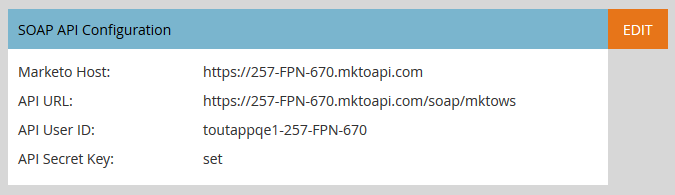

# Sales Insight Page voor Marketo Admins {#sales-insight-page-for-marketo-admins}

Marketo Admins heeft bepaalde rechten in Sales Insight. Leer hieronder wat ze zijn.

## Soap API-configuratie {#soap-api-configuration}

Deze gegevens worden gebruikt om uw Salesforce-account aan te sluiten op uw Marketo-exemplaar, zodat u MSI in Salesforce kunt gebruiken.

## API-configuratie opnieuw instellen {#rest-api-configuration}

Deze gegevens worden gebruikt om uw Salesforce-account aan te sluiten op uw Marketo-exemplaar, zodat u het MSI Insights-dashboard in Salesforce kunt gebruiken.

## Instellingen persoonlijke score {#person-score-settings}

* **Sterren**: Sterren geven de totale loodscore aan in vergelijking met andere leads.
* **Flames**: Flames geven urgentie aan - hoeveel de score van een lead de laatste tijd is veranderd.

Standaard gebruikt Marketo Sales Insight het veld Score voor het berekenen van sterren en vlammen. Maar als je een ander veld wilt kiezen, is dit hoe:

1. In de **Beheer** gebied van Marketo, klik **Verkoopoverzicht**.

   

1. Klik onder Scoreinstellingen voor lead op **Bewerken**.

   

1. Selecteer het veld dat u voor sterren wilt gebruiken.

   

1. Selecteer het veld dat u voor vlammen wilt gebruiken.

   

1. Klikken **Opslaan**. Verkoopinzicht neemt enige tijd in beslag om opnieuw te berekenen. U kunt uw CRM later controleren om de sterren en de vlammen te zien.

   

   >[!TIP]
   >
   >Als je nog geen aangepaste score hebt, kun je het volgende doen: [maken](/help/marketo/product-docs/administration/field-management/create-a-custom-field-in-marketo.md).

   >[!MORELIKETHIS]
   >
   >[Sterren en lamellen](/help/marketo/product-docs/marketo-sales-insight/msi-for-salesforce/features/stars-and-flames/customize-stars-and-flames.md)

## Instellingen {#settings}

**Abonnementsinstellingen opzeggen:**

U kunt kiezen uit de volgende instellingen voor abonnementen voor Geen sjabloon, Standaard e-mails en Operationele e-mails

* Instelling voor afmelden respecteren
* Abonnementsinstellingen respecteren wanneer meer dan 1 ontvanger
* Abonnementsinstellingen respecteren wanneer meer dan 5 ontvangers
* Abonnementsinstellingen negeren

**Sjablonen vergrendelen:**

Indien ingeschakeld, kunnen MSI-gebruikers geen sjablonen bewerken tijdens het verzenden van e-mails van Salesforce

**RSS-feed inschakelen:**

Als deze optie is ingeschakeld, kunnen MSI-gebruikers hun voer voor leads bekijken in een RSS-feed (in aanvulling op het voer voor leads in Salesforce). RSS-feed kan alleen functioneren als de functie &quot;Symbolische vervaldatum&quot; is uitgeschakeld.

**Vervaldatum token:**

De Symbolische Vervaldatum wordt gecontroleerd in de Manager van de Eigenschap. Als u deze wilt in-/uitschakelen, bereikt u [Marketo-ondersteuning](https://nation.marketo.com/t5/Support/ct-p/Support). Als deze optie is ingeschakeld, verlopen alle Marketo-tokens binnen 10 minuten. Als Marketo-tokens zijn uitgeschakeld, verlopen deze niet.

Tokens die vóór het toelaten van de Symbolische Vervalsing worden geproduceerd zullen geen verlooptijd hebben om tegen te bevestigen, zodat zullen zij niet verlopen zelfs als de eigenschap momenteel wordt toegelaten.

Tokens die na het toelaten van Symbolische Vervaltijd worden geproduceerd zullen een vervaltijd van 10 minuten hebben, zodat zullen zij nog over 10 minuten verlopen zelfs nadat de eigenschap wordt onbruikbaar gemaakt.

Tokengedrag wordt gebaseerd op het tijdstip waarop het is gegenereerd (wanneer de functie Symbolische vervaldatum is in-/uitgeschakeld in plaats van de huidige status van de functie).
