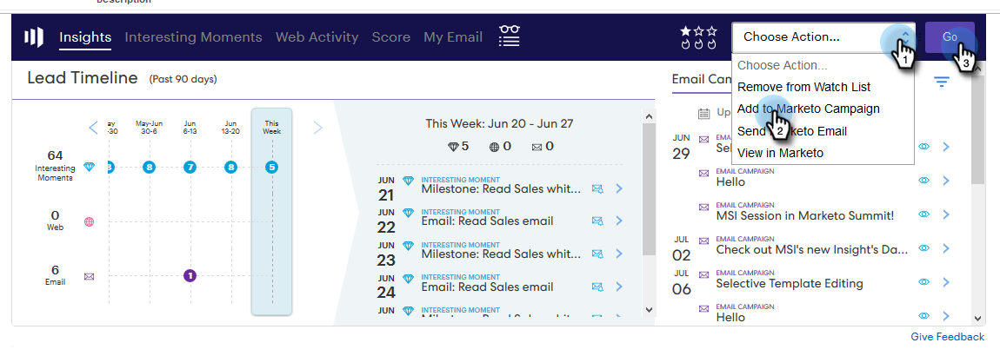

# Voeg een Lood/Contact aan een Campagne van de Marketo van Salesforce toe {#add-a-lead-contact-to-a-marketo-campaign-from-salesforce}

U kunt vanuit Salesforce gemakkelijk leads of contactpersonen toevoegen aan slimme campagnes van Marketo. Zo gaat het met leads.

1. Klik in Salesforce op de tab **Leads **.

   

1. Selecteer in de vervolgkeuzelijst de lijst met personen die u wilt weergeven en klik op **Ga**.

   

   >[!NOTE]
   >
   >De keuzelijst in de vervolgkeuzelijst bevat Alle open leads of Ongelezen leads, Onlangs bekeken leads, de huidige leads en kunnen andere categorieën bevatten.

1. Selecteer een lead in de lijst om de record te openen.

   

1. Blader in de record omlaag naar het gebied Marktkoopoverzicht, klik op de vervolgkeuzelijst **Handelingen** , selecteer **Toevoegen aan Marketo-campagne** en klik **op Ga.**

   

1. Klik op het vervolgkeuzemenu **Campagnenaam** , selecteer de gewenste Marketo-campagne en klik op **Toevoegen aan Marketo-campagne**.

   

   >[!NOTE]
   >
   >Voor de campagne om in drop-down te verschijnen, gebruik de [**Campagne wordt Gevraagd** trekker](../../../../../../product-docs/core-marketo-concepts/smart-campaigns/using-smart-campaigns/setting-up-a-trigger-smart-campaign-for-sales-using-campaign-is-requested.md), met het Inzicht **van de** Verkoop als bron, wanneer u opstelling de campagne.

En dat is het! De persoon wordt toegevoegd aan uw Marketo-campagne.